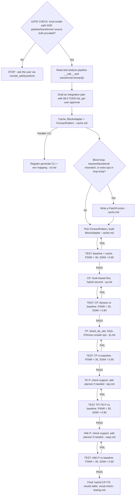
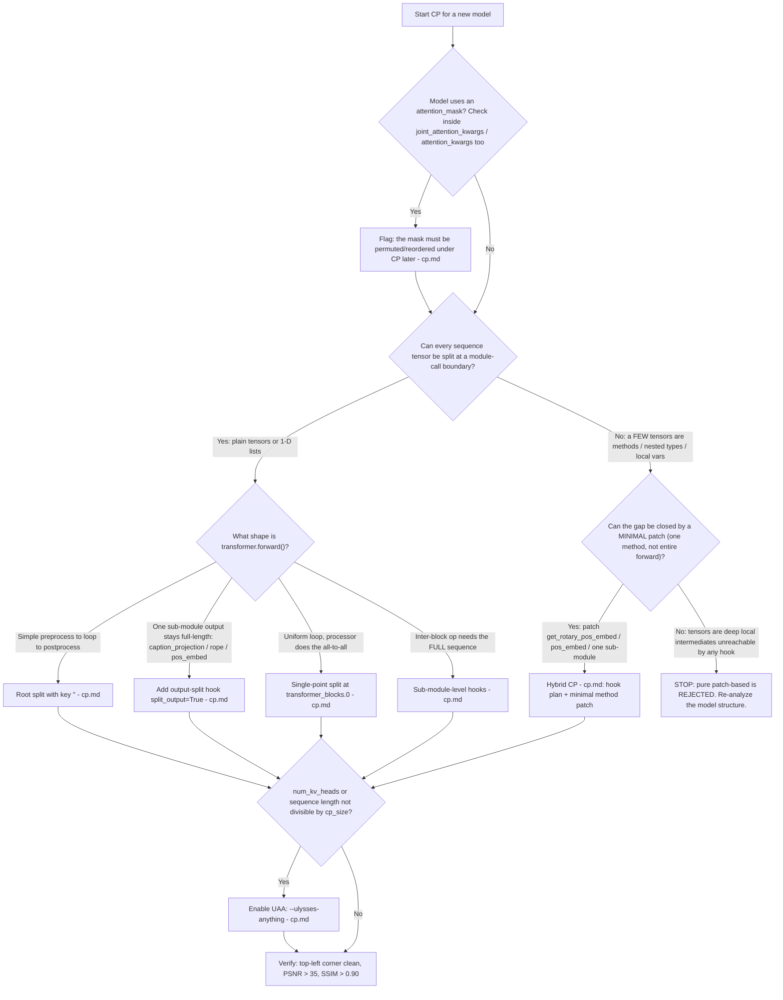
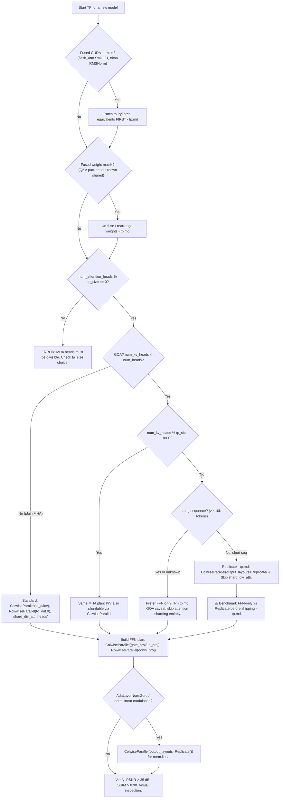

## GATE CHECK

Before writing any code, confirm the following:

```
STOP — Has the user provided BOTH of the following?
  1. A local model path (e.g., /workspace/dev/vipdev/hf_models/Krea-2-Turbo)
  2. The model's pipeline/transformer code info:
     - Pipeline class name (e.g., Krea2Pipeline, or third-party like BooguImagePipeline)
     - Transformer class name (e.g., Krea2Transformer2DModel)
     - File paths to the pipeline and transformer source code (diffusers or third-party)
  NO  → **MUST ask the user to specify these before proceeding.**
         Do NOT guess, search blindly, or assume defaults.
  YES → Continue.

STOP — Have you identified the new model's transformer architecture?
  NO  → Read the model's diffusers source code. Identify:
         - The ModuleList name(s) containing transformer blocks (e.g., transformer_blocks)
         - The block forward() signature (inputs and outputs)
  YES → Proceed to Cache (`./references/cache.md`) and CLI (`./references/cli.md`) in parallel.
```

**Hard rules:**

- **⚠️ MANDATORY: Local model path and code info.** If the user has not explicitly provided (a) the local model path and (b) the pipeline/transformer class names with source file paths (diffusers or third-party), you **MUST** ask the user to specify them via ``vscode_askQuestions`` before any code changes.  Do NOT search the codebase or assume default paths — the user knows their setup best.
- **⚠️ MANDATORY: Plan before code.** Before writing ANY implementation code, you **MUST**: (1) thoroughly analyze the model's pipeline and transformer source code, (2) create a detailed integration plan following this skill's workflow and read the relevant references (Cache → CP → TP → TE-P → VAE-P → CLI → Testing), (3) present the plan to the user for review and approval.  **Do NOT start implementing until the user explicitly approves the plan.**  This prevents wasted effort from incorrect assumptions about the model architecture.
- ALWAYS set up local model paths via environment variables BEFORE testing — downloading from HuggingFace Hub is extremely slow.
- ALWAYS compute BOTH PSNR and SSIM when verifying correctness — PSNR alone cannot detect image corruption (garbled output).
- For Python-only changes, `pip install -e "." --no-build-isolation` is sufficient; SVDQuant C++ compilation is NOT required.
- **Do NOT alter core dependency versions** (torch, torchvision, transformers, diffusers, cache-dit, triton) in the `cdit` conda environment. Other dependencies may be installed only if they do not conflict with these.
- **Do NOT modify any code in the diffusers library.** If a model requires patches (e.g., monkey-patching `forward()`, attention processors, etc.), write all patch code inside the cache-dit repository. Diffusers is a third-party dependency and must not be altered.
- **All examples in this skill are references, not templates to copy.** Every model has unique architecture details (block signatures, tensor layouts, shared vs per-block modulation, attention mask requirements, etc.). Before following any example, first analyze whether the referenced model's architecture is actually comparable to the target model. Blindly copying an example that was designed for a different architecture will produce incorrect or broken code.
- ControlNet parallelism is a special case and is NOT covered in this guide.
- **⚠️ GQA attention backend pitfall**: When a model uses GQA (e.g., ``num_heads=48, num_kv_heads=12``), the ``dispatch_attention_fn(..., enable_gqa=True)`` path may cause PyTorch SDPA to fall back to a **slow backend** (``math`` or an inefficient ``mem_efficient`` kernel) because flash-attention / cuDNN SDPA backends have limited GQA support.  **Always benchmark ``enable_gqa=True`` vs. manually repeating K/V heads to match Q heads and passing ``enable_gqa=False``** (MHA path).  On NVIDIA L20, the MHA repeat gave a **~2.2× single-GPU speedup** for Krea-2-Turbo (48 Q / 12 KV heads, 128 head_dim, 4608 seq).  This is not CP-specific — any model with GQA should evaluate whether the repeat→MHA path is faster.  If confirmed, apply the repeat unconditionally in the attention processor patch, not just in the CP path.  Document the finding in the planner's docstring as well (see ``krea2.py`` for an example).

---

## 0. Model Integration Practical Navigation

> Start here. This map orients you before you dive into any chapter. The integration order is **Cache → CP → TP → TE-P → VAE-P → CLI → Testing**; each feature is verified against a single-GPU baseline before moving on.

### 0.1 End-to-End Workflow

> The integration order is **Cache → CP → TP → TE-P → VAE-P**. Each feature is tested against a single-GPU baseline before moving to the next. Use the detailed checklist in §0.6 for planning and tracking.



### 0.2 Context Parallelism Decision Chart (the highest-risk step)



### 0.3 Tensor Parallelism Decision Chart (second-highest-risk step)



### 0.4 Decision Index — "If you're dealing with X, read this"

| Situation | Section |
|---|---|
| Choosing the block I/O pattern | `./references/cache.md` and the ForwardPattern table below |
| Block loop calls blocks with keyword args, or has extra ops inside the loop | `./references/cache.md` PatchFunctor pitfalls |
| More complex structural patch (per-block forward, block-id injection, block-list merge) | `./references/cache.md` advanced PatchFunctor cases |
| Third-party (non-diffusers) model | `./references/cache.md` third-party model section |
| CP: choosing hook-based vs hybrid | `./references/cp.md` plus the CP chart above |
| CP: a projection / rope / pos_embed output stays full-length | `./references/cp.md` output-split hook |
| CP: uniform loop + attention-processor all-to-all | `./references/cp.md` single-point split |
| CP: an inter-block op needs the full sequence | `./references/cp.md` sub-module hooks |
| CP: a tensor is a method return or nested type that hooks cannot split | `./references/cp.md` hybrid CP |
| CP: head count or sequence length not divisible by cp_size | `./references/cp.md` UAA |
| CP: the model has an attention_mask | `./references/cp.md` attention mask reorder |
| TP: choosing the overall TP strategy | `./references/tp.md` plus the TP chart above |
| TP: attention output garbled | `./references/tp.md` shard_div_attr |
| TP: fused CUDA kernels crash under TP | `./references/tp.md` DTensor-unsafe ops |
| TP: a single Linear packs fused QKV or out+down weights | `./references/tp.md` fused-weight rearrangement |
| TP: GQA with `num_kv_heads` not divisible by `tp_size` | `./references/tp.md` GQA performance caveat |
| TP: when to use `output_layouts=Replicate()` | `./references/tp.md` Replicate strategy |
| New text encoder / new VAE | `./references/tep.md` / `./references/vaep.md` |
| Register the model in the CLI | `./references/cli.md` |
| Verify correctness | `./references/testing.md` PSNR AND SSIM |

### 0.5 Top Pitfalls That Silently Corrupt Output

These are the traps that pass without crashing but produce wrong images. Each is expanded in its section.

1. **Skipping SSIM.** PSNR alone cannot detect garbled output — a garbled image can still score PSNR > 25 dB. Always compute both. → `./references/testing.md` correctness verification
2. **CP + `attention_mask` misalignment.** Ulysses all-to-all reorders the sequence; a position-indexed mask no longer lines up → localized **top-left corruption**, PSNR stuck ~28–30. → `./references/cp.md` attention mask reorder
3. **Missing `shard_div_attr` in TP.** The attention processor reshapes with a stale head count → garbled output (the #1 TP bug). → `./references/tp.md` shard_div_attr
4. **PatchFunctor drops loop-body ops.** Extra operations inside the block loop are silently skipped after the cache wrapper takes over → stale `temb` / modulation. → `./references/cache.md` PatchFunctor Pitfall B
5. **GQA attention TP via `Replicate` is *correct* but often *slower* than a single GPU** (all-gather on Q dominates). Benchmark against FFN-only TP before shipping. → `./references/tp.md` GQA strategy
6. **DTensor-unsafe fused kernels** (flash_attn SwiGLU, triton RMSNorm) crash with illegal-memory-access under TP → patch them to PyTorch ops first. → `./references/tp.md` DTensor-unsafe ops
7. **Choosing pure patch-based CP when hybrid (hook + method patch) suffices.** If the ONLY obstacle is a method like `get_rotary_pos_embed` or `pos_embed` that returns a sequence-length-dependent tensor not reachable by hooks, patch that ONE method — do NOT patch the entire `forward()`. Pure patch-based CP is a maintenance burden that should never be green-lit without proving hybrid is truly impossible. → `./references/cp.md` implementation approaches and hybrid CP

### 0.6 Integration TODO List Template

> **⚠️ MANDATORY: One feature at a time. Test thoroughly before starting the next.** Do NOT develop Cache + CP + TP together — a bug in one will contaminate all downstream results. Each phase depends on a verified-correct baseline from the previous phase.

Copy this template into your plan, fill in model-specific details, and check off items as they pass.

Phase 0 — Prerequisites

```
- [ ] Model files downloaded to local path
- [ ] Test image prepared (for IE2I / I2V models)
- [ ] Diffusers source code read: pipeline __call__, transformer.forward(), block class
- [ ] ForwardPattern identified (Pattern_0 through Pattern_5)
- [ ] Block ModuleList name(s) confirmed
- [ ] GQA / attention_mask / modulation style documented
- [ ] Planning complete and reviewed (use Review Plan agent)

Phase 1 — Cache (BlockAdapter)
- [ ] 1.1 Write BlockAdapter function in adapters.py
        - register name, _relaxed_assert, blocks, forward_pattern, check_forward_pattern=True
- [ ] 1.2 Evaluate PatchFunctor need
        - Check: keyword args in block call? extra ops in loop body?
        - If needed: write PatchFunctor in patch_functors/ → wire in BlockAdapter
- [ ] 1.3 Register in block_adapters/__init__.py
- [ ] 1.4 pip install -e . --no-build-isolation
- [ ] 1.5 BASELINE TEST: python3 -m cache_dit.generate <model> --save-path .tmp/<task>/base.png
        - Verify: image loads, inference completes, output looks correct
        - If OOM: consider --cpu-offload, --sequential-cpu-offload, or multi-GPU
- [ ] 1.6 CACHE TEST: ... --cache --summary --save-path .tmp/<task>/cache.png
        - Verify: inference faster than baseline, output visually identical
- [ ] 1.7 CACHE CORRECTNESS: cache-dit-metrics psnr ssim -i1 base.png -i2 cache.png
        - Criteria: PSNR > 30 dB, SSIM > 0.90
- [ ] 1.8 [STOP] Cache fully verified ── do NOT proceed until this passes

Phase 2 — CLI Integration (can start in parallel with Phase 1)
- [ ] 2.1 Add Example function in _utils/examples.py
        - @ExampleRegister.register("<model_name>", default="<hf-id>")
        - ExampleType (T2I / IE2I / T2V / I2V / ...)
        - prompt, height, width, num_inference_steps, guidance_scale, image (for IE2I)
- [ ] 2.2 Add env var mapping in _env_path_mapping dict
- [ ] 2.3 Add to __all__ list in examples.py
- [ ] 2.4 Register in _utils/__init__.py
- [ ] 2.5 VERIFY: python3 -m cache_dit.generate list | grep <model_name>

Phase 3 — CP: Context Parallelism
- [ ] 3.1 DESIGN: Determine CP approach using `./references/cp.md` priority rules
        - Pure hook-based? (root split, single-point split, sub-module hooks)
        - Hybrid? (hook plan + minimal method patch, e.g. for RoPE)
        - Pure patch-based is REJECTED — escalate if hybrid cannot work
- [ ] 3.2 Create <model>.py in distributed/transformers/
        - ContextParallelismPlanner class + _apply()
        - Hook plan dict (or hybrid: patch functions + hook plan)
- [ ] 3.3 Write attention processor patch (set _parallel_config)
- [ ] 3.4 If attention_mask present: write mask permute patch (`./references/cp.md` attention mask reorder)
- [ ] 3.5 Register in distributed/transformers/planners.py (_activate_cp_planners)
- [ ] 3.6 TEST CP Ulysses 2GPU:
        torchrun --nproc_per_node=2 -m cache_dit.generate <model> --parallel ulysses --save-path .tmp/<task>/cp_ulysses2.png
- [ ] 3.7 CORRECTNESS: cache-dit-metrics psnr ssim -i1 base.png -i2 cp_ulysses2.png
        - Criteria: PSNR > 35 dB, SSIM > 0.90
        - Visual check: top-left corner clean, no localized corruption
- [ ] 3.8 [OPTIONAL] CP Ring 2GPU: --parallel ring (long-sequence models only)
- [ ] 3.9 [OPTIONAL] UAA: --parallel ulysses --ulysses-anything (indivisible heads/seq)
- [ ] 3.10 [STOP] CP fully verified ── do NOT proceed until this passes

Phase 4 — TP: Tensor Parallelism
- [ ] 4.1 DESIGN: Determine TP strategy using `./references/tp.md` plus the TP chart above
        - Identify fused weight matrices (QKV packed? out+down shared?)
        - GQA? num_kv_heads divisible by tp_size?
        - Modulation style (AdaLayerNormZero? JoyImageModulate? none?)
- [ ] 4.2 Add TensorParallelismPlanner class in <model>.py
        - parallelize_transformer() with layer plans
        - shard_div_attr for every attention block
        - Separate plans for double-stream vs single-stream blocks if both exist
- [ ] 4.3 Handle non-Linear modules (e.g. modulation tables: skip TP, keep full copy)
- [ ] 4.4 Handle DTensor-unsafe fused kernels (`./references/tp.md` DTensor-unsafe ops): patch to PyTorch equivalents
- [ ] 4.5 Register in distributed/transformers/planners.py (_activate_tp_planners)
- [ ] 4.6 TEST TP 2GPU:
        torchrun --nproc_per_node=2 -m cache_dit.generate <model> --parallel tp --save-path .tmp/<task>/tp2.png
- [ ] 4.7 CORRECTNESS: cache-dit-metrics psnr ssim -i1 base.png -i2 tp2.png
        - Criteria: PSNR > 35 dB, SSIM > 0.90
        - If garbled: check shard_div_attr, DTensor placement, ColwiseParallel output_layouts
- [ ] 4.8 [STOP] TP fully verified

Phase 5 — TE-P: Text Encoder Parallelism
- [ ] 5.1 CHECK existing support: grep distributed/text_encoders/ for encoder class name
- [ ] 5.2 IF already supported → skip to test
        IF not → create new planner in distributed/text_encoders/<encoder>.py
        - Reference: HuggingFace Config.base_model_tp_plan
- [ ] 5.3 Register in distributed/text_encoders/planners.py
- [ ] 5.4 TEST TP + TE-P 2GPU:
        torchrun --nproc_per_node=2 -m cache_dit.generate <model> --parallel tp --parallel-text --save-path .tmp/<task>/tp2_tep2.png
- [ ] 5.5 CORRECTNESS: cache-dit-metrics psnr ssim -i1 base.png -i2 tp2_tep2.png
        - Criteria: PSNR > 35 dB, SSIM > 0.90
- [ ] 5.6 [STOP] TE-P verified (or confirmed not needed)

Phase 6 — VAE-P: VAE Parallelism
- [ ] 6.1 CHECK existing support: grep distributed/autoencoders/ for VAE class name
- [ ] 6.2 IF already supported → skip to test
        IF not → create new planner in distributed/autoencoders/<vae>.py
- [ ] 6.3 Register in distributed/autoencoders/planners.py
- [ ] 6.4 TEST VAE-P 2GPU:
        torchrun --nproc_per_node=2 -m cache_dit.generate <model> --parallel-vae --save-path .tmp/<task>/vae2.png
- [ ] 6.5 CORRECTNESS: cache-dit-metrics psnr ssim -i1 base.png -i2 vae2.png
        - Criteria: PSNR > 35 dB, SSIM > 0.90
- [ ] 6.6 [STOP] VAE-P verified (or confirmed not needed)

Phase 7 — Final Integration Tests
- [ ] 7.1 Hybrid CP + TP: --parallel ulysses_tp (2 GPU)
- [ ] 7.2 CORRECTNESS: vs baseline
- [ ] 7.3 Fill in results table (`./references/testing.md` results table): latency, PSNR, SSIM, GPU mem per config
- [ ] 7.4 Visual inspection: at least one output image per configuration
- [ ] 7.5 [DONE] Integration complete ── all checks passed
```

> **Key discipline**: after each test, record results in the plan before moving on. A failing test at Phase 4 should trigger a re-read of the relevant sections, not a blind "try TP with different flags" loop.

---

## 1. Cache Integration: BlockAdapter + ForwardPattern

### 1.1 Concept

cache-dit's caching engine works by intercepting the forward pass of DiT transformer blocks. To do this, it needs to know:

1. **Where the blocks are** — which `ModuleList` attribute holds the repeated transformer blocks.
2. **What goes in and out** — the block's `forward()` input/output signature ("forward pattern").
3. **Any model quirks** — separate CFG passes, special patching needs, etc.

All of this is described by a single `BlockAdapter` dataclass instance.

### 1.2 ForwardPattern — The 6 Block I/O Contracts

`ForwardPattern` is an enum in `src/cache_dit/caching/forward_pattern.py`. It captures the hidden-state ordering and forward-signature shape of a family of transformer blocks. Choose the pattern that matches your block's `forward()` signature:

| Pattern             | `forward()` inputs                       | `forward()` returns                      | Return_H_First | Return_H_Only | Forward_H_only | Typical Models                                                         |
| ------------------- | ------------------------------------------ | ------------------------------------------ | -------------- | ------------- | -------------- | ---------------------------------------------------------------------- |
| **Pattern_0** | `(hidden_states, encoder_hidden_states)` | `(hidden_states, encoder_hidden_states)` | `True`       | `False`     | `False`      | Mochi, CogVideoX, CogView4, HunyuanVideo, EasyAnimate                  |
| **Pattern_1** | `(hidden_states, encoder_hidden_states)` | `(encoder_hidden_states, hidden_states)` | `False`      | `False`     | `False`      | Flux transformer_blocks, QwenImage, SD3, VisualCloze                   |
| **Pattern_2** | `(hidden_states, encoder_hidden_states)` | `(hidden_states,)`                       | `False`      | `True`      | `False`      | Wan, Allegro, Cosmos, LTX-1                                            |
| **Pattern_3** | `(hidden_states,)`                       | `(hidden_states,)`                       | `False`      | `True`      | `True`       | Flux single_transformer_blocks, DiT, PixArt, Sana, Lumina2, SkyReelsV2 |
| **Pattern_4** | `(hidden_states,)`                       | `(hidden_states, encoder_hidden_states)` | `True`       | `False`     | `True`       | (rare)                                                                 |
| **Pattern_5** | `(hidden_states,)`                       | `(encoder_hidden_states, hidden_states)` | `False`      | `False`     | `True`       | (rare)                                                                 |

**How to determine the correct pattern for your model:**

1. Open the block's `forward()` method in diffusers source.
2. Check the parameter list: does it take only `hidden_states`, or also `encoder_hidden_states`? This determines `Forward_H_only`.
3. Check the return statement: does it return one tensor or two? In what order? This determines `Return_H_Only` / `Return_H_First`.
4. Match against the table above. If none fits exactly, open an issue.

> Detailed BlockAdapter parameters, implementation templates, registration, third-party model guidance, and PatchFunctor cases live in [`./references/cache.md`](./references/cache.md).

## 2. Context Parallelism (CP)

### 2.1 Concept

Context Parallelism splits the **sequence dimension** of hidden states across multiple GPUs. Each GPU computes attention over a local chunk, then gathers results. cache-dit supports two CP strategies:

- **Ulysses** (`--parallel ulysses`): All-to-all communication. Better for shorter sequences or when combined with TP. **Always prefer Ulysses over Ring** — it is more mature, better tested, and supports `--ulysses-anything` (UAA) for non-divisible head counts and sequence lengths.
- **Ring** (`--parallel ring`): Peer-to-peer communication in a ring topology. Better for very long sequences. Only consider Ring if Ulysses is proven inadequate for your use case.

### 2.2 Two Implementation Approaches

> **⚠️ MANDATORY: Hook-based first, hybrid second, pure patch-based NEVER.**
>
> The implementation priority is:
> 1. **Pure hook-based**: Every sequence tensor is a function parameter of an `nn.Module` → use declarative hooks only. Details: [`./references/cp.md`](./references/cp.md).
> 2. **Hybrid: hook-based + minimal method patch**: ONE or TWO tensors are produced by a plain method (e.g. `get_rotary_pos_embed`) or a nested tuple → write a ~10-line patch for that method, keep everything else hook-based. Details: [`./references/cp.md`](./references/cp.md).
> 3. **Pure patch-based: REJECTED.** Patching the entire `transformer.forward()` copies ~100+ lines of diffusers code, breaks on every upstream change, and bypasses all framework validation. **If hybrid cannot work, re-analyze the model structure — pure patch-based is NOT an acceptable answer.**

cache-dit offers **two** CP implementation patterns:

| Priority | Approach | Mechanism | When to use |
|---|---|---|---|
| **1st** | **Hook-based** | Declarative `_ContextParallelInput` / `_ContextParallelOutput` dict; framework inserts split/gather hooks at specified module-call boundaries. | All sequence tensors are **plain tensors or 1-D flat lists** passed as parameters to `nn.Module.forward()`. |
| **2nd** | **Hybrid: hook plan + minimal patch** | Hook-based CP plan handles most tensors; a **single method patch** (~10 lines) fixes the one or two tensors hooks cannot reach (e.g. a RoPE method, a nested tuple return). Return the hook plan (not `{}`) from `_apply()`. | One or two sequence-dependent tensors are produced by a **plain method** (not a sub-module), have a **nested tuple type** hooks cannot iterate, or are **local variables** that a tiny wrapper can expose. |

> **❌ Pure patch-based (patching the entire `forward()`) is explicitly REJECTED.** The two shipped "patch-based" planners — ErnieImage (legacy, pre-dates hook list support) and BooguImage (genuinely complex double→single stream fusion + per-stream internal concat) — should NOT be cited as justification. Any new model must use hook-based or hybrid. If a model appears to need a full forward patch, escalate for architecture review.

> Detailed hook plans, hybrid CP patches, registration, UAA, and attention-mask permutation fixes live in [`./references/cp.md`](./references/cp.md).

## 3. Tensor Parallelism (TP)

### 3.1 Concept

Tensor Parallelism splits **model parameters** (weight matrices) across GPUs. Unlike CP which splits the input, TP splits the linear layers themselves. TP reduces per-GPU memory and can be combined with CP for hybrid parallelism (`--parallel ulysses_tp`, `--parallel ring_tp`).

cache-dit's TP is built on top of the **PyTorch tensor parallel API** (`torch.distributed.tensor.parallel`). The core primitives are:

- **`ColwiseParallel()`**: Shards a linear layer along its **output (column) dimension**. For a weight matrix `[out_features, in_features]`, each GPU holds `[out_features / tp_size, in_features]`. The input is replicated (each GPU has a full copy), and each GPU computes a partial output. Use for: Q/K/V projections, FFN first layer — anywhere the output is naturally partitioned (e.g., per-head).
- **`RowwiseParallel()`**: Shards a linear layer along its **input (row) dimension**. For a weight matrix `[out_features, in_features]`, each GPU holds `[out_features, in_features / tp_size]`. Each GPU receives a partial input and computes a partial output, then an **all-reduce** automatically sums the partial results into the full output. Use for: output projections, FFN second layer — anywhere the output needs to be reassembled.

#### `output_layouts` / `input_layouts`: Controlling DTensor Placement

Every `ColwiseParallel` and `RowwiseParallel` layer has two hidden parameters that control how its result is placed across GPUs:

| Parameter | Default | Meaning |
|---|---|---|
| `output_layouts` | `Shard(-1)` | How the layer's **output** DTensor is sharded across GPUs. `Shard(-1)` = each GPU holds a slice along the last dimension. `Replicate()` = each GPU holds a full copy. |
| `input_layouts` | `Shard(-1)` for Rowwise, `Replicate()` for Colwise | How the layer expects its **input** to be placed. `Shard(-1)` = input is already sharded along the last dim. `Replicate()` = input is a full copy on each GPU. |

**Default behavior (efficient, works for most models):**

- `ColwiseParallel()`: each GPU computes a partial output from a replicated input. By default `use_local_output=True`, so the caller receives a **plain local tensor** `[..., out_features/tp]` (not a DTensor). The `output_layouts` default `Shard(-1)` only matters if the output flows into another parallelized layer.
- `RowwiseParallel()`: expects `Shard(-1)` input (from a preceding `ColwiseParallel`), computes a partial output, then **all-reduces** to produce a full result.

**When to override to `Replicate()`:**

The defaults work when tensor flow is a clean chain: `Colwise → Rowwise → Colwise → Rowwise ...`.  You need to override the layouts when there is a **non-TP-aware consumer or producer** between two parallelized layers — typically the **attention processor**.  The processor's `.view()` / `.unflatten()` / RoPE / GQA repeat operations expect a plain tensor of a specific shape and do **not** understand DTensor shard placements.

| Scenario | Override | Why |
|---|---|---|
| **Attention processor between `Colwise(to_q)` and `Rowwise(to_out)`** | `to_q`: `ColwiseParallel(output_layouts=Replicate())` | The processor reshapes the Q projection — it needs the full `[B, S, heads*head_dim]` tensor to correctly `unflatten(-1, (heads, head_dim))`. A `Shard(-1)` output would give the processor a DTensor shard, which corrupts the reshape. `Replicate()` all-gathers the partial Q outputs so the processor sees a complete tensor. |
| **GQA: `num_kv_heads` indivisible by `tp_size`** | `to_q`: `ColwiseParallel(output_layouts=Replicate())`, `to_k`/`to_v`: leave unparallelized | K/V heads cannot be divided evenly — you cannot apply standard `ColwiseParallel` to `to_k`/`to_v`. But you can still shard `to_q` with `Replicate()` and shard `to_out` with `RowwiseParallel(input_layouts=Replicate())` to get partial TP savings for Q + output projection. See [`./references/tp.md`](./references/tp.md) for full details. |
| **Downstream `RowwiseParallel` receives a Replicate input** | `to_out`: `RowwiseParallel(input_layouts=Replicate())` | If the preceding `ColwiseParallel` used `output_layouts=Replicate()`, the attention processor's output is a full tensor. The downstream `RowwiseParallel` must be told its input is `Replicate()`, not `Shard(-1)`, or it will misinterpret the full tensor as a shard of a larger logical tensor (doubling the effective feature dim → shape crash). |

**Import statement:**

```python
from torch.distributed._tensor import Replicate
```

> **Key takeaway**: `Replicate()` is a **correctness tool, not an optimization**. It adds an all-gather (for output) or a redistribute (for input) at each use — only apply it when the attention processor genuinely cannot handle sharded tensors. For models without GQA and with DTensor-aware attention (or pure FFN sharding), the defaults are both correct and more efficient. See [`./references/tp.md`](./references/tp.md) for when to keep `shard_div_attr` vs. skip it (they are coupled: Replicate + no `shard_div_attr` vs. Shard + `shard_div_attr`).

For a detailed walkthrough, see the official PyTorch tutorial: https://docs.pytorch.org/tutorials/intermediate/TP_tutorial.html

> Detailed TP planner templates, `shard_div_attr`, GQA/Replicate strategies, fused QKV handling, and DTensor-unsafe op patches live in [`./references/tp.md`](./references/tp.md).

## 4. Text Encoder Parallelism (TE-P)

### 4.1 Concept

TE-P shards the text encoder (e.g., T5, CLIP) across GPUs using the same TP mechanism. It is independent of transformer TP — you can use TE-P with or without transformer TP. Activate via `--parallel-text` (or `--parallel-text-encoder`).

> Detailed support checks, HuggingFace `base_model_tp_plan` guidance, planner templates, and registration live in [`./references/tep.md`](./references/tep.md).

## 5. VAE Parallelism (VAE-P)

### 5.1 Concept

VAE-P applies **data parallelism** (not tensor parallelism) to the VAE decoder. Multiple GPUs each decode a portion of the latent grid, then results are stitched together. This is useful when the VAE decoder is a memory bottleneck. Activate via `--parallel-vae`.

> Detailed support checks, planner templates, and registration live in [`./references/vaep.md`](./references/vaep.md).

## 6. generate CLI Integration

### 6.1 Concept

Cache-dit's `python3 -m cache_dit.generate` CLI discovers models through `ExampleRegister`. Each model registers a factory function that returns an `Example` dataclass specifying the pipeline class, default parameters, and model path.

> Detailed `ExampleRegister`, `ExampleType`, `ExampleInputData`, registration, and environment variable mapping guidance live in [`./references/cli.md`](./references/cli.md).

## 7. Testing & Verification

```
╔══════════════════════════════════════════════════════════════╗
║  ⚠️  TESTING IS MANDATORY — DO NOT SKIP                      ║
║                                                              ║
║  Every integration feature (Cache, CP, TP, TE-P, VAE-P)      ║
║  MUST be tested against a baseline.  Guessing "it            ║
║  should work" is not acceptable.  Subtle bugs (e.g.,         ║
║  DTensor shard placement issues, incorrect GQA handling)     ║
║  can produce visually plausible but mathematically wrong     ║
║  output that is only caught by quantitative metrics.         ║
║                                                              ║
║  NEVER skip SSIM.  PSNR alone can NOT detect garbled         ║
║  images.  A corrupted image can still have PSNR > 25 dB.     ║
║  If you omit SSIM you WILL ship broken code.                 ║
╚══════════════════════════════════════════════════════════════╝
```

> Detailed local model path setup, installation, command matrix, PSNR/SSIM acceptance criteria, result table, and debugging tips live in [`./references/testing.md`](./references/testing.md).

## 8. Reference Code Paths

All paths are relative to the cache-dit repository root.

### Core Integration Files

| Module                       | File                                                        | Purpose                                       |
| ---------------------------- | ----------------------------------------------------------- | --------------------------------------------- |
| BlockAdapter implementations | `src/cache_dit/caching/block_adapters/adapters.py`        | Model-specific adapter functions (30+ models) |
| BlockAdapter registration    | `src/cache_dit/caching/block_adapters/__init__.py`        | `_safe_import` registration of all adapters |
| BlockAdapter class           | `src/cache_dit/caching/block_adapters/block_adapters.py`  | `BlockAdapter` dataclass definition         |
| ForwardPattern enum          | `src/cache_dit/caching/forward_pattern.py`                | 6 block I/O contract patterns                 |
| BlockAdapterRegister         | `src/cache_dit/caching/block_adapters/block_registers.py` | Registration decorator                        |

### Distributed Parallelism Files

| Module                        | File                                                     | Purpose                                                                              |
| ----------------------------- | -------------------------------------------------------- | ------------------------------------------------------------------------------------ |
| CP/TP planner implementations | `src/cache_dit/distributed/transformers/<model>.py`    | Model-specific CP and TP planners                                                    |
| CP/TP planner registration    | `src/cache_dit/distributed/transformers/planners.py`   | `_activate_cp_planners()` / `_activate_tp_planners()`                            |
| CP/TP base classes            | `src/cache_dit/distributed/transformers/register.py`   | `ContextParallelismPlanner`, `TensorParallelismPlanner`, registration decorators |
| CP core types                 | `src/cache_dit/distributed/core/`                      | `_ContextParallelInput`, `_ContextParallelOutput`, `_ContextParallelModelPlan` |
| TE-P planner implementations  | `src/cache_dit/distributed/text_encoders/<encoder>.py` | Text encoder TP planners                                                             |
| TE-P planner registration     | `src/cache_dit/distributed/text_encoders/planners.py`  | `_activate_text_encoder_tp_planners()`                                             |
| VAE-P planner implementations | `src/cache_dit/distributed/autoencoders/<vae>.py`      | VAE data-parallel planners                                                           |
| VAE-P planner registration    | `src/cache_dit/distributed/autoencoders/planners.py`   | `_activate_auto_encoder_dp_planners()`                                             |
| ParallelismConfig             | `src/cache_dit/distributed/config.py`                  | `ParallelismConfig` dataclass                                                      |

### CLI & Examples Files

| Module                       | File                                  | Purpose                                                                                        |
| ---------------------------- | ------------------------------------- | ---------------------------------------------------------------------------------------------- |
| Example implementations      | `src/cache_dit/_utils/examples.py`  | Model example factory functions                                                                |
| Example registration         | `src/cache_dit/_utils/__init__.py`  | `_safe_import` of all examples                                                               |
| Example/ExampleRegister base | `src/cache_dit/_utils/registers.py` | `Example`, `ExampleRegister`, `ExampleInitConfig`, `ExampleInputData`, `ExampleType` |
| CLI entry point              | `src/cache_dit/_utils/generate.py`  | CLI argument parsing and dispatch                                                              |
| CLI argument definitions     | `src/cache_dit/_utils/utils.py`     | `get_base_args()` — all CLI flags                                                           |
| Metrics CLI                  | `src/cache_dit/metrics/metrics.py`  | PSNR, SSIM, LPIPS, FID computation and CLI                                                     |

### Documentation & Examples

| Resource                | File                                          | Purpose                                                                          |
| ----------------------- | --------------------------------------------- | -------------------------------------------------------------------------------- |
| Developer guide         | `docs/developer_guide/SUPPORT_NEW_MODEL.md` | Official step-by-step integration guide                                          |
| CLI examples            | `examples/README.md`                        | Comprehensive CLI usage examples (single-GPU, distributed, quantization, hybrid) |
| Pipeline usage examples | `examples/generate.py`                      | Programmatic pipeline usage examples                                             |
| **User Guide**    | **`docs/user_guide/`**                | **Complete user documentation covering all features:**                     |
|                         | `docs/user_guide/OVERVIEWS.md`              | Feature overview and architecture                                                |
|                         | `docs/user_guide/INSTALL.md`                | Installation guide                                                               |
|                         | `docs/user_guide/CACHE_API.md`              | Cache API usage and configuration                                                |
|                         | `docs/user_guide/DBCACHE_DESIGN.md`         | DBCache algorithm design details                                                 |
|                         | `docs/user_guide/CONTEXT_PARALLEL.md`       | Context Parallelism usage guide                                                  |
|                         | `docs/user_guide/TENSOR_PARALLEL.md`        | Tensor Parallelism usage guide                                                   |
|                         | `docs/user_guide/HYBRID_PARALLEL.md`        | Hybrid CP+TP parallelism                                                         |
|                         | `docs/user_guide/EXTRA_PARALLEL.md`         | TE-P, VAE-P, ControlNet-P guides                                                 |
|                         | `docs/user_guide/COMPILE.md`                | torch.compile integration                                                        |
|                         | `docs/user_guide/QUANTIZATION.md`           | Quantization usage guide                                                         |
|                         | `docs/user_guide/OFFLOAD.md`                | CPU offload guide                                                                |
|                         | `docs/user_guide/ATTENTION.md`              | Attention backend configuration                                                  |
|                         | `docs/user_guide/METRICS.md`                | Metrics and evaluation guide                                                     |
|                         | `docs/user_guide/ENV.md`                    | Environment variables reference                                                  |
|                         | `docs/user_guide/LOAD_CONFIGS.md`           | YAML config file loading                                                         |

## 9. Detailed References

Read these only when the current phase needs them:

| Phase | Reference | Read when |
|---|---|---|
| Cache | [`./references/cache.md`](./references/cache.md) | Implementing `BlockAdapter`, selecting `ForwardPattern`, handling third-party models, or writing `PatchFunctor`. |
| CP | [`./references/cp.md`](./references/cp.md) | Implementing hook-based or hybrid CP, UAA, attention processor patches, or mask permutation fixes. |
| TP | [`./references/tp.md`](./references/tp.md) | Implementing TP planners, `shard_div_attr`, GQA handling, fused QKV, `Replicate()`, or DTensor-unsafe op patches. |
| TE-P | [`./references/tep.md`](./references/tep.md) | Adding or checking text encoder tensor parallelism. |
| VAE-P | [`./references/vaep.md`](./references/vaep.md) | Adding or checking VAE parallel decoding support. |
| CLI | [`./references/cli.md`](./references/cli.md) | Registering `cache_dit.generate` examples and local model path environment variables. |
| Testing | [`./references/testing.md`](./references/testing.md) | Running baseline, Cache, CP, TP, TE-P, VAE-P, final metrics, and debugging checks. |
