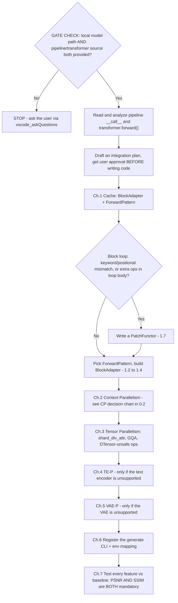
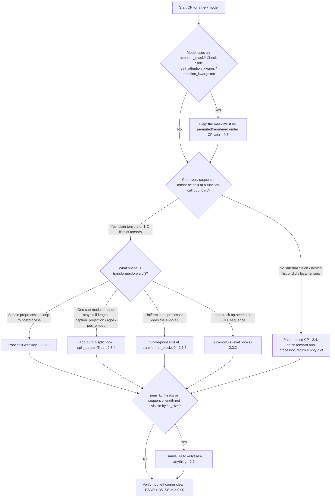
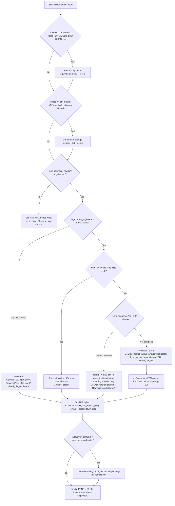

# Cache-DiT Model Integration Guide

## GATE CHECK

Before writing any code, confirm the following:

```
STOP — Has the user provided BOTH of the following?
  1. A local model path (e.g., /workspace/dev/vipdev/hf_models/Krea-2-Turbo)
  2. The model's pipeline/transformer code info:
     - Pipeline class name (e.g., Krea2Pipeline, or third-party like BooguImagePipeline)
     - Transformer class name (e.g., Krea2Transformer2DModel)
     - File paths to the pipeline and transformer source code (diffusers or third-party)
  NO  → **MUST ask the user to specify these before proceeding.**
         Do NOT guess, search blindly, or assume defaults.
  YES → Continue.

STOP — Have you identified the new model's transformer architecture?
  NO  → Read the model's diffusers source code. Identify:
         - The ModuleList name(s) containing transformer blocks (e.g., transformer_blocks)
         - The block forward() signature (inputs and outputs)
  YES → Proceed to Chapter 1 (Cache) and Chapter 6 (CLI) in parallel.
```

**Hard rules:**

- **⚠️ MANDATORY: Local model path and code info.** If the user has not explicitly provided (a) the local model path and (b) the pipeline/transformer class names with source file paths (diffusers or third-party), you **MUST** ask the user to specify them via ``vscode_askQuestions`` before any code changes.  Do NOT search the codebase or assume default paths — the user knows their setup best.
- **⚠️ MANDATORY: Plan before code.** Before writing ANY implementation code, you **MUST**: (1) thoroughly analyze the model's pipeline and transformer source code, (2) create a detailed integration plan following this skill's chapter structure (Cache → CP → TP → TE-P → VAE-P → CLI → Testing), (3) present the plan to the user for review and approval.  **Do NOT start implementing until the user explicitly approves the plan.**  This prevents wasted effort from incorrect assumptions about the model architecture.
- ALWAYS set up local model paths via environment variables BEFORE testing — downloading from HuggingFace Hub is extremely slow.
- ALWAYS compute BOTH PSNR and SSIM when verifying correctness — PSNR alone cannot detect image corruption (garbled output).
- For Python-only changes, `pip install -e "." --no-build-isolation` is sufficient; SVDQuant C++ compilation is NOT required.
- **Do NOT alter core dependency versions** (torch, torchvision, transformers, diffusers, cache-dit, triton) in the `cdit` conda environment. Other dependencies may be installed only if they do not conflict with these.
- **Do NOT modify any code in the diffusers library.** If a model requires patches (e.g., monkey-patching `forward()`, attention processors, etc.), write all patch code inside the cache-dit repository. Diffusers is a third-party dependency and must not be altered.
- **All examples in this skill are references, not templates to copy.** Every model has unique architecture details (block signatures, tensor layouts, shared vs per-block modulation, attention mask requirements, etc.). Before following any example, first analyze whether the referenced model's architecture is actually comparable to the target model. Blindly copying an example that was designed for a different architecture will produce incorrect or broken code.
- ControlNet parallelism is a special case and is NOT covered in this guide.
- **⚠️ GQA attention backend pitfall**: When a model uses GQA (e.g., ``num_heads=48, num_kv_heads=12``), the ``dispatch_attention_fn(..., enable_gqa=True)`` path may cause PyTorch SDPA to fall back to a **slow backend** (``math`` or an inefficient ``mem_efficient`` kernel) because flash-attention / cuDNN SDPA backends have limited GQA support.  **Always benchmark ``enable_gqa=True`` vs. manually repeating K/V heads to match Q heads and passing ``enable_gqa=False``** (MHA path).  On NVIDIA L20, the MHA repeat gave a **~2.2× single-GPU speedup** for Krea-2-Turbo (48 Q / 12 KV heads, 128 head_dim, 4608 seq).  This is not CP-specific — any model with GQA should evaluate whether the repeat→MHA path is faster.  If confirmed, apply the repeat unconditionally in the attention processor patch, not just in the CP path.  Document the finding in the planner's docstring as well (see ``krea2.py`` for an example).

---

## 0. Model Integration Practical Navigation

> Start here. This map orients you before you dive into any chapter. The integration order is **Cache → CP → TP → TE-P → VAE-P → CLI → Testing**; each feature is verified against a single-GPU baseline before moving on.

### 0.1 End-to-End Workflow



### 0.2 Context Parallelism Decision Chart (the highest-risk step)



### 0.3 Tensor Parallelism Decision Chart (second-highest-risk step)



### 0.4 Decision Index — "If you're dealing with X, read §Y"

| Situation | Section |
|---|---|
| Choosing the block I/O pattern | §1.2 ForwardPattern table |
| Block loop calls blocks with keyword args, or has extra ops inside the loop | §1.7 PatchFunctor (Pitfalls A / B) |
| More complex structural patch (per-block forward, block-id injection, block-list merge) | §1.7 "Beyond the two canonical pitfalls" |
| Third-party (non-diffusers) model | §1.6 |
| CP: choosing hook-based vs patch-based | §2.2 + the chart in §0.2 |
| CP: a projection / rope / pos_embed output stays full-length | §2.3.4 output-split hook |
| CP: uniform loop + attention-processor all-to-all | §2.3.5 single-point split |
| CP: an inter-block op needs the full sequence | §2.3.2 sub-module hooks |
| CP: forward does internal concat/split/pad, or has nested/local tensors | §2.4 patch-based |
| CP: head count or sequence length not divisible by cp_size | §2.6 UAA |
| CP: the model has an attention_mask | §2.7 mask permute ⚠️ |
| TP: choosing the overall TP strategy | §3.2 + the chart in §0.3 |
| TP: attention output garbled | §3.2.1 shard_div_attr |
| TP: fused CUDA kernels crash under TP | §3.4.6 DTensor-unsafe ops |
| TP: a single Linear packs fused QKV or out+down weights | §3.2 rule #4 (weight rearrange) |
| TP: GQA with `num_kv_heads` not divisible by `tp_size` | §3.4 (mind the performance caveat) |
| TP: when to use `output_layouts=Replicate()` | §3.1 Replicate table + §3.4.2 |
| New text encoder / new VAE | §4 / §5 |
| Register the model in the CLI | §6 |
| Verify correctness | §7 (PSNR AND SSIM) |

### 0.5 Top Pitfalls That Silently Corrupt Output

These are the traps that pass without crashing but produce wrong images. Each is expanded in its section.

1. **Skipping SSIM.** PSNR alone cannot detect garbled output — a garbled image can still score PSNR > 25 dB. Always compute both. → §7.4
2. **CP + `attention_mask` misalignment.** Ulysses all-to-all reorders the sequence; a position-indexed mask no longer lines up → localized **top-left corruption**, PSNR stuck ~28–30. → §2.7
3. **Missing `shard_div_attr` in TP.** The attention processor reshapes with a stale head count → garbled output (the #1 TP bug). → §3.2.1
4. **PatchFunctor drops loop-body ops.** Extra operations inside the block loop are silently skipped after the cache wrapper takes over → stale `temb` / modulation. → §1.7 Pitfall B
5. **GQA attention TP via `Replicate` is *correct* but often *slower* than a single GPU** (all-gather on Q dominates). Benchmark against FFN-only TP before shipping. → §3.4
6. **DTensor-unsafe fused kernels** (flash_attn SwiGLU, triton RMSNorm) crash with illegal-memory-access under TP → patch them to PyTorch ops first. → §3.4.6

---

## 1. Cache Integration: BlockAdapter + ForwardPattern

### 1.1 Concept

cache-dit's caching engine works by intercepting the forward pass of DiT transformer blocks. To do this, it needs to know:

1. **Where the blocks are** — which `ModuleList` attribute holds the repeated transformer blocks.
2. **What goes in and out** — the block's `forward()` input/output signature ("forward pattern").
3. **Any model quirks** — separate CFG passes, special patching needs, etc.

All of this is described by a single `BlockAdapter` dataclass instance.

### 1.2 ForwardPattern — The 6 Block I/O Contracts

`ForwardPattern` is an enum in `src/cache_dit/caching/forward_pattern.py`. It captures the hidden-state ordering and forward-signature shape of a family of transformer blocks. Choose the pattern that matches your block's `forward()` signature:

| Pattern             | `forward()` inputs                       | `forward()` returns                      | Return_H_First | Return_H_Only | Forward_H_only | Typical Models                                                         |
| ------------------- | ------------------------------------------ | ------------------------------------------ | -------------- | ------------- | -------------- | ---------------------------------------------------------------------- |
| **Pattern_0** | `(hidden_states, encoder_hidden_states)` | `(hidden_states, encoder_hidden_states)` | `True`       | `False`     | `False`      | Mochi, CogVideoX, CogView4, HunyuanVideo, EasyAnimate                  |
| **Pattern_1** | `(hidden_states, encoder_hidden_states)` | `(encoder_hidden_states, hidden_states)` | `False`      | `False`     | `False`      | Flux transformer_blocks, QwenImage, SD3, VisualCloze                   |
| **Pattern_2** | `(hidden_states, encoder_hidden_states)` | `(hidden_states,)`                       | `False`      | `True`      | `False`      | Wan, Allegro, Cosmos, LTX-1                                            |
| **Pattern_3** | `(hidden_states,)`                       | `(hidden_states,)`                       | `False`      | `True`      | `True`       | Flux single_transformer_blocks, DiT, PixArt, Sana, Lumina2, SkyReelsV2 |
| **Pattern_4** | `(hidden_states,)`                       | `(hidden_states, encoder_hidden_states)` | `True`       | `False`     | `True`       | (rare)                                                                 |
| **Pattern_5** | `(hidden_states,)`                       | `(encoder_hidden_states, hidden_states)` | `False`      | `False`     | `True`       | (rare)                                                                 |

**How to determine the correct pattern for your model:**

1. Open the block's `forward()` method in diffusers source.
2. Check the parameter list: does it take only `hidden_states`, or also `encoder_hidden_states`? This determines `Forward_H_only`.
3. Check the return statement: does it return one tensor or two? In what order? This determines `Return_H_Only` / `Return_H_First`.
4. Match against the table above. If none fits exactly, open an issue.

### 1.3 BlockAdapter Parameters

Defined in `src/cache_dit/caching/block_adapters/block_adapters.py`. Key parameters:

| Parameter                 | Type                                               | Description                                                                                                                                                                 |
| ------------------------- | -------------------------------------------------- | --------------------------------------------------------------------------------------------------------------------------------------------------------------------------- |
| `pipe`                  | `DiffusionPipeline` or `FakeDiffusionPipeline` | The pipeline instance (or a placeholder if no pipeline is available).                                                                                                       |
| `transformer`           | `nn.Module` or `List[nn.Module]`               | The transformer module(s). Single module for most models; list of 2 for dual-transformer models (e.g., Wan 2.2 MoE).                                                        |
| `blocks`                | `nn.ModuleList` or `List[nn.ModuleList]`       | The block collection(s). Single ModuleList for most models; list of 2 for models with dual block types (e.g., Flux:`transformer_blocks` + `single_transformer_blocks`). |
| `forward_pattern`       | `ForwardPattern` or `List[ForwardPattern]`     | Must match`blocks` count. Single pattern for single block list; list of patterns for multiple block lists.                                                                |
| `check_forward_pattern` | `Optional[bool]`                                 | Validate that each block's I/O matches the declared pattern. If left `None` (default), cache-dit **auto-detects**: `True` for `diffusers` transformers, `False` for third-party ones (`maybe_skip_checks()`); it is also forced `False` when the transformer already has an `_hf_hook` / `_diffusers_hook`. Set explicitly for new models.                                                             |
| `check_num_outputs`     | `bool`                                           | If`True`, cache-dit additionally validates that each block returns the exact number of outputs the pattern declares. Needed for models whose blocks can return a variable tuple (e.g., HiDream, HunyuanVideo 1.0). Default `False`.                                             |
| `has_separate_cfg`      | `bool`                                           | Set`True` if the model performs separate conditional/unconditional forward passes for Classifier-Free Guidance.                                                           |
| `patch_functor`         | `PatchFunctor` or `None`                       | Optional pre-patch logic. Used when the model needs structural modification before caching hooks are installed (e.g., Flux dummy block merging, DiT re-patching).           |
| `blocks_name`           | `str` or `List[str]`                           | Override block attribute names (advanced).                                                                                                                                  |
| `dummy_blocks_names`    | `List[str]`                                      | Names of blocks that should be treated as dummy/merged (advanced, e.g., Flux single_transformer_blocks when merged into transformer_blocks).                                |

### 1.4 Implementation Templates

#### Template A: Single block list (most common)

```python
# In src/cache_dit/caching/block_adapters/adapters.py

@BlockAdapterRegister.register("MyModel")
def mymodel_adapter(pipe, **kwargs) -> BlockAdapter:
    from diffusers import MyModelTransformer2DModel

    _relaxed_assert(pipe.transformer, MyModelTransformer2DModel)
    return BlockAdapter(
        pipe=pipe,
        transformer=pipe.transformer,
        blocks=pipe.transformer.transformer_blocks,
        forward_pattern=ForwardPattern.Pattern_0,    # adjust to your model
        check_forward_pattern=True,
        **kwargs,
    )
```

#### Template B: Dual block lists (like Flux)

```python
# Standard Flux: both block types use Pattern_1.
# For Flux2 / Nunchaku variants: single_transformer_blocks use Pattern_3 instead.

@BlockAdapterRegister.register("Flux")
def flux_adapter(pipe, **kwargs) -> BlockAdapter:
    from diffusers import FluxTransformer2DModel

    _relaxed_assert(pipe.transformer, FluxTransformer2DModel)
    return BlockAdapter(
        pipe=pipe,
        transformer=pipe.transformer,
        blocks=[
            pipe.transformer.transformer_blocks,
            pipe.transformer.single_transformer_blocks,
        ],
        forward_pattern=[
            ForwardPattern.Pattern_1,
            ForwardPattern.Pattern_1,
        ],
        check_forward_pattern=True,
        **kwargs,
    )
```

#### Template C: Dual transformers (like Wan 2.2 MoE)

```python
@BlockAdapterRegister.register("Wan")
def wan_adapter(pipe, **kwargs) -> BlockAdapter:
    return BlockAdapter(
        pipe=pipe,
        transformer=[
            pipe.transformer,
            pipe.transformer_2,          # second transformer (MoE)
        ],
        blocks=[
            pipe.transformer.blocks,
            pipe.transformer_2.blocks,
        ],
        forward_pattern=[
            ForwardPattern.Pattern_2,
            ForwardPattern.Pattern_2,
        ],
        check_forward_pattern=True,
        has_separate_cfg=True,
        **kwargs,
    )
```

### 1.5 Registration

After implementing the adapter function, register it in `src/cache_dit/caching/block_adapters/__init__.py`:

```python
# Add this line:
mymodel_adapter = _safe_import(".adapters", "mymodel_adapter")
```

The `BlockAdapterRegister.register("MyModel")` decorator on your function already links the model name. The `__init__.py` import ensures the adapter is discovered at runtime.

### 1.6 Third-Party (Non-Diffusers) Models

If your model does **not** come from the official `diffusers` library (e.g., it is defined in `sglang` or another third-party package), follow these rules:

**Do NOT hardcode `from diffusers import ...`.** Instead, use `_safe_import` with name-based matching, or simply skip the diffusers-specific import entirely.

**`_relaxed_assert` is NOT mandatory.** The function (`src/cache_dit/caching/block_adapters/adapters.py`) checks `transformer.__module__` — if it does not start with `"diffusers"`, the function logs a warning and skips the strict type check automatically. For third-party models, you can:

- Omit `_relaxed_assert` entirely, or
- Call it with `allow_classes=None` to rely on the automatic skip behavior.

**Example — third-party BlockAdapter without `_relaxed_assert`:**

```python
@BlockAdapterRegister.register("MyThirdPartyModel")
def mythirdparty_adapter(pipe, **kwargs) -> BlockAdapter:
    # No `from diffusers import ...` — the transformer type is resolved at runtime.
    return BlockAdapter(
        pipe=pipe,
        transformer=pipe.transformer,
        blocks=pipe.transformer.transformer_blocks,
        forward_pattern=ForwardPattern.Pattern_0,
        check_forward_pattern=True,
        **kwargs,
    )
```

**The same principle applies to distributed modules** (CP, TP, TE-P, VAE-P planners): do not hardcode diffusers class names in `@...PlannerRegister.register(...)` if the model is from a third-party library. Instead, register under a descriptive name and ensure the dispatch logic matches on that name.

**Dependency management for third-party models:** The goal is to run the model through cache-dit inside the existing `cdit` conda environment. Follow these rules strictly:

- **Do NOT change** the versions of `torch`, `torchvision`, `transformers`, `diffusers`, `cache-dit`, or `triton` — these are cache-dit's core stack and altering them may break cache-dit itself.
- **Other dependencies** (e.g., `einops`, `opencv-python`, model-specific packages) may be installed ONLY if they do not conflict with the core stack above. Check `pip check` after installing.
- **Prefer importing optional dependencies lazily** (inside adapter/planner functions) rather than at module level, so the model integration does not force all users to install extra packages.
- If the third-party model requires a newer version of a core dependency, work with the cache-dit maintainers to upgrade it centrally rather than changing it unilaterally.

### 1.7 PatchFunctor — When the Default BlockAdapter Is Not Enough

> ⚠️ **Always check for these pitfalls before declaring the cache integration "done."** A BlockAdapter that looks correct on paper can silently produce wrong results if the `transformer.forward()` has any of the structural issues below. When in doubt, run a full inference with caching enabled and compare PSNR/SSIM against the uncached baseline.

The `BlockAdapter` works by intercepting the block-loop inside `transformer.forward()`. It replaces the original `ModuleList` (e.g., `self.transformer_blocks`) with `UnifiedBlocks` — a wrapper that injects cache look-up/save logic around each block call. This interception is mechanical: it relies on `inspect.signature` to bind arguments and on the assumption that the for-loop body contains **nothing but a single block call**. When the model's `forward()` violates these assumptions, the cache produces wrong results silently (no crash, just corrupted output).

A **`PatchFunctor`** is a monkey-patch that rewrites `transformer.forward()` *before* the `BlockAdapter` is applied. It exists solely to fix structural incompatibilities that would otherwise break the caching interceptor.

Two categories of pitfalls require a `PatchFunctor`:

#### Pitfall A: Block call argument mismatch (keyword vs positional)

**Problem**: `transformer.forward()` calls blocks with **keyword arguments** (e.g., `block(hidden_states=x, encoder_hidden_states=e, temb=t)`), but the block's `forward()` signature defines those parameters as **positional**. When cache-dit's `UnifiedBlocks` wrapper intercepts the call, it uses `inspect.signature.bind()` to match arguments — keyword-to-positional mismatches cause `bind()` to fail or bind to the wrong parameters.

**Symptom**: `TypeError` from `inspect.signature.bind()`, or the cache silently feeds wrong tensors to the block.

**Solution**: Write a `PatchFunctor` that rewrites the call site to pass positional arguments as positional (matching the block's actual signature), keeping only truly keyword-only parameters as keyword args.

**Canonical example — `LTX2PatchFunctor`** (`src/cache_dit/caching/patch_functors/functor_ltx2.py`):

The original diffusers code for LTX-2.0 passes all block arguments as keywords:

```python
# Original (diffusers) — ALL keyword args:
hidden_states, audio_hidden_states = block(
    hidden_states=hidden_states,
    audio_hidden_states=audio_hidden_states,
    encoder_hidden_states=encoder_hidden_states,
    audio_encoder_hidden_states=audio_encoder_hidden_states,
    temb=temb,
    temb_audio=temb_audio,
    ...
)
```

The patched version converts the first four positional parameters to positional form, keeping the rest as keyword:

```python
# Patched — positional args match the block's forward(hidden_states, audio_hidden_states, ...):
hidden_states, audio_hidden_states = block(
    hidden_states,
    audio_hidden_states,
    encoder_hidden_states,
    audio_encoder_hidden_states,
    temb=temb,
    temb_audio=temb_audio,
    ...
)
```

**How to detect this pitfall**: Read the block's `forward()` signature in the diffusers source. Count how many parameters are positional (before any `*` or `*args`). Then check how `transformer.forward()` invokes the block — if it passes any of those positional params as keyword args, you need a PatchFunctor.

#### Pitfall B: For-loop body has extra operations

**Problem**: The `for block in self.blocks:` loop in `transformer.forward()` contains operations *other than* the block call itself — such as `temb` reassignment, conditional checks, or tensor reshaping. After `CacheAdapter.apply()` replaces `self.blocks` with `UnifiedBlocks`, the caching wrapper **takes over the iteration** and only executes the block call; all extra operations inside the original loop body are **silently skipped**.

**Symptom**: Cache-enabled output is corrupted (low PSNR/SSIM, visual artifacts) because modulation parameters or intermediate tensors are stale or missing.

**Solution**: Write a `PatchFunctor` that moves the extra operations **outside** (before or after) the for-loop, so the loop body contains only the block call.

**Canonical example — `ErnieImagePatchFunctor`** (`src/cache_dit/caching/patch_functors/functor_ernie_image.py`):

The original diffusers code reconstructs `temb` inside the loop body:

```python
# Original (diffusers) — temb reassigned INSIDE the for-loop:
for layer in self.layers:
    temb = [shift_msa, scale_msa, gate_msa, shift_mlp, scale_mlp, gate_mlp]
    x = layer(x, rotary_pos_emb, temb, attention_mask=attention_mask)
```

After `CacheAdapter.apply()` replaces `self.layers` with `UnifiedBlocks`, the `temb = [...]` line is never executed — each block receives a stale or undefined `temb`. The patched version moves `temb` construction **before** the loop:

```python
# Patched — temb constructed ONCE before the loop:
temb = [shift_msa, scale_msa, gate_msa, shift_mlp, scale_mlp, gate_mlp]
for layer in self.layers:
    x = layer(x, rotary_pos_emb, temb, attention_mask=attention_mask)
```

**How to detect this pitfall**: Inspect the for-loop body in `transformer.forward()`. If *any* line between `for ... in self.XXX:` and the actual block call does something other than a trivial `if torch.is_grad_enabled()` guard, you likely need a PatchFunctor.

#### Beyond the two canonical pitfalls

Pitfalls A and B are the two simplest cases (fix at the call site, or hoist one line out of the loop). Real models often need heavier PatchFunctors. Browse `src/cache_dit/caching/patch_functors/` (13+ functors) before writing your own — recurring patterns include:

- **Per-block `forward()` replacement + block-id injection** — when the loop body has *per-block* extra operations that cannot simply be hoisted (they depend on the block index). The functor patches `transformer.forward()` **and** each block's `forward()`, and injects a `_block_id` / `_layer_id` onto every block so the patched block can look up per-block data (skip-connection lists, per-block encoder states, control hints). Examples: `HiDreamPatchFunctor`, `HunyuanDiTPatchFunctor`, `WanVACEPatchFunctor`, `ChromaPatchFunctor`, `GlmImagePatchFunctor`, `BriaFiboPatchFunctor`.
- **Block signature modification** — rewriting a block's `forward()` signature so the caching wrapper can bind it (e.g. `FluxPatchFunctor` adds an `encoder_hidden_states` parameter to `FluxSingleTransformerBlock` in older diffusers).
- **Block-list merge / dummy blocks** — structurally merging two `ModuleList`s into one for unified caching (e.g. `FluxPatchFunctor` merging `transformer_blocks` + `single_transformer_blocks` when `dummy_blocks_names` is set).

The rules below (identical signature, identical output when cache is disabled, minimal changes) apply to all of these.

#### Implementing a PatchFunctor (template)

```python
# In src/cache_dit/caching/patch_functors/functor_my_model.py

from .functor_base import PatchFunctor

class MyModelPatchFunctor(PatchFunctor):

    def _apply(self, transformer, **kwargs):
        # Always check the transformer type if importing from diffusers:
        # from diffusers.models.transformers.transformer_xxx import MyTransformer
        # assert isinstance(transformer, MyTransformer)

        # Replace transformer.forward with the patched version:
        transformer.forward = _patched_forward.__get__(transformer)
        transformer._is_patched = True
        return transformer


def _patched_forward(self, hidden_states, ...):
    """Patched forward — same logic as original, with structural fixes applied."""
    ...  # Copy the original forward body and apply fixes at the affected sites.
```

Then reference it in your `BlockAdapter`:

```python
@BlockAdapterRegister.register("MyModel")
def mymodel_adapter(pipe, **kwargs) -> BlockAdapter:
    return BlockAdapter(
        pipe=pipe,
        transformer=pipe.transformer,
        blocks=pipe.transformer.transformer_blocks,
        forward_pattern=ForwardPattern.Pattern_0,
        check_forward_pattern=True,
        patch_functor=MyModelPatchFunctor(),    # ← wire up the patch
        **kwargs,
    )
```

**Key rules for PatchFunctor:**

- The patched `forward()` **must** keep the exact same signature (parameter names, types, defaults) as the original — the pipeline calls it with the same arguments.
- The patched `forward()` **must** produce identical output to the original when caching is disabled — verify with PSNR/SSIM before enabling the cache.
- Only fix the structural issue; do not refactor, optimize, or "improve" unrelated code in the patched forward.
- Import the transformer class **lazily** (inside `_apply()`) if the model's diffusers version may not be installed everywhere.

---

## 2. Context Parallelism (CP)

### 2.1 Concept

Context Parallelism splits the **sequence dimension** of hidden states across multiple GPUs. Each GPU computes attention over a local chunk, then gathers results. cache-dit supports two CP strategies:

- **Ulysses** (`--parallel ulysses`): All-to-all communication. Better for shorter sequences or when combined with TP. **Always prefer Ulysses over Ring** — it is more mature, better tested, and supports `--ulysses-anything` (UAA) for non-divisible head counts and sequence lengths.
- **Ring** (`--parallel ring`): Peer-to-peer communication in a ring topology. Better for very long sequences. Only consider Ring if Ulysses is proven inadequate for your use case.

### 2.2 Two Implementation Approaches

> **⚠️ MANDATORY: Hook-based first.** You MUST attempt a hook-based CP plan before considering patch-based. The hook mechanism supports 1-D flat lists of tensors (each element is split independently). Only fall back to patch-based when you can articulate a specific structural reason hook-based cannot work — e.g., deeply nested list/dict structures, tensors that are not function parameters (local intermediates), or forward() methods with complex internal fusion that requires split boundaries BETWEEN internal operations rather than at function-call boundaries.
>
> Start with transformer-level hooks (§2.3.1). If the model has inter-block operations that need the full sequence, try sub-module-level hooks (§2.3.2). Patch-based (§2.4) is the LAST resort.

cache-dit offers **two** distinct CP implementation patterns. Hook-based is the standard approach; patch-based exists only for the rare cases where hooks are structurally impossible.

| Priority | Approach | Mechanism | When to use |
|---|---|---|---|
| **1st** | **Hook-based** (§2.3) | Declarative `_ContextParallelInput` / `_ContextParallelOutput` dict; framework inserts split/gather hooks at specified function-call boundaries. | All block inputs are **plain tensors or 1-D flat lists of tensors** (hook iterates and splits each element), and the `forward()` method has no internal tensor fusion or complex attention-mask logic. |
| **2nd (last resort)** | **Patch-based** (§2.4) | Monkey-patch `transformer.forward()` (and optionally the attention processor); manually split/gather at the correct boundaries; return `{}` from `_apply()`. | The `forward()` method does internal fusion (concat/split/pad) that requires split points INSIDE the function body (not at function-call boundaries), or there are deeply nested list/dict-of-tensors structures. **Only use after confirming hook-based is truly infeasible.** |

> **Decision shortcut**: If you can express the CP logic as "split these named tensors before the block loop, gather these named tensors after", use hook-based. If you find yourself thinking "I need to split this AFTER the concat on line 87 but BEFORE the layer loop on line 92", first try sub-module-level hooks (§2.3.2). Only if that also fails (e.g., the tensors you need to split are not function parameters but intermediate locals) should you consider patch-based.

### 2.3 Hook-Based CP

The hook mechanism inserts split/gather operations at **function-call boundaries** of the transformer module tree. Hooks are specified as a dict `{module_path: {param_name: _ContextParallelInput(...)}, ...}`. The framework uses `inspect.signature` on each intercepted function to match parameter names; non-tensor parameters (str, int, list, dict) are silently ignored.

There are two **granularity levels** within hook-based CP:

#### 2.3.1 Transformer-Level CP Plan (Recommended Default)

The hook key `""` (empty string) means **"apply to `transformer.forward()`"** — the hooks intercept the top-level forward's arguments and return values. All sequence-dependent tensors are split **before** the block loop and gathered **after** it.

**When to use**: The model's `forward()` is a simple "preprocess → block loop → postprocess" pipeline where all block inputs are plain tensors. No inter-block operations need the full sequence.

**Examples**: `FluxContextParallelismPlanner` (`flux.py`), `OvisImageContextParallelismPlanner` (`ovis_image.py`), `ChromaContextParallelismPlanner` (`chroma.py`), `LongCatImageContextParallelismPlanner` (`longcat_image.py`), and the vanilla `Flux2ContextParallelismPlanner` (`flux2.py`). (Note: many models do NOT split at the root `""` but at a single block boundary `transformer_blocks.0` and rely on the attention processor's all-to-all to keep later blocks consistent — see §2.3.5.)

**Template** (Flux / OvisImage pattern):

```python
from .register import (
    ContextParallelismPlanner,
    ContextParallelismPlannerRegister,
)
from ...distributed.core import _ContextParallelInput, _ContextParallelOutput

@ContextParallelismPlannerRegister.register("MyModelTransformer2DModel")
class MyModelContextParallelismPlanner(ContextParallelismPlanner):

    def _apply(self, transformer=None, parallelism_config=None, **kwargs):
        _cp_plan = {
            # "" = transformer.forward() — intercept top-level args
            "": {
                "hidden_states":
                    _ContextParallelInput(split_dim=1, expected_dims=3, split_output=False),
                "encoder_hidden_states":
                    _ContextParallelInput(split_dim=1, expected_dims=3, split_output=False),
                "img_ids":
                    _ContextParallelInput(split_dim=0, expected_dims=2, split_output=False),
                "txt_ids":
                    _ContextParallelInput(split_dim=0, expected_dims=2, split_output=False),
            },
            # Gather the output of the final projection layer
            "proj_out": _ContextParallelOutput(gather_dim=1, expected_dims=3),
        }
        return _cp_plan
```

The `""` key exposes every named parameter of `transformer.forward()` to hooks. Split happens once, before any block executes. Gather happens once, after all blocks finish. This is the **simplest, most efficient** pattern — use it unless your model's architecture prevents it.

**When transformer-level is NOT suitable** — the root-level plan can break in two distinct ways, and each has a lighter-weight fix than "convert everything to per-block split/gather":

1. **A per-block sub-module produces a sequence-dependent output that must match the LOCAL (split) sequence** — e.g. BriaFIBO's per-block `caption_projection`, QwenImage's `pos_embed`, or Wan/SkyReels/HunyuanImage's `rope`. You do NOT need to abandon the root plan: keep splitting the main tensors at the root, and add an **output-split hook** (`split_output=True`) on that one sub-module so its output is re-split to the local sequence. See §2.3.4.

2. **An inter-block operation genuinely needs the FULL (gathered) sequence** — e.g. history/current fusion, ControlNet injection, or multiple `ModuleList`s with different structures. Only then drop down to **sub-module-level hooks** (§2.3.2), which gather → run the op on the full sequence → re-split at each boundary (at the cost of extra communication).

> ⚠️ **Do NOT reflexively rewrite a root plan into a per-block split-and-gather of `transformer_blocks.*` + `single_transformer_blocks.*`.** That structure double-splits, is almost never correct, and **no shipped planner uses it** — including BriaFIBO, whose real CP plan is a root split plus a `caption_projection` output-split plus a mask permute (see §2.3.4 and §2.7), NOT a per-block plan.

#### 2.3.2 Sub-Module-Level CP Plan (Per-Block / Per-Layer)

Hooks are inserted on **specific sub-module paths** (e.g., `"blocks.0.attn1"`, `"blocks.*.ffn"`). Split/gather happens at each sub-module boundary — the sequence is split, a single sub-module runs on the local chunk, then the sequence is gathered again before the next sub-module runs.

**When to use**: The model has inter-block operations that **require the full sequence** between blocks. Common triggers:

1. **Cross-attention between different sequence groups** where two sub-sequences are split/merged between blocks (e.g., Helios's history-current state fusion).
2. **ControlNet block sample injection** where an external tensor is added to the hidden states between layers (e.g., ZImage's `unified + controlnet_block_samples[layer_idx]`).
3. **Multiple `ModuleList`s with different structures** (e.g., ZImage's `noise_refiner` → `context_refiner` → `layers`).
4. **Per-block outputs that diverge into separate paths** before being re-merged later.

**Examples**: `HeliosContextParallelismPlanner` (`helios.py`), `ZImageContextParallelismPlanner` (`zimage.py`).

**Template** (Helios pattern — per-attn/ffn hooks):

```python
@ContextParallelismPlannerRegister.register("HeliosTransformer3DModel")
class HeliosContextParallelismPlanner(ContextParallelismPlanner):

    def _apply(self, transformer=None, parallelism_config=None, **kwargs):
        num_blocks = len(transformer.blocks)
        _cp_plan = {
            # Split at each attn/ffn sub-module boundary.
            # Wildcard "blocks.*" matches all blocks.
            "blocks.*.attn1": {
                "hidden_states": _ContextParallelInput(split_dim=1, expected_dims=3, split_output=False),
                "rotary_emb": _ContextParallelInput(split_dim=1, expected_dims=3, split_output=False),
            },
            "blocks.*.attn2": {
                "hidden_states": _ContextParallelInput(split_dim=1, expected_dims=3, split_output=False),
            },
            "blocks.*.ffn": {
                "hidden_states": _ContextParallelInput(split_dim=1, expected_dims=3, split_output=False),
            },
            # Gather after every sub-module (needed because of history-current fusion between them).
            **{f"blocks.{i}.attn1": _ContextParallelOutput(gather_dim=1, expected_dims=3)
               for i in range(num_blocks)},
            **{f"blocks.{i}.attn2": _ContextParallelOutput(gather_dim=1, expected_dims=3)
               for i in range(num_blocks)},
            **{f"blocks.{i}.ffn": _ContextParallelOutput(gather_dim=1, expected_dims=3)
               for i in range(num_blocks)},
        }
        return _cp_plan
```

**Template** (ZImage pattern — multi-ModuleList + ControlNet injection):

```python
@ContextParallelismPlannerRegister.register("ZImageTransformer2DModel")
class ZImageContextParallelismPlanner(ContextParallelismPlanner):

    def _apply(self, transformer=None, parallelism_config=None, **kwargs):
        n_noise_refiner = len(transformer.noise_refiner)
        n_context_refiner = len(transformer.context_refiner)
        _cp_plan = {
            # ModuleList 1: noise_refiner (split at first block, gather after last)
            "noise_refiner.0": {
                "x": _ContextParallelInput(split_dim=1, expected_dims=3, split_output=False),
            },
            "noise_refiner.*": {
                "freqs_cis": _ContextParallelInput(split_dim=1, expected_dims=3, split_output=False),
            },
            f"noise_refiner.{n_noise_refiner - 1}":
                _ContextParallelOutput(gather_dim=1, expected_dims=3),
            # ModuleList 2: context_refiner (same pattern)
            "context_refiner.0": {
                "x": _ContextParallelInput(split_dim=1, expected_dims=3, split_output=False),
            },
            f"context_refiner.{n_context_refiner - 1}":
                _ContextParallelOutput(gather_dim=1, expected_dims=3),
            # ModuleList 3: main layers (split/gather at each block due to ControlNet injection)
            "layers.*": {
                "x": _ContextParallelInput(split_dim=1, expected_dims=3, split_output=False),
                "freqs_cis": _ContextParallelInput(split_dim=1, expected_dims=3, split_output=False),
            },
            **{f"layers.{i}": _ContextParallelOutput(gather_dim=1, expected_dims=3)
               for i in range(len(transformer.layers))},
        }
        return _cp_plan
```

**⚠️ Trade-off**: Sub-module-level plans introduce **extra all-gather + re-split overhead** at every hook boundary. For a 30-layer model with per-block hooks, this adds 30× more communication than a transformer-level plan. Only use this when the model's inter-block logic genuinely requires the full sequence. For most models, the transformer-level plan (§2.3.1) is sufficient and more performant.

#### 2.3.3 Hook Key Reference

| Key pattern | Intercepts | Example |
|---|---|---|
| `""` | `transformer.forward()` args & return | `"hidden_states": _ContextParallelInput(...)` inside `""` |
| `"blocks.0"` | `transformer.blocks[0].forward()` args & return | First block only |
| `"blocks.*.attn1"` | `attn1.forward()` of every block | Wildcard — applies to all matching sub-modules |
| `"blocks.{N-1}"` | `transformer.blocks[N-1].forward()` | Last block only (gather output) |
| `"proj_out"` | `transformer.proj_out()` return value | Output-only hook (no input split) |
| `"pos_embed"` | `transformer.pos_embed()` args & return | Pre-embedding split |

**Hook semantics** (`_ContextParallelInput` / `_ContextParallelOutput`):

- **`split_dim`**: Dimension to split. For `[B, S, D]` tensors, `split_dim=1` splits sequence. For `[B, S]` position IDs, `split_dim=0` splits batch.
- **`expected_dims`**: Number of tensor dimensions expected (2, 3, or 4). Used for validation.
- **`split_output`**: If `True`, also splits the return value after the function runs (rarely needed; default `False`).
- **`gather_dim`**: Dimension along which to all-gather the output (usually matches the corresponding `split_dim`).
- **Parameters not listed** in the hook dict are passed through unchanged (not split, not gathered).
- **Scalar non-tensor parameters** (str, int, float, bool) are silently ignored by hooks — they cannot be split.
- **1-D flat lists of tensors** (e.g., `text_encoder_layers: list[Tensor]`, `temb: list[Tensor]`) are supported — the hook iterates and splits each tensor element independently. Nested structures (list of lists, dict of tensors) are NOT supported.

#### 2.3.4 Output-Split Hook (`split_output=True`) — Re-Splitting a Sub-Module Output

This is the **correct, lightweight fix** for the most common "root plan is almost right, but one sub-module output has the wrong sequence length" situation. Instead of dropping to a per-block plan, you keep the root `""` split and add **one** hook on the offending sub-module with `split_output=True`.

**The problem it solves.** When you split `hidden_states` / `encoder_hidden_states` at the root, some models have a sub-module (usually a *per-block projection* or a *RoPE / position-embedding builder*) that either (a) is called on a **full-sequence** input and returns a full-sequence output that must be re-split to the local chunk, or (b) recomputes a sequence-length-dependent tensor internally. The main tensors are already local, but this one sub-module output is not — so the block sees mismatched sequence lengths and produces garbage.

**The mechanism.** A `_ContextParallelInput(..., split_output=True)` hook on a sub-module path does two things: it splits the named **input** before the sub-module runs *and* splits the sub-module's **return value** after it runs. Keyed on a `ModuleList` wildcard (e.g. `"caption_projection.*"`), it applies to every element of that list. The dict key is the **positional argument index** (an `int`) or the **parameter name** (a `str`).

**Canonical example — BriaFIBO** (`bria_fibo.py`, `BriaFiboContextParallelismPlanner`). BriaFIBO has one `caption_projection` per block, each projecting the text embedding for that block. The real plan is a **root split** plus a **`caption_projection.*` output-split** plus a **mask permute** (see §2.7) — NOT a per-block plan:

```python
@ContextParallelismPlannerRegister.register("BriaFiboTransformer2DModel")
class BriaFiboContextParallelismPlanner(ContextParallelismPlanner):
    def _apply(self, transformer=None, parallelism_config=None, **kwargs):
        _patch_bria_fibo_mask_permute(transformer)   # §2.7: permute the 2D mask under CP
        _cp_plan = {
            # Root split: main sequence tensors + position ids.
            "": {
                "hidden_states":
                    _ContextParallelInput(split_dim=1, expected_dims=3, split_output=False),
                "encoder_hidden_states":
                    _ContextParallelInput(split_dim=1, expected_dims=3, split_output=False),
                "img_ids":
                    _ContextParallelInput(split_dim=0, expected_dims=2, split_output=False),
                "txt_ids":
                    _ContextParallelInput(split_dim=0, expected_dims=2, split_output=False),
            },
            # Output-split: each per-block caption_projection output is re-split
            # so it stays aligned with the LOCAL encoder_hidden_states.
            # Key 0 = the first positional arg of caption_projection[i].forward().
            "caption_projection.*": {
                0: _ContextParallelInput(split_dim=1, expected_dims=3, split_output=True),
            },
            # Single gather restores the full sequence for the output head.
            "proj_out": _ContextParallelOutput(gather_dim=1, expected_dims=3),
        }
        return _cp_plan
```

**Other real users of output-split:**

| Model | Sub-module | Why `split_output=True` |
|---|---|---|
| **BriaFIBO** (`bria_fibo.py`) | `caption_projection.*` (positional arg `0`) | Per-block text projection must match the local sequence. |
| **QwenImage** (`qwen_image.py`, newer diffusers) | `pos_embed` (args `0`, `1`) | The position embedder returns full-sequence RoPE tables that must be re-split. |
| **Wan / ChronoEdit / SkyReels** (`wan.py`, `chrono_edit.py`, `skyreels.py`) | `rope` (args `0`, `1`) | RoPE freqs are recomputed on the full sequence; split the two returned tensors. |
| **HunyuanImage / HunyuanVideo** (`hunyuan.py`) | `rope` (args `0`, `1`) | Same RoPE re-split, combined with the mask reorder of §2.7. |
| **LTX2** (`ltx2.py`) | `rope`, `audio_rope`, `cross_attn_rope`, `cross_attn_audio_rope` | Four separate RoPE tables, each output-split. |

**Rule of thumb**: if a root plan gives wrong results and the culprit is a *single* projection / RoPE / pos-embed sub-module whose output length is full instead of local, reach for an output-split hook **before** considering §2.3.2 (sub-module-level) or §2.4 (patch-based).

#### 2.3.5 Single-Point Split at `transformer_blocks.0` (Common "Processor-Driven" Pattern)

Many models do NOT split at the root `""`. Instead they split the sequence **once**, on the input of the **first block** (`transformer_blocks.0`), and rely on the **attention processor's Ulysses all-to-all** to keep every subsequent block consistent (each block's attention internally all-to-all's the sequence back and forth). A matching output gather is placed on the last block or on the final projection.

**When to use**: The block loop is uniform (every block has the same signature) and the attention processor is patched to call `_dispatch_attention_fn` with the CP config, so the sequence "just flows" through the local chunks. This is the single **most common** CP shape in the codebase.

**Real users**: `CogVideoX`, `CogView3Plus`, `CogView4`, `ConsisID`, `DiT`, `PixArt`, `HunyuanImage`, `HunyuanVideo`, and newer `QwenImage`. Most of these also patch the attention processor and add a `rope` output-split (§2.3.4).

**Sketch**:

```python
_cp_plan = {
    # Split once, on the first block's input.
    "transformer_blocks.0": {
        "hidden_states": _ContextParallelInput(split_dim=1, expected_dims=3),
        "encoder_hidden_states": _ContextParallelInput(split_dim=1, expected_dims=3),
    },
    # Often combined with a rope output-split (see §2.3.4):
    "rope": {0: _ContextParallelInput(split_dim=1, expected_dims=3, split_output=True),
             1: _ContextParallelInput(split_dim=1, expected_dims=3, split_output=True)},
    # Gather after the last block (or on the final projection).
    f"transformer_blocks.{n_blocks - 1}": _ContextParallelOutput(gather_dim=1, expected_dims=3),
}
```

> The gather key is model-specific — Flux/OvisImage gather on `proj_out`, DiT on `proj_out_2`, CogVideoX/ConsisID on the last block, ZImage on its final layer. Always check where the full sequence must be restored for the output head.

### 2.4 Patch-Based CP

> ⚠️ **This is a fallback, not a first choice.** Before writing a patch-based CP planner, you MUST exhaust hook-based options: first try transformer-level hooks (§2.3.1), then sub-module-level hooks (§2.3.2). Only when both fail — and you can articulate the specific structural reason (e.g., "temb is a list, hooks cannot split list elements", not "it seems complicated") — should you proceed with patch-based. Patches bypass the framework's validation and require manual maintenance of split/gather boundaries across forward() code changes.

When hook-based semantics **cannot express** the needed CP logic, fall back to monkey-patching. This is necessary when:

| Trigger | Why hooks fail | Example |
|---|---|---|
| **Nested list/dict structures** | Hook cannot iterate nested `list[list[Tensor]]` or `dict[str, Tensor]` | Models with hierarchical block groupings |
| **Internal tensor fusion** | Transformer does concat/split/pad/flat inside `forward()` — hooks at function-call boundaries cannot intercept internal transformations | BooguImage: `flat_and_pad_to_seq`, double→single stream fusion |
| **Complex per-block control flow** | Different block types need different split boundaries; hook-based sub-module plans would double-split | BooguImage: double-stream layers (full seq) → single-stream layers (split) |
| **Locally-created tensors** | Tensors created as local variables inside `forward()` (not function parameters) cannot be reached by hooks | Attention masks built from position IDs inside forward |

**Solution**: Monkey-patch `transformer.forward()` (and optionally the attention processor), manually split/gather at the correct internal boundaries, and return an **empty dict `{}`** from `_apply()` — no hook-based plan is needed because all CP logic lives inside the patches.

**Template**:

```python
@ContextParallelismPlannerRegister.register("MyModel")
class MyModelCPPlanner(ContextParallelismPlanner):

    def _apply(self, transformer=None, parallelism_config=None, **kwargs):
        if transformer is not None:
            # Optional: patch the attention processor for UAA dispatch
            _patch_attention_processor_for_cp(transformer)
            # Required: patch transformer.forward() for split/gather
            _patch_transformer_forward_for_cp(transformer)
        return {}  # empty — all CP logic is in the patches
```

**Reference implementations**:

- **`ErnieImageContextParallelismPlanner`** (`ernie_image.py`) — legacy patch-based CP for historical reasons (originally written before hook-based list support was added). Uses monkey-patched `transformer.forward()` for split/gather.

- **`BooguImageContextParallelismPlanner`** (`boogu_image.py`) — internal `flat_and_pad_to_seq`, double→single stream fusion, GQA with `num_kv_heads=7`. Monkey-patches BOTH `transformer.forward()` AND the attention processor. The forward patch handles: preprocessing + double-stream (full seq) → split joint sequence → single-stream on local chunk → all-gather → `norm_out`. The processor patch does KV→Q repeat BEFORE `_dispatch_attention_fn` (to avoid non-integer GQA ratios after UAA split) and passes `enable_gqa=False`.

**Key rules for patch-based CP:**

1. **Split AFTER preprocessing, BEFORE the main block loop.** Preprocessing (embedding, patching, RoPE, modulation) runs on the full sequence on every GPU — it is cheap (no attention compute) and avoids complex split/gather logic for non-standard tensors.
2. **DO NOT split `attention_mask` — but CHECK whether it must be REORDERED.** Ulysses all-to-all internally recovers the full sequence, so each GPU keeps the complete mask (never `tensor_split` it). **However**, all-to-all *reorders* the recovered sequence into rank-concatenated order, so any mask indexed by sequence position can become misaligned. A 1D key-only mask `[B, 1, 1, S_full]` broadcasts over the query dim and needs reordering along the **key** dim only (Hunyuan pattern). A 2D full mask `[B, 1, S, S]` must be permuted along **both** query and key dims (BriaFIBO pattern). Getting this wrong causes *localized* corruption at the text/image boundary. **See §2.7 — this is one of the most common and hardest-to-spot CP bugs.**
3. **Use `tensor_split` for uneven sequences** (complement to UAA at the sequence level).
4. **All-gather the output** before the final projection (`norm_out`, `proj_out`) so the output head sees the full sequence.
5. **Patch the attention processor** to call `_dispatch_attention_fn` (from `cache_dit.attention`) with `cp_config`. This ensures UAA all-to-all is used inside each attention layer.
6. **GQA handling in the processor patch:** If the model has GQA with indivisible `num_kv_heads`, do the KV→Q repeat BEFORE calling `_dispatch_attention_fn` and pass `enable_gqa=False`. This avoids non-integer GQA ratios after UAA's head split.

### 2.5 Registration

Add to `src/cache_dit/distributed/transformers/planners.py` inside `_activate_cp_planners()`:

```python
MyModelContextParallelismPlanner = _safe_import(
    ".my_model", "MyModelContextParallelismPlanner",
    ImportErrorContextParallelismPlanner)
```

### 2.6 Ulysses Anything Attention (UAA)

**UAA** (Ulysses Anything Attention) extends Ulysses CP to handle two common scenarios that vanilla Ulysses cannot:

1. **Head count not divisible by `cp_size`** — e.g., `num_kv_heads=7` with `cp_size=2`.
2. **Sequence length not divisible by `cp_size`** — uneven sequence splits.

UAA is enabled via the `--ulysses-anything` CLI flag:

```bash
# task: task name for logging and output organization
CUDA_VISIBLE_DEVICES=6,7 torchrun --nproc_per_node=2 \
    -m cache_dit.generate <model_name> \
    --parallel ulysses --ulysses-anything \
    --save-path .tmp/{task}/<model_name>_ulysses_uaa.png
```

**How it works:** UAA internally pads K/V heads and/or sequence lengths to the nearest divisible size before the all-to-all communication, then strips the padding after. The padding is transparent — no model code changes are needed. The all-to-all primitives (`_all_to_all_single_any_qkv_async` / `_all_to_all_single_any_o_async` in `src/cache_dit/distributed/core/_distributed_primitives.py`) handle the padding logic automatically.

**When to use UAA:**

- Model has GQA with `num_kv_heads` not divisible by `cp_size` (e.g., Boogu-Image with 7 KV heads).
- Sequence lengths vary across samples in a batch or are not divisible by `cp_size`.
- Any model where vanilla Ulysses crashes with divisibility errors.

### 2.7 ⚠️ Attention Mask vs CP Sequence Reordering (Critical Pitfall)

> **If the model uses an `attention_mask`, CP can silently corrupt the output even when nothing crashes.** This is the single most common "CP runs but the image is wrong" bug. ALWAYS check for a mask before assuming a model is CP-safe.

**Why it happens.** Ulysses all-to-all does NOT preserve the original sequence order. Each rank holds a local sequence `[text_local, image_local]`, and the all-to-all concatenates them **in rank order**, so the global sequence the attention kernel actually sees is:

```
[text_0, image_0, text_1, image_1, ...]   # rank-concatenated
```

not the original `[text_all, image_all]`. For a **mask-free** model this is harmless — attention is permutation-equivariant, so every token still gets the correct output regardless of order (RoPE is applied per-token *before* the all-to-all). But if the model applies an `attention_mask` that is indexed by absolute sequence position, the mask no longer lines up with the reordered sequence → wrong entries get masked → **localized corruption**.

**Symptoms (how to recognize it):**

- The image is *mostly correct* but a **small localized region is garbled** — very often the **top-left corner** (the first image patch, which sits right at the text/image concatenation boundary).
- Metrics plateau: PSNR stuck around ~28–30, SSIM ~0.80–0.85, and **no amount of RoPE / split-position tweaking helps**.
- The corruption is **consistent across seeds** and independent of whether you use patch-based or hook-based CP.

**Diagnosis (do this FIRST when metrics are stuck ~30):**

Dump the transformer's real first-step inputs on a single GPU and inspect for a hidden mask:

```python
saved = {}
def pre_hook(m, args, kwargs):
    saved.setdefault("kwargs", {k: (v.detach().cpu() if torch.is_tensor(v) else v)
                                for k, v in kwargs.items()})
pipe.transformer.register_forward_pre_hook(pre_hook, with_kwargs=True)
pipe(prompt=..., num_inference_steps=1)
# Inspect saved["kwargs"] — look inside joint_attention_kwargs / attention_kwargs too!
# A tensor of -inf/0 with shape [B,1,S,S] or [B,1,1,S] is a padding mask.
```

The mask is frequently **buried inside `joint_attention_kwargs["attention_mask"]`** (BriaFIBO) rather than a top-level forward argument, so it is easy to miss. It is typically a **text-padding mask**: real text tokens attend freely, padding text tokens are `-inf` (masked as both key and query), image attends to all image + real text.

**Fix.** Do NOT split the mask. Instead, patch `transformer.forward()` to **permute** the mask into all-to-all order under CP, then delegate the rest to the original forward (local RoPE from split ids is already correct). Build the permutation from each rank's local (text, image) lengths via `all_gather_object`:

```python
import torch, torch.distributed as dist

def _build_ulysses_mask_perm(local_txt, local_img, cp_config, device):
    """Map original [text, image] order -> all-to-all [text_0, img_0, text_1, img_1, ...]."""
    group = cp_config._ulysses_mesh.get_group()
    ws = dist.get_world_size(group)
    gathered = [None] * ws
    dist.all_gather_object(gathered, (int(local_txt), int(local_img)), group=group)
    txt_sizes = [g[0] for g in gathered]
    img_sizes = [g[1] for g in gathered]
    global_txt = sum(txt_sizes)
    perm, t_off, i_off = [], 0, 0
    for r in range(ws):
        perm += range(t_off, t_off + txt_sizes[r])                 # text chunk r
        base = global_txt + i_off
        perm += range(base, base + img_sizes[r])                   # image chunk r
        t_off += txt_sizes[r]; i_off += img_sizes[r]
    return torch.tensor(perm, device=device, dtype=torch.long)

def _patch_forward_for_mask(transformer):
    orig = transformer.forward
    def patched(hidden_states, encoder_hidden_states=None, *, joint_attention_kwargs=None, **kw):
        cp = getattr(transformer, "_cp_config", None)
        if cp is not None and getattr(cp, "_world_size", 1) > 1 and joint_attention_kwargs:
            mask = joint_attention_kwargs.get("attention_mask")
            if mask is not None and mask.dim() == 4:
                perm = _build_ulysses_mask_perm(
                    encoder_hidden_states.shape[1], hidden_states.shape[1], cp, mask.device)
                # 2D full mask: permute BOTH query (-2) and key (-1) dims.
                # 1D key mask [B,1,1,S]: permute only the key dim (-1).
                mask = mask.index_select(-2, perm).index_select(-1, perm)
                joint_attention_kwargs = {**joint_attention_kwargs, "attention_mask": mask}
        return orig(hidden_states, encoder_hidden_states=encoder_hidden_states,
                    joint_attention_kwargs=joint_attention_kwargs, **kw)
    transformer.forward = patched
```

Call `_patch_forward_for_mask(transformer)` inside the planner's `_apply()` before returning the (otherwise standard root-split) CP plan.

**Reference implementations:**

- **BriaFIBO** (`bria_fibo.py`) — 2D `[B,1,S,S]` text-padding mask, permuted on both dims. Fix lifted PSNR 30 → 34.6–37.8, SSIM 0.83 → 0.92–0.97, and eliminated the top-left corruption.
- **HunyuanImage** (`hunyuan.py`, `__patch__HunyuanImageTransformer2DModel_forward__`) — 1D key mask, reordered along the key dim only via interleaved `chunk`+`cat`.
- **HunyuanVideo** (`hunyuan.py`, `__patch__HunyuanVideoTransformer3DModel_forward__`) — same 1D key-mask `chunk`+`cat` reorder, plus an attention-processor patch; a second reference for the 1D pattern.

**Checklist when integrating any new model's CP:**

1. Does the model (or its pipeline) build an `attention_mask`? Search the pipeline `__call__` and the transformer `forward` / attention processor. **Check inside `joint_attention_kwargs` / `attention_kwargs` dicts.**
2. If yes, is it 1D key-mask `[B,1,1,S]` or 2D full `[B,1,S,S]`?
3. Add a forward patch to permute it into all-to-all order (key-only for 1D, both dims for 2D).
4. Verify: top-left corner clean, PSNR > 34, SSIM > 0.90.

---

## 3. Tensor Parallelism (TP)

### 3.1 Concept

Tensor Parallelism splits **model parameters** (weight matrices) across GPUs. Unlike CP which splits the input, TP splits the linear layers themselves. TP reduces per-GPU memory and can be combined with CP for hybrid parallelism (`--parallel ulysses_tp`, `--parallel ring_tp`).

cache-dit's TP is built on top of the **PyTorch tensor parallel API** (`torch.distributed.tensor.parallel`). The core primitives are:

- **`ColwiseParallel()`**: Shards a linear layer along its **output (column) dimension**. For a weight matrix `[out_features, in_features]`, each GPU holds `[out_features / tp_size, in_features]`. The input is replicated (each GPU has a full copy), and each GPU computes a partial output. Use for: Q/K/V projections, FFN first layer — anywhere the output is naturally partitioned (e.g., per-head).
- **`RowwiseParallel()`**: Shards a linear layer along its **input (row) dimension**. For a weight matrix `[out_features, in_features]`, each GPU holds `[out_features, in_features / tp_size]`. Each GPU receives a partial input and computes a partial output, then an **all-reduce** automatically sums the partial results into the full output. Use for: output projections, FFN second layer — anywhere the output needs to be reassembled.

#### `output_layouts` / `input_layouts`: Controlling DTensor Placement

Every `ColwiseParallel` and `RowwiseParallel` layer has two hidden parameters that control how its result is placed across GPUs:

| Parameter | Default | Meaning |
|---|---|---|
| `output_layouts` | `Shard(-1)` | How the layer's **output** DTensor is sharded across GPUs. `Shard(-1)` = each GPU holds a slice along the last dimension. `Replicate()` = each GPU holds a full copy. |
| `input_layouts` | `Shard(-1)` for Rowwise, `Replicate()` for Colwise | How the layer expects its **input** to be placed. `Shard(-1)` = input is already sharded along the last dim. `Replicate()` = input is a full copy on each GPU. |

**Default behavior (efficient, works for most models):**

- `ColwiseParallel()`: each GPU computes a partial output from a replicated input. By default `use_local_output=True`, so the caller receives a **plain local tensor** `[..., out_features/tp]` (not a DTensor). The `output_layouts` default `Shard(-1)` only matters if the output flows into another parallelized layer.
- `RowwiseParallel()`: expects `Shard(-1)` input (from a preceding `ColwiseParallel`), computes a partial output, then **all-reduces** to produce a full result.

**When to override to `Replicate()`:**

The defaults work when tensor flow is a clean chain: `Colwise → Rowwise → Colwise → Rowwise ...`.  You need to override the layouts when there is a **non-TP-aware consumer or producer** between two parallelized layers — typically the **attention processor**.  The processor's `.view()` / `.unflatten()` / RoPE / GQA repeat operations expect a plain tensor of a specific shape and do **not** understand DTensor shard placements.

| Scenario | Override | Why |
|---|---|---|
| **Attention processor between `Colwise(to_q)` and `Rowwise(to_out)`** | `to_q`: `ColwiseParallel(output_layouts=Replicate())` | The processor reshapes the Q projection — it needs the full `[B, S, heads*head_dim]` tensor to correctly `unflatten(-1, (heads, head_dim))`. A `Shard(-1)` output would give the processor a DTensor shard, which corrupts the reshape. `Replicate()` all-gathers the partial Q outputs so the processor sees a complete tensor. |
| **GQA: `num_kv_heads` indivisible by `tp_size`** | `to_q`: `ColwiseParallel(output_layouts=Replicate())`, `to_k`/`to_v`: leave unparallelized | K/V heads cannot be divided evenly — you cannot apply standard `ColwiseParallel` to `to_k`/`to_v`. But you can still shard `to_q` with `Replicate()` and shard `to_out` with `RowwiseParallel(input_layouts=Replicate())` to get partial TP savings for Q + output projection. See §3.4 for full details. |
| **Downstream `RowwiseParallel` receives a Replicate input** | `to_out`: `RowwiseParallel(input_layouts=Replicate())` | If the preceding `ColwiseParallel` used `output_layouts=Replicate()`, the attention processor's output is a full tensor. The downstream `RowwiseParallel` must be told its input is `Replicate()`, not `Shard(-1)`, or it will misinterpret the full tensor as a shard of a larger logical tensor (doubling the effective feature dim → shape crash). |

**Import statement:**

```python
from torch.distributed._tensor import Replicate
```

> **Key takeaway**: `Replicate()` is a **correctness tool, not an optimization**. It adds an all-gather (for output) or a redistribute (for input) at each use — only apply it when the attention processor genuinely cannot handle sharded tensors. For models without GQA and with DTensor-aware attention (or pure FFN sharding), the defaults are both correct and more efficient.  See the decision table in §3.2.1 for when to keep `shard_div_attr` vs. skip it (they are coupled: Replicate + no `shard_div_attr` vs. Shard + `shard_div_attr`).

For a detailed walkthrough, see the official PyTorch tutorial: https://docs.pytorch.org/tutorials/intermediate/TP_tutorial.html

### 3.2 Implementation

Create a TP Planner in the same file as the CP planner:

```python
from torch.distributed.tensor.parallel import (
    ColwiseParallel, RowwiseParallel, parallelize_module,
)
from ..utils import shard_div_attr
from .register import (
    TensorParallelismPlanner,
    TensorParallelismPlannerRegister,
)

@TensorParallelismPlannerRegister.register("MyModel")
class MyModelTensorParallelismPlanner(TensorParallelismPlanner):

    def _apply(self, transformer, parallelism_config, **kwargs):
        tp_mesh = self.mesh(parallelism_config=parallelism_config)
        transformer, layer_plans = self.parallelize_transformer(
            transformer=transformer,
            tp_mesh=tp_mesh,
        )
        return transformer, layer_plans

    def parallelize_transformer(self, transformer, tp_mesh):
        layer_plans = []
        for _, block in transformer.transformer_blocks.named_children():
            # CRITICAL: divide the head count by tp_size
            shard_div_attr(block.attn, "heads", tp_mesh.size())

            layer_plan = {
                # Column-wise: split along output dimension
                "attn.to_q": ColwiseParallel(),
                "attn.to_k": ColwiseParallel(),
                "attn.to_v": ColwiseParallel(),
                # Row-wise: split along input dimension (gathers partial results)
                "attn.to_out.0": RowwiseParallel(),
                # FFN layers
                "ff.net.0.proj": ColwiseParallel(),
                "ff.net.2": RowwiseParallel(),
            }
            parallelize_module(
                module=block,
                device_mesh=tp_mesh,
                parallelize_plan=layer_plan,
            )
            layer_plans.append(layer_plan)

        return transformer, layer_plans
```

**Key rules for TP planners:**

1. **`ColwiseParallel()`**: Use for layers whose output dimension is split across GPUs (Q/K/V projections, FFN first layer).
2. **`RowwiseParallel()`**: Use for layers whose input dimension is split (output projections, FFN second layer). Rowwise layers automatically all-reduce partial results.
3. **`shard_div_attr(module, "heads", tp_size)`**: Always call this on the attention module to update the head count metadata. Without it, attention computation will use the wrong number of heads.
4. **Weight rearrangement before sharding** (⚠️ key difficulty): Some models pack multiple logical projections into a single weight matrix. Before applying `RowwiseParallel` or `ColwiseParallel`, you must rearrange the weights so that the TP-shardable dimension is contiguous and correctly aligned. The canonical example is Flux's `rearrange_proj_out_weight` — a **nested helper defined inside `FluxTensorParallelismPlanner.parallelize_transformer()`** in `src/cache_dit/distributed/transformers/flux.py` (it is a local function, not a module-level import): Flux packs both the `out` and `down` projection weights into `proj_out`, so the weight must be split, rearranged with `einops.rearrange`, and re-concatenated before `RowwiseParallel` is applied. Always inspect your model's weight layout — if a single `nn.Linear` serves multiple logical roles (e.g., fused QKV, combined out+down), you must un-fuse it for the TP dimension before sharding.

### 3.2.1 `shard_div_attr`: Updating Attention Metadata (⚠️ #1 TP Gotcha)

> **This is the single most common cause of silent garbled TP output.** When you shard `to_q`/`to_k`/`to_v` with `ColwiseParallel()`, each GPU's projection now produces only `inner_dim / tp_size` output features. But the attention processor still reads the module's **integer metadata** (e.g. `attn.heads`) to reshape that output — `query.unflatten(-1, (attn.heads, -1))`, `query.view(B, S, attn.heads, head_dim)`, etc. If the metadata is not updated to reflect the reduced per-GPU count, the reshape uses the wrong number of heads and either crashes or silently produces a corrupted image. **Always update the metadata with `shard_div_attr` for every TP-sharded attention block.**

**Signature** (`src/cache_dit/distributed/utils.py`):

```python
shard_div_attr(obj, attr, tp_size, *, what=None, context=None) -> int
```

It divides the integer attribute `obj.attr` by `tp_size` **in place**, after a fail-fast divisibility check (raises `ValueError`, listing valid factors, if `obj.attr % tp_size != 0`), and returns the new value. Import it with `from ..utils import shard_div_attr`.

**Which attributes to divide:** divide **every integer attribute the attention processor uses to reshape a TP-sharded tensor**.

- **`heads`** — always. Every processor uses the head count to unflatten/view the sharded Q/K/V.
- **`inner_dim` / `mlp_hidden_dim` / etc.** — only if the processor uses them to `split`/`view` a **fused** projection whose output you sharded. Separate `to_q`/`to_k`/`to_v` projections do not need these.

**Example A — MHA with separate Q/K/V (e.g. ErnieImage, most models): only `heads`.**

```python
for _, block in transformer.layers.named_children():
    shard_div_attr(block.self_attention, "heads", tp_mesh.size())  # e.g. 24 → 12
    layer_plan = {
        "self_attention.to_q": ColwiseParallel(),
        "self_attention.to_k": ColwiseParallel(),
        "self_attention.to_v": ColwiseParallel(),
        "self_attention.to_out.0": RowwiseParallel(),
        # ... FFN ...
    }
    parallelize_module(module=block, device_mesh=tp_mesh, parallelize_plan=layer_plan)
```

The processor's `query.unflatten(-1, (attn.heads, -1))` now sees `heads=12` and correctly infers `head_dim = (inner_dim / tp) / 12`, keeping `head_dim` intact — which also makes RoPE slices like `x_in[..., :rot_dim]` exact.

**Example B — fused QKV+MLP single block (e.g. Flux2): divide `heads` AND the fused split sizes.**

```python
for _, block in transformer.single_transformer_blocks.named_children():
    self.rearrange_singleblock_weight(block, tp_size)   # un-fuse packed weights first
    shard_div_attr(block.attn, "heads", tp_size)
    shard_div_attr(block.attn, "inner_dim", tp_size)      # processor uses this to split QKV
    shard_div_attr(block.attn, "mlp_hidden_dim", tp_size) # processor uses this to split MLP
    layer_plan = {
        "attn.to_qkv_mlp_proj": ColwiseParallel(),
        "attn.to_out": RowwiseParallel(),
    }
    parallelize_module(module=block, device_mesh=tp_mesh, parallelize_plan=layer_plan)
```

Here the processor slices the single `to_qkv_mlp_proj` output using `inner_dim` and `mlp_hidden_dim`; because those slices are now per-GPU sharded, **both** metadata values must be divided in addition to `heads`. See `Flux2TensorParallelismPlanner` in `src/cache_dit/distributed/transformers/flux2.py`.

**How to know which attributes to divide:** open the attention **processor** (`__call__`) and list every place a `Q/K/V/MLP` tensor is reshaped (`.view`, `.unflatten`, `torch.split`, `.reshape`). Any integer attribute (`attn.xxx`) feeding those reshapes on a sharded tensor must be passed to `shard_div_attr`.

**When to SKIP `shard_div_attr`** (see §3.4 for details):

- **Replicate strategy** — if you shard Q/K/V with `ColwiseParallel(output_layouts=Replicate())`, the processor receives a **full (all-gathered) tensor**, so `heads` must stay at its original value. Calling `shard_div_attr` here would corrupt the reshape.
- **GQA with indivisible `num_kv_heads`** — when `num_kv_heads` is not divisible by `tp_size`, you cannot shard K/V by heads; use the Replicate strategy from §3.4 instead (and do not divide `heads`).

### 3.3 Registration

Add to `src/cache_dit/distributed/transformers/planners.py` inside `_activate_tp_planners()`:

```python
MyModelTensorParallelismPlanner = _safe_import(
    ".my_model", "MyModelTensorParallelismPlanner",
    ImportErrorTensorParallelismPlanner)
```

### 3.4 GQA Models with Non-Divisible KV Heads (Boogu-Image Pattern)

**⚠️ Common pitfall**: When a model uses Grouped Query Attention (GQA) and `num_kv_heads` is **not evenly divisible** by `tp_size`, the standard approach of applying `ColwiseParallel` to all of `to_q`, `to_k`, `to_v` will **fail** — `shard_div_attr` raises a `ValueError` because `num_kv_heads` cannot be split.

This section describes a **numerically correct** TP strategy for this case, using the **Boogu-Image** model (`num_attention_heads=28`, `num_kv_heads=7`, `tp_size=2`) as a concrete reference. The full implementation is at `src/cache_dit/distributed/transformers/boogu_image.py`.

> 🔴 **PERFORMANCE CAVEAT — read this before sharding attention on a GQA model.**
> The `Replicate`-based attention TP below is **correct** (it produces the right image), but it is **not necessarily faster** — and for long sequences it is usually **slower than a single GPU**. Because K/V cannot be sharded, the only way to shard `to_q` is `ColwiseParallel(output_layouts=Replicate())`, which inserts an **all-gather on Q at every attention layer**. On a long joint sequence that all-gather dominates the communication budget and overwhelms the compute savings.
>
> **This is exactly what happened to Boogu-Image in production.** The team measured FFN-only TP as both faster and more accurate than attention TP (`108.9s` vs `115.7s` inference; PSNR `50.2` vs `49.9`), so **the shipped `boogu_image.py` now comments out all attention Q/K/V/out sharding and parallelizes only FFN + modulation** (see `_single_stream_layer_plan` / `_double_stream_layer_plan`). The `Replicate` attention plan below is kept here as a *correctness reference* and for models where attention compute genuinely dominates — **benchmark it against FFN-only TP before shipping it, and default to FFN-only for long-sequence GQA models.**

#### 3.4.1 Problem: DTensor Shard Placement in Attention Processors

A naïve attempt is to shard only `to_q` with `ColwiseParallel()` (keeping `to_k`/`to_v` replicated), plus `to_out.0` with `RowwiseParallel()`, and call `shard_div_attr` to update `attn.heads`:

```python
# ❌ WRONG — produces garbled output (SSIM ≈ 0.02)
shard_div_attr(block.attn, "heads", tp_mesh.size())  # 28 → 14
layer_plan = {
    "attn.to_q": ColwiseParallel(),
    "attn.to_out.0": RowwiseParallel(),
}
```

**Why this fails:** `ColwiseParallel()` (without explicit `output_layouts`) produces a `DTensor` with `Shard(-1)` placement along the **last dimension**. When this `Shard`-placed DTensor enters the attention processor's `.view()` / `.transpose()` operations, PyTorch DTensor's sharding propagation can place the shard along `head_dim` (each GPU gets 60 out of 120 dims) rather than along the **heads** dimension (each GPU gets a subset of complete heads). This corrupts the GQA repeat and SDPA computation, producing severely garbled output.

#### 3.4.2 Correct Strategy: `output_layouts=Replicate()` + `input_layouts=Replicate()`

The fix is to ensure the attention processor **always sees a complete (non-DTensor) tensor** for Q, while still parallelizing the linear projections:

```python
# ✅ CORRECT — PSNR > 46 dB, SSIM > 0.99
layer_plan = {
    "attn.to_q": ColwiseParallel(output_layouts=Replicate()),
    "attn.to_out.0": RowwiseParallel(input_layouts=Replicate()),
}
# NOTE: Do NOT call shard_div_attr — attn.heads stays at 28
```

**How it works:**

| Component | ParallelStyle | What happens |
|---|---|---|
| `attn.to_q` | `ColwiseParallel(output_layouts=Replicate())` | Each GPU computes half the Q features, then **all-gather** merges them. The attention processor sees a full (replicated) Q tensor. |
| `attn.to_k` / `attn.to_v` | **Not parallelized** (omitted from plan) | Full K/V weights on each GPU. `num_kv_heads=7` is indivisible by `tp_size=2`. |
| `attn.to_out.0` | `RowwiseParallel(input_layouts=Replicate())` | Each GPU computes partial output from its weight shard, then **all-reduce** combines them. |

**Why `input_layouts=Replicate()` on `RowwiseParallel` is critical:**  
`RowwiseParallel`'s default `input_layouts` is `Shard(-1)`. If the actual input is a replicated (full) tensor from the attention processor, PyTorch TP will **misinterpret** the local tensor as a shard of a larger logical tensor — effectively doubling the feature dimension. This causes shape mismatches like `[B, S, 2×D] × [D, D]` → crash. Setting `input_layouts=Replicate()` explicitly tells TP that each GPU holds a full copy, so it can correctly `redistribute` to `Shard(-1)` before computing partial contributions.

**When to keep `shard_div_attr` vs. when to skip it:**

| Scenario | Call `shard_div_attr`? | Reason |
|---|---|---|
| Standard `ColwiseParallel()` (output is `Shard(-1)`) | **Yes** | `attn.heads` must be divided so `head_dim` stays correct for the sharded Q dimension. |
| `ColwiseParallel(output_layouts=Replicate())` | **No** | The attention processor sees the full Q dimension (`3360`). `attn.heads` must stay at the original value (`28`) so `head_dim = 3360/28 = 120` is correct. |

#### 3.4.3 Double-Stream / Processor-Owned QKV Projections

Some models (e.g., Boogu-Image's double-stream layers) have Q/K/V projections that live **inside the attention processor** rather than on the `attn` module. In Boogu-Image, `img_instruct_attn.to_q` / `to_k` / `to_v` are **deleted** at init — the processor owns `img_to_q`, `instruct_to_q`, etc. The same `Replicate` strategy applies, but the module paths in the layer plan must target the processor's attributes:

```python
# Joint cross-attention: QKV weights are in the processor, not on attn
layer_plan = {
    "img_instruct_attn.processor.img_to_q": ColwiseParallel(output_layouts=Replicate()),
    "img_instruct_attn.processor.instruct_to_q": ColwiseParallel(output_layouts=Replicate()),
    "img_instruct_attn.to_out.0": RowwiseParallel(input_layouts=Replicate()),
    # img_self_attn uses standard Diffusers Attention (same pattern as single-stream)
    "img_self_attn.to_q": ColwiseParallel(output_layouts=Replicate()),
    "img_self_attn.to_out.0": RowwiseParallel(input_layouts=Replicate()),
}
```

**Key insight for double-stream blocks:** Intermediate output projections (`img_out`, `instruct_out` in the processor) should **not** be parallelized. They sit between the flash-attention output and the final `to_out.0`, and parallelizing them would cause **chained all-reduces** (`img_out` all-reduce → `instruct_out` all-reduce → `to_out.0` all-reduce). Only parallelize the **final output projection** (`attn.to_out.0`) in each attention block.

#### 3.4.4 Verification Results (Boogu-Image, tp_size=2)

> **These numbers were measured on the earlier `Replicate`-based attention-TP prototype**, to prove it is *numerically* correct. They are **not** the shipped configuration — see the performance caveat at the top of §3.4. Note that FFN-only TP already reaches PSNR 47.61 and was ultimately chosen for production because it is faster **and** slightly more accurate (PSNR 50.2 vs 49.9) than full attention TP.

| Configuration | Steps | PSNR (dB) | SSIM |
|---|---|---|---|
| **FFN-only TP (shipped)** | 50 | 47.61 | — |
| Full TP (Q+out+FFN, single-stream only) | 4 | 48.45 | 0.9945 |
| Full TP (single + double-stream attention) | 4 | 46.77 | 0.9944 |
| **Full TP (all layers)** | **50** | **49.99** | **0.9974** |

Acceptance criteria: PSNR > 35 dB, SSIM > 0.90. All configurations pass comfortably.

#### 3.4.5 Head Padding (Alternative, Not Yet Needed)

Another approach for GQA TP is to **pad** `num_kv_heads` to the nearest multiple of `tp_size` (e.g., 7 → 8) by adding zero-initialized rows to `to_k.weight` / `to_v.weight`, and correspondingly pad `to_q.weight` and `to_out.0.weight` to maintain consistent shapes. This would allow standard `ColwiseParallel` for all of Q/K/V. However, the `Replicate` strategy described above is simpler and already achieves near-identical numerical results, so padding is reserved for future optimization when attention compute becomes the bottleneck.

#### 3.4.6 DTensor-Unsafe Fused Ops: Patch Before Parallelizing

**⚠️ Common pitfall**: Some models use environment-variable-gated fused CUDA kernels (e.g., flash_attn SwiGLU, triton RMSNorm) that operate on raw GPU memory and do **not** understand DTensor shard placements. When TP wraps model parameters as DTensors, these fused kernels will either crash (`cudaErrorIllegalAddress`) or silently produce wrong results.

**Symptoms:**
- `CUDA error: an illegal memory access was encountered` during NCCL collective (the kernel corrupted memory that NCCL later tries to read).
- PSNR collapses to ~28 dB, SSIM drops to ~0.28 — the model runs without crashing but produces garbled output.

**Root cause:** The fused kernel reads/writes memory assuming a contiguous full tensor, but DTensor has split the tensor across GPUs. The kernel accesses addresses that belong to another GPU's shard → illegal memory access.

**Fix: Monkey-patch the unsafe ops back to DTensor-compatible PyTorch equivalents BEFORE calling `parallelize_module`.**

Reference implementation: `_patch_dtensor_unsafe_modules()` in `src/cache_dit/distributed/transformers/boogu_image.py`.

**Template:**

```python
def _patch_dtensor_unsafe_for_tp(block: nn.Module) -> None:
    """Replace fused CUDA kernels with DTensor-safe PyTorch ops before TP."""

    # 1. SwiGLU: flash_attn fused kernel → PyTorch F.silu + multiply
    for ffn_name in ("feed_forward", "img_feed_forward", "instruct_feed_forward"):
        ffn = getattr(block, ffn_name, None)
        if ffn is None:
            continue
        swiglu_fn = getattr(ffn, "swiglu", None)
        if swiglu_fn is None:
            continue
        fn_cls = getattr(swiglu_fn, "__self__", None)
        if fn_cls is not None and getattr(fn_cls, "__module__", "").startswith("flash_attn"):
            ffn.swiglu = _dtensor_safe_swiglu  # F.silu(x).to(dtype) * y

    # 2. RMSNorm: triton fused kernel → torch.nn.RMSNorm
    #    CRITICAL: copy the learned weight from the old module
    for name, module in list(block.named_modules()):
        if type(module).__module__ == "boogu.ops.triton.layer_norm":
            weight = module.weight
            new_norm = torch.nn.RMSNorm(
                weight.shape[0], eps=module.eps,
                elementwise_affine=True, device=weight.device, dtype=weight.dtype)
            new_norm.weight.data.copy_(weight.data)  # ← MUST copy weight!
            parent_path, leaf = name.rsplit(".", 1)
            setattr(block.get_submodule(parent_path), leaf, new_norm)
```

**Common fused ops that need patching:**

| Op | Unsafe Variant | DTensor-Safe Replacement |
|---|---|---|
| SwiGLU | `flash_attn.ops.activations.swiglu` | `F.silu(x.float()).to(x.dtype) * y` |
| RMSNorm / LayerNorm | `triton.layer_norm.RMSNorm` | `torch.nn.RMSNorm` |
| Fused MLP | Any single-kernel fused projection+activation | Decompose into individual `nn.Linear` + activation |

**How to detect:** Identify these ops by searching the model source for `import flash_attn` / `import triton` and checking for env-var-gated feature flags like `os.getenv("device")`. Any op behind such a gate that is a custom CUDA kernel is suspect.

---

## 4. Text Encoder Parallelism (TE-P)

### 4.1 Concept

TE-P shards the text encoder (e.g., T5, CLIP) across GPUs using the same TP mechanism. It is independent of transformer TP — you can use TE-P with or without transformer TP. Activate via `--parallel-text` (or `--parallel-text-encoder`).

### 4.2 When to implement

Implement TE-P only if your model uses a text encoder that is **not yet supported** by cache-dit. Currently supported encoders include: T5, UMT5, Mistral, Qwen2.5-VL, Qwen3, Llama, Gemma, Glm, GlmImage, SmolLM3. If your model uses one of these, TE-P works out of the box.

### 4.3 Finding the TP Plan from HuggingFace Transformers

**⚠️ Key technique**: Most HuggingFace transformer models already define a canonical TP plan in their config class. This is the best reference for which layers should be `colwise` vs `rowwise`. For example, `cache-dit`'s `Qwen3TensorParallelismPlanner` (in `src/cache_dit/distributed/text_encoders/qwen3.py`) hardcodes a layer plan that **mirrors the structure of** `Qwen3Config.base_model_tp_plan` in the transformers library (it does not read the config attribute at runtime — it just uses the same colwise/rowwise mapping):

```python
# From transformers: Qwen3Config.base_model_tp_plan
base_model_tp_plan = {
    "layers.*.self_attn.q_proj": "colwise",
    "layers.*.self_attn.k_proj": "colwise",
    "layers.*.self_attn.v_proj": "colwise",
    "layers.*.self_attn.o_proj": "rowwise",
    "layers.*.mlp.gate_proj": "colwise",
    "layers.*.mlp.up_proj": "colwise",
    "layers.*.mlp.down_proj": "rowwise",
}
```

When implementing a new TE-P planner, always check the encoder's `Config` class (e.g., `T5Config`, `LlamaConfig`, `GemmaConfig`) for a similar `base_model_tp_plan` — it tells you exactly which layer names map to `colwise`/`rowwise`, saving you from reverse-engineering the architecture.

### 4.4 Implementation

In `src/cache_dit/distributed/text_encoders/<encoder_name>.py`:

```python
from torch.distributed.tensor.parallel import ColwiseParallel, RowwiseParallel, parallelize_module
from .register import (
    TextEncoderTensorParallelismPlanner,
    TextEncoderTensorParallelismPlannerRegister,
)

@TextEncoderTensorParallelismPlannerRegister.register("MyTextEncoderModel")
class MyTextEncoderTensorParallelismPlanner(TextEncoderTensorParallelismPlanner):

    def _apply(self, text_encoder, parallelism_config, **kwargs):
        tp_mesh = self.mesh(parallelism_config=parallelism_config)
        layer_plans = []
        for _, block in text_encoder.encoder.block.named_children():
            layer_plan = {
                "attention.self.query": ColwiseParallel(),
                "attention.self.key": ColwiseParallel(),
                "attention.self.value": ColwiseParallel(),
                "attention.output.dense": RowwiseParallel(),
                "intermediate.dense": ColwiseParallel(),
                "output.dense": RowwiseParallel(),
            }
            parallelize_module(block, device_mesh=tp_mesh, parallelize_plan=layer_plan)
            layer_plans.append(layer_plan)
        return text_encoder, layer_plans
```

### 4.5 Registration

Add to `src/cache_dit/distributed/text_encoders/planners.py` inside `_activate_text_encoder_tp_planners()`:

```python
MyTextEncoderTensorParallelismPlanner = _safe_import(
    ".my_encoder", "MyTextEncoderTensorParallelismPlanner")
```

---

## 5. VAE Parallelism (VAE-P)

### 5.1 Concept

VAE-P applies **data parallelism** (not tensor parallelism) to the VAE decoder. Multiple GPUs each decode a portion of the latent grid, then results are stitched together. This is useful when the VAE decoder is a memory bottleneck. Activate via `--parallel-vae`.

### 5.2 When to implement

Implement VAE-P only if your model uses a VAE that is **not yet supported**. Currently supported: AutoencoderKL (generic), plus specialized variants for LTX2, QwenImage, Wan, HunyuanVideo, and Flux2.

### 5.3 Implementation

In `src/cache_dit/distributed/autoencoders/<vae_name>.py`:

```python
from ..config import ParallelismConfig
from .register import (
    AutoEncoderDataParallelismPlanner,
    AutoEncoderDataParallelismPlannerRegister,
)

@AutoEncoderDataParallelismPlannerRegister.register("MyAutoencoderKL")
class MyAutoencoderKLDataParallelismPlanner(AutoEncoderDataParallelismPlanner):

    def _apply(
        self,
        auto_encoder: torch.nn.Module,
        parallelism_config: ParallelismConfig,
        **kwargs,
    ) -> torch.nn.Module:
        # Obtain the data-parallel device mesh
        dp_mesh = self.mesh(parallelism_config=parallelism_config)
        # Apply your model-specific tiling / P2P communication logic here.
        # See src/cache_dit/distributed/autoencoders/autoencoder_kl.py for the
        # reference implementation (TileBatchedP2PComm + parallelize_tiling).
        return auto_encoder
```

### 5.4 Registration

Add to `src/cache_dit/distributed/autoencoders/planners.py` inside `_activate_auto_encoder_dp_planners()`:

```python
MyAutoencoderKLDataParallelismPlanner = _safe_import(
    ".my_vae", "MyAutoencoderKLDataParallelismPlanner")
```

---

## 6. generate CLI Integration

### 6.1 Concept

Cache-dit's `python3 -m cache_dit.generate` CLI discovers models through `ExampleRegister`. Each model registers a factory function that returns an `Example` dataclass specifying the pipeline class, default parameters, and model path.

### 6.2 Implementation

In `src/cache_dit/_utils/examples.py`:

```python
@ExampleRegister.register("my_model", default="org/my-model-on-huggingface")
def my_model_example(args: argparse.Namespace, **kwargs) -> Example:
    from diffusers import MyModelPipeline

    return Example(
        args=args,
        init_config=ExampleInitConfig(
            task_type=ExampleType.T2I,            # T2I, IE2I, T2V, I2V, etc.
            model_name_or_path=_path("org/my-model-on-huggingface"),
            pipeline_class=MyModelPipeline,
            # Optional: hints for BitsAndBytes quantization
            bnb_4bit_components=["text_encoder_2"],
        ),
        input_data=ExampleInputData(
            prompt="A cat holding a sign that says hello world",
            height=1024,
            width=1024,
            num_inference_steps=28,
        ),
    )
```

**`ExampleType` options:**

- `ExampleType.T2I` — Text to Image
- `ExampleType.IE2I` — Image Editing to Image
- `ExampleType.T2V` — Text to Video
- `ExampleType.I2V` — Image to Video
- `ExampleType.FLF2V` — First/Last Frames to Video
- `ExampleType.VACE` — Video All-in-one Creation and Editing

**`ExampleInputData` key fields:**

- `prompt`, `negative_prompt`: text prompts
- `height`, `width`: output resolution
- `num_inference_steps`: diffusion steps (default 28)
- `num_frames`: for video models
- `guidance_scale`: CFG scale
- `seed`: for reproducibility
- `image`, `mask_image`: for image-editing models
- `extra_input_kwargs`: dict of model-specific kwargs

### 6.3 Registration

Add to `src/cache_dit/_utils/__init__.py`:

```python
my_model_example = _safe_import(".examples", "my_model_example")
```

### 6.4 Environment Variable Mapping

In `src/cache_dit/_utils/examples.py`, the `_env_path_mapping` dict maps environment variables to default HuggingFace model IDs. Add your model:

```python
_env_path_mapping = {
    # ... existing entries ...
    "MY_MODEL_DIR": "org/my-model-on-huggingface",
}
```

Users then set `export MY_MODEL_DIR=/path/to/local/model` to avoid downloading from HuggingFace Hub.

---

## 7. Testing & Verification

```
╔══════════════════════════════════════════════════════════════╗
║  ⚠️  TESTING IS MANDATORY — DO NOT SKIP                      ║
║                                                              ║
║  Every integration feature (Cache, CP, TP, TE-P, VAE-P)      ║
║  MUST be tested against a baseline.  Guessing "it            ║
║  should work" is not acceptable.  Subtle bugs (e.g.,         ║
║  DTensor shard placement issues, incorrect GQA handling)     ║
║  can produce visually plausible but mathematically wrong     ║
║  output that is only caught by quantitative metrics.         ║
║                                                              ║
║  NEVER skip SSIM.  PSNR alone can NOT detect garbled         ║
║  images.  A corrupted image can still have PSNR > 25 dB.     ║
║  If you omit SSIM you WILL ship broken code.                 ║
╚══════════════════════════════════════════════════════════════╝
```

### 7.1 Prerequisites: Local Model Path

**⚠️ CRITICAL: Always set local model paths before testing. Downloading from HuggingFace Hub is extremely slow.**

Models are stored at `/workspace/dev/vipdev/hf_models/`. List available models with `ls /workspace/dev/vipdev/hf_models/`. Set the corresponding environment variable before testing:

```bash
# Find your model's env var in src/cache_dit/_utils/examples.py (_env_path_mapping)
# For example:
export FLUX_DIR=/workspace/dev/vipdev/hf_models/FLUX.1-dev
export QWEN_IMAGE_DIR=/workspace/dev/vipdev/hf_models/Qwen-Image

# Or use --model-path to bypass env vars:
python3 -m cache_dit.generate flux --model-path /workspace/dev/vipdev/hf_models/FLUX.1-dev
```

### 7.2 Installation

```bash
conda activate cdit # if has cdit conda env, otherwise use the default python3 env

# Python-only changes (no C++ compilation needed):
pip install -e "." --no-build-isolation
```

### 7.3 Test Command Matrix

**⚠️ IMPORTANT:** The commands below use `flux` as an **example template**. When testing your new model:

- Replace `flux` with your model's registered name (from `ExampleRegister.register("...")`)
- Replace `FLUX_DIR` with your model's environment variable
- Replace `flux_` in save paths with your model name
- These are **templates**, not instructions to test Flux itself.

```bash
# === 0. Set local model path (REQUIRED) ===
export <NEW_MODEL>_DIR=/workspace/dev/vipdev/hf_models/<your-model-dir>
# Alternative: use --model-path directly

# task: task name for temporary logging and output files 
# === 1. Baseline (no optimizations) ===
python3 -m cache_dit.generate <new_model> --save-path .tmp/{task}/<new_model>_base.png

# === 2. Cache acceleration ===
python3 -m cache_dit.generate <new_model> --cache --summary \
    --save-path .tmp/{task}/<new_model>_cache.png

# === 3. Context Parallelism: Ulysses (2 GPUs) ===
CUDA_VISIBLE_DEVICES=6,7 torchrun --nproc_per_node=2 \
    -m cache_dit.generate <new_model> \
    --parallel ulysses --save-path .tmp/{task}/<new_model>_ulysses2.png

# === 4. Context Parallelism: Ring (2 GPUs) ===
CUDA_VISIBLE_DEVICES=6,7 torchrun --nproc_per_node=2 \
    -m cache_dit.generate <new_model> \
    --parallel ring --save-path .tmp/{task}/<new_model>_ring2.png

# === 5. Tensor Parallelism (2 GPUs) ===
CUDA_VISIBLE_DEVICES=6,7 torchrun --nproc_per_node=2 \
    -m cache_dit.generate <new_model> \
    --parallel tp --save-path .tmp/{task}/<new_model>_tp2.png

# === 6. TP + Text Encoder Parallelism ===
CUDA_VISIBLE_DEVICES=6,7 torchrun --nproc_per_node=2 \
    -m cache_dit.generate <new_model> \
    --parallel tp --parallel-text --save-path .tmp/{task}/<new_model>_tp2_tep2.png

# === 7. TP + VAE Parallelism ===
CUDA_VISIBLE_DEVICES=6,7 torchrun --nproc_per_node=2 \
    -m cache_dit.generate <new_model> \
    --parallel tp --parallel-vae --save-path .tmp/{task}/<new_model>_tp2_vaep2.png
```

### 7.4 Correctness Verification

> ⚠️ **PSNR AND SSIM ARE BOTH MANDATORY — NEVER OMIT SSIM.**
>
> **PSNR alone cannot detect image corruption (garbled output).**  A completely garbled image can still have PSNR > 20 dB or even > 30 dB in some cases, because PSNR only measures per-pixel difference magnitude — it is blind to structural destruction.  SSIM captures perceptual structure and will drop sharply (below 0.5) when the image is corrupted.
>
> **SSIM is not an afterthought — it is the primary guard against silent correctness bugs.**  If you only check PSNR and skip SSIM, you **will** ship broken code.

```bash
# Compare each accelerated result against baseline
cache-dit-metrics psnr ssim -i1 .tmp/{task}/<new_model>_base.png -i2 .tmp/{task}/<new_model>_cache.png
cache-dit-metrics psnr ssim -i1 .tmp/{task}/<new_model>_base.png -i2 .tmp/{task}/<new_model>_ulysses2.png
cache-dit-metrics psnr ssim -i1 .tmp/{task}/<new_model>_base.png -i2 .tmp/{task}/<new_model>_ring2.png
cache-dit-metrics psnr ssim -i1 .tmp/{task}/<new_model>_base.png -i2 .tmp/{task}/<new_model>_tp2.png
cache-dit-metrics psnr ssim -i1 .tmp/{task}/<new_model>_base.png -i2 .tmp/{task}/<new_model>_tp2_tep2.png
cache-dit-metrics psnr ssim -i1 .tmp/{task}/<new_model>_base.png -i2 .tmp/{task}/<new_model>_tp2_vaep2.png
```

**Acceptance criteria:**

- **Cache**: PSNR > 25 dB, SSIM > 0.90 (lossy optimization; exact values depend on `--rdt` threshold).
- **CP/TP/VAE-P**: PSNR > 35 dB, SSIM > 0.90.  These should be numerically near-identical to baseline; the SSIM threshold is set lower than 0.999 to accommodate real-world models like Boogu-Image where CP/TP are verified at ~0.994–0.997.
- **⚠️ Garbled-image red flag**: If PSNR is "reasonable" (e.g., 28 dB) but SSIM is below 0.5, the image is almost certainly visually corrupted. **Do not accept the result** — investigate the root cause (common culprits: missing/wrong `shard_div_attr`, DTensor placement mismatch, incorrect GQA handling).
- Always **visually inspect** at least one output image per configuration.

### 7.5 Results Table

Record your results in this format:

| Configuration     | Latency (s) | PSNR (dB) | SSIM  | GPU Mem (GB) |
| ----------------- | ----------- | --------- | ----- | ------------ |
| Baseline          | —          | ∞        | 1.000 | —           |
| Cache             | —          | —        | —    | —           |
| CP Ulysses (2GPU) | —          | —        | —    | —           |
| CP Ring (2GPU)    | —          | —        | —    | —           |
| TP (2GPU)         | —          | —        | —    | —           |
| TP + TE-P (2GPU)  | —          | —        | —    | —           |
| TP + VAE-P (2GPU) | —          | —        | —    | —           |

**Tips for collecting latency:** Use `--warmup 1 --repeat 1` is enough for stable timing. Use `--track-memory` to log peak GPU memory (usually unnecessary).

### 7.6 Debugging Tips

1. **Model not found**: Run `python3 -m cache_dit.generate list` to verify your model appears in the example list.
2. **BlockAdapter not activating**: Check that `check_forward_pattern=True` and verify the block forward signature matches the declared pattern.
3. **CP/TP errors**: Verify the transformer class name matches exactly what `@ContextParallelismPlannerRegister.register(...)` expects. Check `transformer.__class__.__name__`.
4. **Image corruption with TP**: Ensure `shard_div_attr(block.attn, "heads", tp_mesh.size())` is called for each attention block.
5. **Cache producing identical output to baseline**: The cache warmup may not have completed. Increase `--max-warmup-steps` or decrease `--residual-diff-threshold`.

---

## 8. Reference Code Paths

All paths are relative to the cache-dit repository root.

### Core Integration Files

| Module                       | File                                                        | Purpose                                       |
| ---------------------------- | ----------------------------------------------------------- | --------------------------------------------- |
| BlockAdapter implementations | `src/cache_dit/caching/block_adapters/adapters.py`        | Model-specific adapter functions (30+ models) |
| BlockAdapter registration    | `src/cache_dit/caching/block_adapters/__init__.py`        | `_safe_import` registration of all adapters |
| BlockAdapter class           | `src/cache_dit/caching/block_adapters/block_adapters.py`  | `BlockAdapter` dataclass definition         |
| ForwardPattern enum          | `src/cache_dit/caching/forward_pattern.py`                | 6 block I/O contract patterns                 |
| BlockAdapterRegister         | `src/cache_dit/caching/block_adapters/block_registers.py` | Registration decorator                        |

### Distributed Parallelism Files

| Module                        | File                                                     | Purpose                                                                              |
| ----------------------------- | -------------------------------------------------------- | ------------------------------------------------------------------------------------ |
| CP/TP planner implementations | `src/cache_dit/distributed/transformers/<model>.py`    | Model-specific CP and TP planners                                                    |
| CP/TP planner registration    | `src/cache_dit/distributed/transformers/planners.py`   | `_activate_cp_planners()` / `_activate_tp_planners()`                            |
| CP/TP base classes            | `src/cache_dit/distributed/transformers/register.py`   | `ContextParallelismPlanner`, `TensorParallelismPlanner`, registration decorators |
| CP core types                 | `src/cache_dit/distributed/core/`                      | `_ContextParallelInput`, `_ContextParallelOutput`, `_ContextParallelModelPlan` |
| TE-P planner implementations  | `src/cache_dit/distributed/text_encoders/<encoder>.py` | Text encoder TP planners                                                             |
| TE-P planner registration     | `src/cache_dit/distributed/text_encoders/planners.py`  | `_activate_text_encoder_tp_planners()`                                             |
| VAE-P planner implementations | `src/cache_dit/distributed/autoencoders/<vae>.py`      | VAE data-parallel planners                                                           |
| VAE-P planner registration    | `src/cache_dit/distributed/autoencoders/planners.py`   | `_activate_auto_encoder_dp_planners()`                                             |
| ParallelismConfig             | `src/cache_dit/distributed/config.py`                  | `ParallelismConfig` dataclass                                                      |

### CLI & Examples Files

| Module                       | File                                  | Purpose                                                                                        |
| ---------------------------- | ------------------------------------- | ---------------------------------------------------------------------------------------------- |
| Example implementations      | `src/cache_dit/_utils/examples.py`  | Model example factory functions                                                                |
| Example registration         | `src/cache_dit/_utils/__init__.py`  | `_safe_import` of all examples                                                               |
| Example/ExampleRegister base | `src/cache_dit/_utils/registers.py` | `Example`, `ExampleRegister`, `ExampleInitConfig`, `ExampleInputData`, `ExampleType` |
| CLI entry point              | `src/cache_dit/_utils/generate.py`  | CLI argument parsing and dispatch                                                              |
| CLI argument definitions     | `src/cache_dit/_utils/utils.py`     | `get_base_args()` — all CLI flags                                                           |
| Metrics CLI                  | `src/cache_dit/metrics/metrics.py`  | PSNR, SSIM, LPIPS, FID computation and CLI                                                     |

### Documentation & Examples

| Resource                | File                                          | Purpose                                                                          |
| ----------------------- | --------------------------------------------- | -------------------------------------------------------------------------------- |
| Developer guide         | `docs/developer_guide/SUPPORT_NEW_MODEL.md` | Official step-by-step integration guide                                          |
| CLI examples            | `examples/README.md`                        | Comprehensive CLI usage examples (single-GPU, distributed, quantization, hybrid) |
| Pipeline usage examples | `examples/generate.py`                      | Programmatic pipeline usage examples                                             |
| **User Guide**    | **`docs/user_guide/`**                | **Complete user documentation covering all features:**                     |
|                         | `docs/user_guide/OVERVIEWS.md`              | Feature overview and architecture                                                |
|                         | `docs/user_guide/INSTALL.md`                | Installation guide                                                               |
|                         | `docs/user_guide/CACHE_API.md`              | Cache API usage and configuration                                                |
|                         | `docs/user_guide/DBCACHE_DESIGN.md`         | DBCache algorithm design details                                                 |
|                         | `docs/user_guide/CONTEXT_PARALLEL.md`       | Context Parallelism usage guide                                                  |
|                         | `docs/user_guide/TENSOR_PARALLEL.md`        | Tensor Parallelism usage guide                                                   |
|                         | `docs/user_guide/HYBRID_PARALLEL.md`        | Hybrid CP+TP parallelism                                                         |
|                         | `docs/user_guide/EXTRA_PARALLEL.md`         | TE-P, VAE-P, ControlNet-P guides                                                 |
|                         | `docs/user_guide/COMPILE.md`                | torch.compile integration                                                        |
|                         | `docs/user_guide/QUANTIZATION.md`           | Quantization usage guide                                                         |
|                         | `docs/user_guide/OFFLOAD.md`                | CPU offload guide                                                                |
|                         | `docs/user_guide/ATTENTION.md`              | Attention backend configuration                                                  |
|                         | `docs/user_guide/METRICS.md`                | Metrics and evaluation guide                                                     |
|                         | `docs/user_guide/ENV.md`                    | Environment variables reference                                                  |
|                         | `docs/user_guide/LOAD_CONFIGS.md`           | YAML config file loading                                                         |
