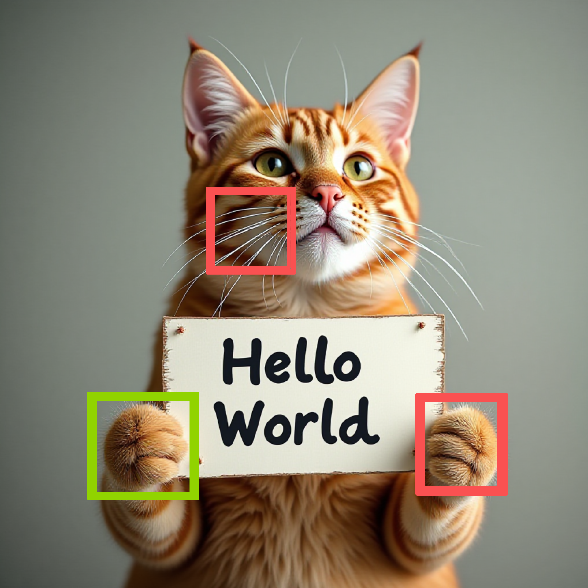

<div align="center">
  <p align="center">
    <h2 align="center">
        
        A PyTorch-native and Flexible Inference Engine with <br>Hybrid Cache Acceleration and Parallelism for 🤗DiTs<br>
        <a href="https://pepy.tech/projects/cache-dit"></a>
        
        
        <a href="https://huggingface.co/docs/diffusers/main/en/optimization/cache_dit"></a> 
        <a href="https://hellogithub.com/repository/vipshop/cache-dit" target="_blank"></a> 
    </h2>
  </p>

|Baseline|SCM S S*|SCM F D*|SCM U D*|+TS|+compile|+FP8*|   
|:---:|:---:|:---:|:---:|:---:|:---:|:---:|
|24.85s|15.4s|11.4s|8.2s|8.2s|**🎉7.1s**|**🎉4.5s**|
||||||||

<p align="center">
  Scheme: <b>DBCache + SCM(steps_computation_mask) + TS(TaylorSeer) + FP8*</b>, L20x1, S*: static cache, <br><b>D*: dynamic cache</b>, <b>S</b>: Slow, <b>F</b>: Fast, <b>U</b>: Ultra Fast, <b>TS</b>: TaylorSeer, <b>FP8*</b>: FP8 DQ + Sage, <b>FLUX.1</b>-Dev
</p>


<p align="center">
    U*: Ulysses Attention, <b>UAA: Ulysses Anything Attenton</b>, UAA*: UAA + Gloo, Device: NVIDIA L20<br>
    FLUX.1-Dev w/o CPU Offload, 28 steps; Qwen-Image w/ CPU Offload, 50 steps; Gloo: Extra All Gather w/ Gloo
</p>

|CP2 U* |CP2 UAA* |  L20x1 | CP2 UAA* | CP2 U* |  L20x1 |  CP2 UAA* | 
|:---:|:---:|:---:|:---:|:---:|:---:|:---:|
|FLUX, 13.87s|**🎉13.88s**|23.25s| **🎉13.75s**|Qwen, 132s|181s|**🎉133s**|
||||||||
|1024x1024|1024x1024|1008x1008|1008x1008|1312x1312|1328x1328|1328x1328|
|✔️U* ✔️UAA|✔️U* ✔️UAA| NO CP|❌U* ✔️UAA|✔️U* ✔️UAA| NO CP|❌U* ✔️UAA|

<p align="center">
 <a href="https://github.com/sgl-project/sglang/blob/main/python/sglang/multimodal_gen/docs/cache_dit.md">
  </a>
 <a href="https://docs.vllm.ai/projects/vllm-omni/en/latest/user_guide/acceleration/cache_dit_acceleration/" >
  </a>
</p>

</div>

## 🔥Hightlight

We are excited to announce that the 🎉[**v1.1.0**](https://github.com/vipshop/cache-dit/releases/tag/v1.1.0) version of cache-dit has finally been released! It brings **[🔥Context Parallelism](./docs/User_Guide.md/#️hybrid-context-parallelism)** and **[🔥Tensor Parallelism](./docs/User_Guide.md#️hybrid-tensor-parallelism)** to cache-dit, thus making it a **[PyTorch-native](./)** and **[Flexible](./)** Inference Engine for 🤗DiTs. Key features: **Unified Cache APIs**, **Forward Pattern Matching**, **Block Adapter**, **DBCache**, **DBPrune**, **Cache CFG**, **TaylorSeer**, **[SCM](./docs/User_Guide.md#scm-steps-computation-masking)**, **Context Parallelism (w/ [UAA](./docs/User_Guide.md#uaa-ulysses-anything-attention))**, **Tensor Parallelism** and **🎉SOTA** performance.

```bash
pip3 install -U cache-dit # Also, pip3 install git+https://github.com/huggingface/diffusers.git (latest)
```
You can install the stable release of cache-dit from PyPI, or the latest development version from GitHub. Then try ♥️ Cache Acceleration with just **one line** of code ~ ♥️
```python
>>> import cache_dit
>>> from diffusers import DiffusionPipeline
>>> pipe = DiffusionPipeline.from_pretrained("Qwen/Qwen-Image") # Can be any diffusion pipeline
>>> cache_dit.enable_cache(pipe) # One-line code with default cache options.
>>> output = pipe(...) # Just call the pipe as normal.
>>> stats = cache_dit.summary(pipe) # Then, get the summary of cache acceleration stats.
>>> cache_dit.disable_cache(pipe) # Disable cache and run original pipe.
```

### 📚Core Features

- **[🎉Full 🤗Diffusers Support](./docs/User_Guide.md#supported-pipelines)**: Notably, **cache-dit** now supports nearly **all** of Diffusers' **DiTs**, include **[60+](./examples/)** DiT-based models, nearly **[100+](./examples/)** pipelines: 🔥FLUX, 🔥Qwen-Image, 🔥Z-image, 🔥Wan, etc.  
- **[🎉Extremely Easy to Use](./docs/User_Guide.md#unified-cache-apis)**: In most cases, you only need **one line** of code: `cache_dit.enable_cache(...)`. After calling this API, just use the pipeline as normal.   
- **[🎉State-of-the-Art Performance](./bench/)**: Compared with other algorithms, cache-dit achieved the **SOTA** w/ **7.4x↑🎉** speedup on ClipScore! Surprisingly, it's **DBCache** also works for extremely few-step distilled models.  
- **[🎉Compatibility with Other Optimizations](./docs/User_Guide.md#️torch-compile)**: Designed to work seamlessly with torch.compile, Quantization, CPU or Sequential Offloading, Context Parallelism, Tensor Parallelism, etc.  
- **[🎉Hybrid Cache Acceleration](./docs/User_Guide.md#taylorseer-calibrator)**: Now supports hybrid **Block-wise Cache + Calibrator** schemes. DBCache acts as the **Indicator** to decide *when* to cache, while the Calibrator decides *how* to cache. 
- **[🎉Ecosystem Integration](https://huggingface.co/docs/diffusers/main/en/optimization/cache_dit)**: 🔥cache-dit has joined the Diffusers community ecosystem as the **first** DiT-specific cache acceleration framework for **[🤗Diffusers](https://huggingface.co/docs/diffusers/main/en/optimization/cache_dit)**, **[🔥SGLang Diffusion](https://github.com/sgl-project/sglang/blob/main/python/sglang/multimodal_gen/docs/cache_dit.md)**, **[🔥vLLM-Omni](https://docs.vllm.ai/projects/vllm-omni/en/latest/user_guide/acceleration/cache_dit_acceleration/)**, **[🔥stable-diffusion.cpp](https://github.com/leejet/stable-diffusion.cpp/blob/master/cache_dit.hpp)**, **[🔥nunchaku](https://nunchaku.tech/docs/nunchaku/usage/cache.html#cache-dit)** and **[🔥sdnext](https://github.com/vladmandic/sdnext/discussions/4269)**.
- **[🎉HTTP Serving Support](./docs/SERVING.md)**: Built-in HTTP serving capabilities for production deployment with simple REST API. Supports **text-to-image**, **image editing**, **text/image-to-video**, and **LoRA**.


## 🔥Supported DiTs

> [!Tip]   
> One Model Series may contain many pipelines. cache-dit applies optimizations at the Transformer level; thus, any pipelines that include the supported transformer are already supported by cache-dit. ✅: supported now; ✖️: not supported now; **[🤖Q](https://github.com/nunchaku-tech/nunchaku)**: **[nunchaku](https://github.com/nunchaku-tech/nunchaku)** w/ SVDQ W4A4; **[C-P](./)**: Context Parallelism; **[T-P](./)**: Tensor Parallelism; **[TE-P](./)**: Text Encoder Parallelism; **[CN-P](./)**: ControlNet Parallelism;  **[VAE-P](./)**: VAE Parallelism (TODO).

<div align="center">

| 📚Supported DiTs: `🤗65+` | Cache  | C-P | T-P | TE-P | CN-P | VAE-P |
|:---:|:---:|:---:|:---:|:---:|:---:|:---:|
| Qwen-Image-2512 | ✅ | ✅ | ✅ | ✅ | ✖️ | ✖️ |
| Z-Image-Turbo `🤖Q` | ✅ | ✅ | ✖️ | ✅ | ✖️ | ✖️ |
| Qwen-Image-Layered | ✅ | ✅ | ✅ | ✅ | ✖️ | ✖️ |
| Qwen-Image-Edit-2511-Lightning | ✅ | ✅ | ✅ | ✅ | ✖️ | ✖️ |
| Qwen-Image-Edit-2511 | ✅ | ✅ | ✅ | ✅ | ✖️ | ✖️ |
| LongCat-Image | ✅ | ✅ | ✅ | ✅ | ✖️ | ✖️ |
| LongCat-Image-Edit | ✅ | ✅ | ✅ | ✅ | ✖️ | ✖️ |
| Z-Image-Turbo | ✅ | ✅ | ✅ | ✅ | ✖️ | ✖️ |
| Z-Image-Turbo-Fun-ControlNet-2.0 | ✅ | ✅ | ✅ | ✅ | ✅ | ✖️ |
| Z-Image-Turbo-Fun-ControlNet-2.1 | ✅ | ✅ | ✅ | ✅ | ✅ | ✖️ |
| Ovis-Image |✅ | ✅ | ✅ | ✅ | ✖️ | ✖️ |
| FLUX.2-dev | ✅ | ✅ | ✅ | ✅ | ✖️ | ✖️ |
| FLUX.1-dev | ✅ | ✅ | ✅ | ✅ | ✖️ | ✖️ |
| FLUX.1-Fill-dev | ✅ | ✅ | ✅ | ✅ | ✖️ | ✖️ |
| FLUX.1-Kontext-dev | ✅ | ✅ | ✅ | ✅ | ✖️ | ✖️ |
| Qwen-Image | ✅ | ✅ | ✅ | ✅ | ✖️ | ✖️ |
| Qwen-Image-Edit | ✅ | ✅ | ✅ | ✅ | ✖️ | ✖️ |
| Qwen-Image-Edit-2509 | ✅ | ✅ | ✅ | ✅ | ✖️ | ✖️ |
| Qwen-Image-ControlNet | ✅ | ✅ | ✅ | ✅ | ✖️ | ✖️ |
| Qwen-Image-ControlNet-Inpainting | ✅ | ✅ | ✅ | ✅ | ✖️ | ✖️ |
| Qwen-Image-Lightning | ✅ | ✅ | ✅ | ✅ | ✖️ | ✖️ |
| Qwen-Image-Edit-Lightning | ✅ | ✅ | ✅ | ✅ | ✖️ | ✖️ |
| Qwen-Image-Edit-2509-Lightning | ✅ | ✅ | ✅ | ✅ | ✖️ | ✖️ |
| Wan-2.2-T2V  | ✅ | ✅ | ✅ | ✅ | ✖️ | ✖️ |
| Wan-2.2-ITV  | ✅ | ✅ | ✅ | ✅ | ✖️ | ✖️ |
| Wan-2.2-VACE-Fun | ✅ | ✅ | ✅ | ✅ | ✖️ | ✖️ |
| Wan-2.1-T2V |  ✅ | ✅ | ✅ | ✅ | ✖️ | ✖️ |
| Wan-2.1-ITV |  ✅ | ✅ | ✅ | ✅ | ✖️ | ✖️ |
| Wan-2.1-FLF2V |  ✅ | ✅ | ✅ | ✅ | ✖️ | ✖️ |
| Wan-2.1-VACE | ✅ | ✅ | ✅ | ✅ | ✖️ | ✖️ |
| HunyuanImage-2.1 | ✅ | ✅ | ✅ | ✅ | ✖️ | ✖️ |
| HunyuanVideo-1.5 | ✅ | ✖️ | ✖️ | ✅ | ✖️ | ✖️ |
| HunyuanVideo | ✅ | ✅ | ✅ | ✅ | ✖️ | ✖️ |
| FLUX.1-dev `🤖Q` | ✅ | ✅ | ✖️ | ✅ | ✖️ | ✖️ |
| FLUX.1-Fill-dev `🤖Q` | ✅ | ✅ | ✖️ | ✅ | ✖️ | ✖️ |
| FLUX.1-Kontext-dev `🤖Q` | ✅ | ✅ | ✖️ | ✅ | ✖️ | ✖️ |
| Qwen-Image `🤖Q` | ✅ | ✅ | ✖️ | ✅ | ✖️ | ✖️ |
| Qwen-Image-Edit `🤖Q` | ✅ | ✅ | ✖️ | ✅ | ✖️ | ✖️ |
| Qwen-Image-Edit-2509 `🤖Q` | ✅ | ✅ | ✖️ | ✅ | ✖️ | ✖️ |
| Qwen-Image-Lightning `🤖Q` | ✅ | ✅ | ✖️ | ✅ | ✖️ | ✖️ |
| Qwen-Image-Edit-Lightning `🤖Q` | ✅ | ✅ | ✖️ | ✅ | ✖️ | ✖️ |
| Qwen-Image-Edit-2509-Lightning `🤖Q` | ✅ | ✅ | ✖️ | ✅ | ✖️ | ✖️ |
| SkyReels-V2-T2V | ✅ | ✅  | ✅  | ✅ | ✖️ | ✖️ |
| LongCat-Video | ✅ | ✖️ | ✖️ | ✅ | ✖️ | ✖️ |
| ChronoEdit-14B | ✅ | ✅ | ✅ | ✅ | ✖️ | ✖️ |
| Kandinsky-5.0-T2V-Lite | ✅ | ✅️ | ✅️ | ✅ | ✖️ | ✖️ |
| PRX-512-t2i-sft | ✅ | ✖️ | ✖️ | ✅ | ✖️ | ✖️ |
| LTX-Video-v0.9.8 | ✅ | ✅ | ✅ | ✅ | ✖️ | ✖️ |
| LTX-Video-v0.9.7 | ✅ | ✅ | ✅ | ✅ | ✖️ | ✖️ |
| CogVideoX | ✅ | ✅ | ✅ | ✅ | ✖️ | ✖️ |
| CogVideoX-1.5 | ✅ | ✅ | ✅ | ✅ | ✖️ | ✖️ |
| CogView-4 | ✅ | ✅ | ✅ | ✅ | ✖️ | ✖️ |
| CogView-3-Plus | ✅ | ✅ | ✅ | ✅ | ✖️ | ✖️ |
| Chroma1-HD | ✅ | ✅ | ✅ | ✅ | ✖️ | ✖️ |
| PixArt-Sigma-XL-2-1024-MS | ✅ | ✅ | ✅ | ✅ | ✖️ | ✖️ |
| PixArt-XL-2-1024-MS | ✅ | ✅ | ✅ | ✅ | ✖️ | ✖️ |
| VisualCloze-512 | ✅ | ✅ | ✅ | ✅ | ✖️ | ✖️ |
| ConsisID-preview | ✅ | ✅ | ✅ | ✅ | ✖️ | ✖️ |
| mochi-1-preview | ✅ | ✖️ | ✅ | ✅ | ✖️ | ✖️ |
| Lumina-Image-2.0 | ✅ | ✖️ | ✅ | ✅ | ✖️ | ✖️ |
| HiDream-I1-Full | ✅ | ✖️ | ✖️ | ✅ | ✖️ | ✖️ |
| HunyuanDiT | ✅ | ✖️ | ✅ | ✅ | ✖️ | ✖️ |
| Sana-1600M-1024px | ✅ | ✖️ | ✖️ | ✅ | ✖️ | ✖️ |
| DiT-XL-2-256 | ✅ | ✅ | ✖️ | ✅ | ✖️ | ✖️ |
| Allegro-T2V | ✅ | ✖️ | ✖️ | ✅ | ✖️ | ✖️ |
| OmniGen-2 | ✅ | ✖️ | ✖️ | ✅ | ✖️ | ✖️ |
| stable-diffusion-3.5-large | ✅ | ✖️ | ✖️ | ✅ | ✖️ | ✖️ |
| Amused-512 | ✅ | ✖️ | ✖️ | ✅ | ✖️ | ✖️ |
| AuraFlow | ✅ | ✖️ | ✖️ | ✅ | ✖️ | ✖️ |

</div>

<details align='center'>
<summary>🔥<b>Click</b> here to show many <b>Image/Video</b> cases🔥</summary>
  
<p align='center'>
  🎉Now, cache-dit covers almost All Diffusers' DiT Pipelines🎉 <br>
   🔥<a href="./examples">Qwen-Image</a> | <a href="./examples">Qwen-Image-Edit</a> | <a href="./examples">Qwen-Image-Edit-Plus </a> 🔥<br>
    🔥<a href="./examples">FLUX.1</a> | <a href="./examples">Qwen-Image-Lightning 4/8 Steps</a> | <a href="./examples"> Wan 2.1 </a> | <a href="./examples"> Wan 2.2 </a>🔥<br>
    🔥<a href="./examples">HunyuanImage-2.1</a> | <a href="./examples">HunyuanVideo</a> | <a href="./examples">HunyuanDiT</a> | <a href="./examples">HiDream</a> | <a href="./examples">AuraFlow</a>🔥<br>
    🔥<a href="./examples">CogView3Plus</a> | <a href="./examples">CogView4</a> | <a href="./examples">LTXVideo</a> | <a href="./examples">CogVideoX</a> | <a href="./examples/">CogVideoX 1.5</a> | <a href="./examples/">ConsisID</a>🔥<br>
    🔥<a href="./examples">Cosmos</a> | <a href="./examples">SkyReelsV2</a> | <a href="./examples">VisualCloze</a> | <a href="./examples">OmniGen 1/2</a> | <a href="./examples">Lumina 1/2</a> | <a href="./examples">PixArt</a>🔥<br>
    🔥<a href="./examples">Chroma</a> | <a href="./examples">Sana</a> | <a href="./examples">Allegro</a> | <a href="./examples">Mochi</a> | <a href="./examples">SD 3/3.5</a> | <a href="./examples">Amused</a> | <a href="./examples"> ... </a> | <a href="./examples">DiT-XL</a>🔥
</p>
  
<div align='center'>
  
  
  
  
  <p><b>🔥Wan2.2 MoE</b> | <a href="https://github.com/vipshop/cache-dit">+cache-dit</a>:2.0x↑🎉 | <b>HunyuanVideo</b> | <a href="https://github.com/vipshop/cache-dit">+cache-dit</a>:2.1x↑🎉</p>
  
  
  
  
  <p><b>🔥Qwen-Image</b> | <a href="https://github.com/vipshop/cache-dit">+cache-dit</a>:1.8x↑🎉 | <b>FLUX.1-dev</b> | <a href="https://github.com/vipshop/cache-dit">+cache-dit</a>:2.1x↑🎉</p>
  
  
  
  
  <p><b>🔥Qwen...Lightning</b> | <a href="https://github.com/vipshop/cache-dit">+cache-dit</a>:1.14x↑🎉 | <b>HunyuanImage</b> | <a href="https://github.com/vipshop/cache-dit">+cache-dit</a>:1.7x↑🎉</p>
  
  
  
  
  <p><b>🔥Qwen-Image-Edit</b> | Input w/o Edit | Baseline | <a href="https://github.com/vipshop/cache-dit">+cache-dit</a>:1.6x↑🎉 | 1.9x↑🎉 </p>
</div>
<div align='center'>
  
  
  
  
  
  <p><b>🔥FLUX-Kontext-dev</b> | Baseline | <a href="https://github.com/vipshop/cache-dit">+cache-dit</a>:1.3x↑🎉 | 1.7x↑🎉 | 2.0x↑ 🎉</p>
  
  
  
  
  
  <p><b>🔥HiDream-I1</b> | <a href="https://github.com/vipshop/cache-dit">+cache-dit</a>:1.9x↑🎉 | <b>CogView4</b> | <a href="https://github.com/vipshop/cache-dit">+cache-dit</a>:1.4x↑🎉 | 1.7x↑🎉</p>
  
  
  
  
  
  <p><b>🔥CogView3</b> | <a href="https://github.com/vipshop/cache-dit">+cache-dit</a>:1.5x↑🎉 | 2.0x↑🎉| <b>Chroma1-HD</b> | <a href="https://github.com/vipshop/cache-dit">+cache-dit</a>:1.9x↑🎉</p>
  
  
  
  
  <p><b>🔥Mochi-1-preview</b> | <a href="https://github.com/vipshop/cache-dit">+cache-dit</a>:1.8x↑🎉 | <b>SkyReelsV2</b> | <a href="https://github.com/vipshop/cache-dit">+cache-dit</a>:1.6x↑🎉</p>
  
  
  
  
  
  <p><b>🔥VisualCloze-512</b> | Model | Cloth | Baseline | <a href="https://github.com/vipshop/cache-dit">+cache-dit</a>:1.4x↑🎉 | 1.7x↑🎉 </p>
  
  
  
  
  <p><b>🔥LTX-Video-0.9.7</b> | <a href="https://github.com/vipshop/cache-dit">+cache-dit</a>:1.7x↑🎉 | <b>CogVideoX1.5</b> | <a href="https://github.com/vipshop/cache-dit">+cache-dit</a>:2.0x↑🎉</p>
  
  
  
  
  
  <p><b>🔥OmniGen-v1</b> | <a href="https://github.com/vipshop/cache-dit">+cache-dit</a>:1.5x↑🎉 | 3.3x↑🎉 | <b>Lumina2</b> | <a href="https://github.com/vipshop/cache-dit">+cache-dit</a>:1.9x↑🎉</p>
  
  
  
  
  <p><b>🔥Allegro</b> | <a href="https://github.com/vipshop/cache-dit">+cache-dit</a>:1.36x↑🎉 | <b>AuraFlow-v0.3</b> | <a href="https://github.com/vipshop/cache-dit">+cache-dit</a>:2.27x↑🎉 </p>
  
  
  
  
  
  <p><b>🔥Sana</b> | <a href="https://github.com/vipshop/cache-dit">+cache-dit</a>:1.3x↑🎉 | 1.6x↑🎉| <b>PixArt-Sigma</b> | <a href="https://github.com/vipshop/cache-dit">+cache-dit</a>:2.3x↑🎉</p>
  
  
  
  
  
  <p><b>🔥PixArt-Alpha</b> | <a href="https://github.com/vipshop/cache-dit">+cache-dit</a>:1.6x↑🎉 | 1.8x↑🎉| <b>SD 3.5</b> | <a href="https://github.com/vipshop/cache-dit">+cache-dit</a>:2.5x↑🎉</p>
  
  
  
  
  
  <p><b>🔥Asumed</b> | <a href="https://github.com/vipshop/cache-dit">+cache-dit</a>:1.1x↑🎉 | 1.2x↑🎉 | <b>DiT-XL-256</b> | <a href="https://github.com/vipshop/cache-dit">+cache-dit</a>:1.8x↑🎉
  <br>♥️ Please consider to leave a <b>⭐️ Star</b> to support us ~ ♥️</p>
</div>

</details>

## 📖Table of Contents

<div id="user-guide"></div>


### 🚀Quick Links

- [📊Examples](./examples/) - The **easiest** way to enable **hybrid cache acceleration** and **parallelism** for DiTs with cache-dit is to start with our examples for popular models: FLUX, Z-Image, Qwen-Image, Wan, etc.
- [🌐HTTP Serving](./docs/SERVING.md) - Deploy cache-dit models with HTTP API for **text-to-image**, **image editing**, **multi-image editing**, and **text/image-to-video** generation.
- [🎉User Guide](./docs/User_Guide.md) - For more advanced features, please refer to the [🎉User_Guide.md](./docs/User_Guide.md) for details.
- [❓FAQ](./docs/FAQ.md) - Frequently asked questions including attention backend configuration, troubleshooting, and optimization tips.


### 📚Documentation


- [⚙️Installation](./docs/User_Guide.md#️installation)
- [🔥Supported DiTs](./docs/User_Guide.md#supported)
- [🔥Benchmarks](./docs/User_Guide.md#benchmarks)
- [🎉Unified Cache APIs](./docs/User_Guide.md#unified-cache-apis)
  - [📚Forward Pattern Matching](./docs/User_Guide.md#forward-pattern-matching)
  - [📚Cache with One-line Code](./docs/User_Guide.md#%EF%B8%8Fcache-acceleration-with-one-line-code)
  - [🔥Automatic Block Adapter](./docs/User_Guide.md#automatic-block-adapter)
  - [📚Hybrid Forward Pattern](./docs/User_Guide.md#hybrid-forward-pattern)
  - [📚Implement Patch Functor](./docs/User_Guide.md#implement-patch-functor)
  - [📚Transformer-Only Interface](./docs/User_Guide.md#transformer-only-interface)
  - [📚How to use ParamsModifier](./docs/User_Guide.md#how-to-use-paramsmodifier)
  - [🤖Cache Acceleration Stats](./docs/User_Guide.md#cache-acceleration-stats-summary)
- [⚡️DBCache: Dual Block Cache](./docs/User_Guide.md#️dbcache-dual-block-cache)
- [⚡️DBPrune: Dynamic Block Prune](./docs/User_Guide.md#️dbprune-dynamic-block-prune)
- [⚡️Hybrid Cache CFG](./docs/User_Guide.md#️hybrid-cache-cfg)
- [🔥Hybrid TaylorSeer Calibrator](./docs/User_Guide.md#taylorseer-calibrator)
- [🤖SCM: Steps Computation Masking](./docs/User_Guide.md#steps-mask)
- [⚡️Hybrid Context Parallelism](./docs/User_Guide.md#context-parallelism)
- [🤖UAA: Ulysses Anything Attention](./docs/User_Guide.md#ulysses-anything-attention)
- [🤖Async Ulysses QKV Projection](./docs/User_Guide.md#ulysses-async)
- [🤖Async FP8 Ulysses Attention](./docs/User_Guide.md#ulysses-async-fp8)
- [⚡️Hybrid Tensor Parallelism](./docs/User_Guide.md#tensor-parallelism)
- [🤖Parallelize Text Encoder](./docs/User_Guide.md#parallel-text-encoder)
- [🤖Low-bits Quantization](./docs/User_Guide.md#quantization)
- [🤖How to use FP8 Attention](./docs/User_Guide.md#fp8-attention)
- [🛠Metrics Command Line](./docs/User_Guide.md#metrics-cli)
- [⚙️Torch Compile](./docs/User_Guide.md#️torch-compile)
- [📊Torch Profiler Usage](./docs/PROFILER.md)
- [📚API Documents](./docs/User_Guide.md#api-documentation)

## 👋Contribute 
<div id="contribute"></div>

How to contribute? Star ⭐️ this repo to support us or check [CONTRIBUTE.md](https://github.com/vipshop/cache-dit/raw/main/docs/CONTRIBUTE.md).

<div align='center'>
<a href="https://star-history.com/#vipshop/cache-dit&Date">
  <picture align='center'>
    <source media="(prefers-color-scheme: dark)" srcset="https://api.star-history.com/svg?repos=vipshop/cache-dit&type=Date&theme=dark" />
    <source media="(prefers-color-scheme: light)" srcset="https://api.star-history.com/svg?repos=vipshop/cache-dit&type=Date" />
    
  </picture>
</a>

</div>

## 🎉Projects Using CacheDiT

Here is a curated list of open-source projects integrating **CacheDiT**, including popular repositories like [jetson-containers](https://github.com/dusty-nv/jetson-containers/blob/master/packages/diffusion/cache_edit/build.sh), [flux-fast](https://github.com/huggingface/flux-fast), [🔥sdnext](https://github.com/vladmandic/sdnext/discussions/4269), 🔥[stable-diffusion.cpp](https://github.com/leejet/stable-diffusion.cpp/blob/master/cache_dit.hpp), [🔥nunchaku](https://nunchaku.tech/docs/nunchaku/usage/cache.html#cache-dit), 🔥[vLLM-Omni](https://github.com/vllm-project/vllm-omni/blob/main/docs/user_guide/acceleration/cache_dit_acceleration.md), and 🔥[SGLang Diffusion](https://github.com/sgl-project/sglang/blob/main/python/sglang/multimodal_gen/docs/cache_dit.md). 🎉CacheDiT has been **recommended** by many famous opensource projects: 🔥[Z-Image](https://github.com/Tongyi-MAI/Z-Image), 🔥[Wan 2.2](https://github.com/Wan-Video/Wan2.2), 🔥[Qwen-Image](https://github.com/QwenLM/Qwen-Image), 🔥[LongCat-Video](https://github.com/meituan-longcat/LongCat-Video), [Qwen-Image-Lightning](https://github.com/ModelTC/Qwen-Image-Lightning), [Kandinsky-5](https://github.com/ai-forever/Kandinsky-5), [LeMiCa](https://github.com/UnicomAI/LeMiCa), [🤗diffusers](https://huggingface.co/docs/diffusers/main/en/optimization/cache_dit), [HelloGitHub](https://hellogithub.com/repository/vipshop/cache-dit) and [GiantPandaLLM](https://mp.weixin.qq.com/s/ZBr3veg7EF5kuiHpYmGGjQ).

## ©️Acknowledgements

Special thanks to vipshop's Computer Vision AI Team for supporting document, testing and production-level deployment of this project. We learned the design and reused code from the following projects: [🤗diffusers](https://huggingface.co/docs/diffusers), [SGLang](https://github.com/sgl-project/sglang), [ParaAttention](https://github.com/chengzeyi/ParaAttention), [xDiT](https://github.com/xdit-project/xDiT), [TaylorSeer](https://github.com/Shenyi-Z/TaylorSeer) and [LeMiCa](https://github.com/UnicomAI/LeMiCa).

## ©️Citations

<div id="citations"></div>

```BibTeX
@misc{cache-dit@2025,
  title={cache-dit: A PyTorch-native and Flexible Inference Engine with Hybrid Cache Acceleration and Parallelism for DiTs.},
  url={https://github.com/vipshop/cache-dit.git},
  note={Open-source software available at https://github.com/vipshop/cache-dit.git},
  author={DefTruth, vipshop.com},
  year={2025}
}
```
