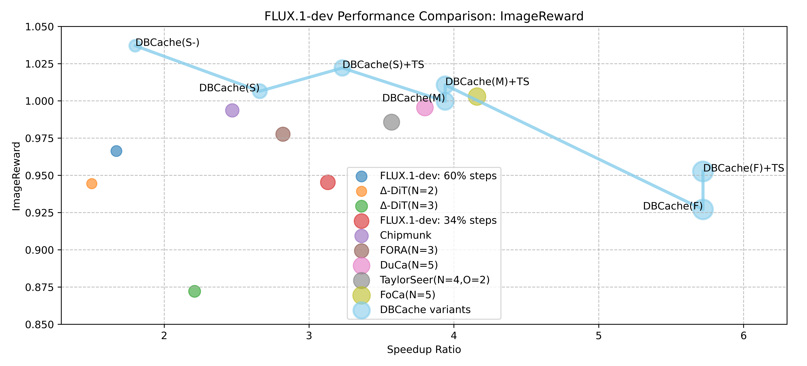

<a href="./README.md">📚English</a> | <a href="./README_CN.md">📚中文阅读 </a> | <a href="https://huggingface.co/docs/diffusers/main/en/optimization/cache_dit">🤗Docs in Diffusers🔥</a>

<div align="center">
  

<p align="center">
    一个专门为🤗Diffusers而开发的，<b>统一</b>、灵活以及无需训练的<b>缓存加速框架</b> <br>
    ♥️ <b>一行代码</b>实现DiT缓存加速 ~ ♥️
  </p>
  <div align='center'>
      
      
      
      
      
      
 </div>
  <p align="center">
    <b><a href="#unified">📚Unified Cache APIs</a></b> | <a href="#forward-pattern-matching">📚Forward Pattern Matching</a> | <a href="./docs/User_Guide.md">📚Automatic Block Adapter</a><br>
    <a href="./docs/User_Guide.md">📚Hybrid Forward Pattern</a> | <a href="#dbcache">📚DBCache</a> | <a href="./docs/User_Guide.md">📚TaylorSeer Calibrator</a> | <a href="./docs/User_Guide.md">📚Cache CFG</a><br>
    <a href="#benchmarks">📚Text2Image DrawBench</a> | <a href="#benchmarks">📚Text2Image Distillation DrawBench</a>
  </p>
  <div align='center'>
        
  </div>
  <p align="center">
    🎉目前, <b>cache-dit</b> 支持Diffusers中几乎<b>所有</b>DiT</b>模型🎉<br>
    🔥<a href="#supported">Qwen-Image</a> | <a href="#supported">FLUX.1</a> | <a href="#supported">Qwen-Image-Lightning</a> | <a href="#supported"> Wan 2.1 </a> | <a href="#supported"> Wan 2.2 </a>🔥<br>
    🔥<a href="#supported">HunyuanImage-2.1</a> | <a href="#supported">HunyuanVideo</a> | <a href="#supported">HunyuanDiT</a> | <a href="#supported">HiDream</a> | <a href="#supported">AuraFlow</a>🔥<br>
    🔥<a href="#supported">CogView3Plus</a> | <a href="#supported">CogView4</a> | <a href="#supported">LTXVideo</a> | <a href="#supported">CogVideoX</a> | <a href="#supported">CogVideoX 1.5</a> | <a href="#supported">ConsisID</a>🔥<br>
    🔥<a href="#supported">Cosmos</a> | <a href="#supported">SkyReelsV2</a> | <a href="#supported">VisualCloze</a> | <a href="#supported">OmniGen 1/2</a> | <a href="#supported">Lumina 1/2</a> | <a href="#supported">PixArt</a>🔥<br>
    🔥<a href="#supported">Chroma</a> | <a href="#supported">Sana</a> | <a href="#supported">Allegro</a> | <a href="#supported">Mochi</a> | <a href="#supported">SD 3/3.5</a> | <a href="#supported">Amused</a> | <a href="#supported"> ... </a> | <a href="#supported">DiT-XL</a>🔥
  </p>
</div>


<div align='center'>
  
  
  
  
  <p><b>🔥Wan2.2 MoE</b> | <a href="https://github.com/vipshop/cache-dit">+cache-dit</a>:2.0x↑🎉 | <b>HunyuanVideo</b> | <a href="https://github.com/vipshop/cache-dit">+cache-dit</a>:2.1x↑🎉</p>
  
  
  
  
  <p><b>🔥Qwen-Image</b> | <a href="https://github.com/vipshop/cache-dit">+cache-dit</a>:1.8x↑🎉 | <b>FLUX.1-dev</b> | <a href="https://github.com/vipshop/cache-dit">+cache-dit</a>:2.1x↑🎉</p>
  
  
  
  
  <p><b>🔥Qwen...Lightning</b> | <a href="https://github.com/vipshop/cache-dit">+cache-dit</a>:1.14x↑🎉 | <b>HunyuanImage</b> | <a href="https://github.com/vipshop/cache-dit">+cache-dit</a>:1.7x↑🎉</p>
  
  
  
  
  <p><b>🔥Qwen-Image-Edit</b> | Input w/o Edit | Baseline | <a href="https://github.com/vipshop/cache-dit">+cache-dit</a>:1.6x↑🎉 | 1.9x↑🎉
  <br>♥️ Please consider to leave a <b>⭐️ Star</b> to support us ~ ♥️
  </p>
</div>

<details align='center'>

<summary>点击这里查看更多Image/Video加速示例</summary>

<div  align='center'>
  
  
  
  
  
  <p><b>🔥FLUX-Kontext-dev</b> | Baseline | <a href="https://github.com/vipshop/cache-dit">+cache-dit</a>:1.3x↑🎉 | 1.7x↑🎉 | 2.0x↑ 🎉</p>
  
  
  
  
  
  <p><b>🔥HiDream-I1</b> | <a href="https://github.com/vipshop/cache-dit">+cache-dit</a>:1.9x↑🎉 | <b>CogView4</b> | <a href="https://github.com/vipshop/cache-dit">+cache-dit</a>:1.4x↑🎉 | 1.7x↑🎉</p>
  
  
  
  
  
  <p><b>🔥CogView3</b> | <a href="https://github.com/vipshop/cache-dit">+cache-dit</a>:1.5x↑🎉 | 2.0x↑🎉| <b>Chroma1-HD</b> | <a href="https://github.com/vipshop/cache-dit">+cache-dit</a>:1.9x↑🎉</p>
  
  
  
  
  <p><b>🔥Mochi-1-preview</b> | <a href="https://github.com/vipshop/cache-dit">+cache-dit</a>:1.8x↑🎉 | <b>SkyReelsV2</b> | <a href="https://github.com/vipshop/cache-dit">+cache-dit</a>:1.6x↑🎉</p>
  
  
  
  
  
  <p><b>🔥VisualCloze-512</b> | Model | Cloth | Baseline | <a href="https://github.com/vipshop/cache-dit">+cache-dit</a>:1.4x↑🎉 | 1.7x↑🎉 </p>
  
  
  
  
  <p><b>🔥LTX-Video-0.9.7</b> | <a href="https://github.com/vipshop/cache-dit">+cache-dit</a>:1.7x↑🎉 | <b>CogVideoX1.5</b> | <a href="https://github.com/vipshop/cache-dit">+cache-dit</a>:2.0x↑🎉</p>
  
  
  
  
  
  <p><b>🔥OmniGen-v1</b> | <a href="https://github.com/vipshop/cache-dit">+cache-dit</a>:1.5x↑🎉 | 3.3x↑🎉 | <b>Lumina2</b> | <a href="https://github.com/vipshop/cache-dit">+cache-dit</a>:1.9x↑🎉</p>
  
  
  
  
  <p><b>🔥Allegro</b> | <a href="https://github.com/vipshop/cache-dit">+cache-dit</a>:1.36x↑🎉 | <b>AuraFlow-v0.3</b> | <a href="https://github.com/vipshop/cache-dit">+cache-dit</a>:2.27x↑🎉 </p>
  
  
  
  
  
  <p><b>🔥Sana</b> | <a href="https://github.com/vipshop/cache-dit">+cache-dit</a>:1.3x↑🎉 | 1.6x↑🎉| <b>PixArt-Sigma</b> | <a href="https://github.com/vipshop/cache-dit">+cache-dit</a>:2.3x↑🎉</p>
  
  
  
  
  
  <p><b>🔥PixArt-Alpha</b> | <a href="https://github.com/vipshop/cache-dit">+cache-dit</a>:1.6x↑🎉 | 1.8x↑🎉| <b>SD 3.5</b> | <a href="https://github.com/vipshop/cache-dit">+cache-dit</a>:2.5x↑🎉</p>
  
  
  
  
  
  <p><b>🔥Asumed</b> | <a href="https://github.com/vipshop/cache-dit">+cache-dit</a>:1.1x↑🎉 | 1.2x↑🎉 | <b>DiT-XL-256</b> | <a href="https://github.com/vipshop/cache-dit">+cache-dit</a>:1.8x↑🎉
  <br>♥️ Please consider to leave a <b>⭐️ Star</b> to support us ~ ♥️</p>
</div>
</details>


## 📖目录

<div id="contents"></div>  

- [⚙️安装依赖](#️installation)
- [🔥快速开始](#quick-start)
- [📚前向模式匹配](#forward-pattern-matching)
- [⚡️双向对偶缓存](#dbcache)
- [🔥泰勒展开校准器](#taylorseer)
- [📚混合CFG缓存](#cfg)
- [🔥性能数据](#benchmarks)
- [🎉用户指引](#user-guide)
- [©️引用我们](#citations)

## ⚙️安装依赖

<div id="installation"></div>

您可以从PyPI上安装`cache-dit`的稳定版本：

```bash
pip3 install -U cache-dit
```

或者从github的源码进行安装：
```bash
pip3 install git+https://github.com/vipshop/cache-dit.git
```

## 🔥快速开始 

<div id="unified"></div>  

<div id="quick-start"></div>

在大多数情况下，您只需调用 ♥️**一行**♥️ 代码，即 `cache_dit.enable_cache(...)`。调用该 API 后，您只需像往常一样调用管道（pipe）即可。其中，`pipe` 参数可以是 **任意** Diffusion Pipeline。示例可参考 [Qwen-Image](https://github.com/vipshop/cache-dit/blob/main/examples/pipeline/run_qwen_image.py)。

```python
>>> import cache_dit
>>> from diffusers import DiffusionPipeline
>>> pipe = DiffusionPipeline.from_pretrained("Qwen/Qwen-Image") # Can be any diffusion pipeline
>>> cache_dit.enable_cache(pipe) # One-line code with default cache options.
>>> output = pipe(...) # Just call the pipe as normal.
>>> stats = cache_dit.summary(pipe) # Then, get the summary of cache acceleration stats.
>>> cache_dit.disable_cache(pipe) # Disable cache and run original pipe.
```

## 📚前向模式匹配 

<div id="supported"></div>

<div id="forward-pattern-matching"></div>  

cache-dit 的工作原理是匹配如下所示的特定输入/输出模式。


详情请查看 [🎉示例](https://github.com/vipshop/cache-dit/blob/main/examples/pipeline)。以下仅列出部分经过测试的模型。

```python
>>> import cache_dit
>>> cache_dit.supported_pipelines()
(30, ['Flux*', 'Mochi*', 'CogVideoX*', 'Wan*', 'HunyuanVideo*', 'QwenImage*', 'LTX*', 'Allegro*',
'CogView3Plus*', 'CogView4*', 'Cosmos*', 'EasyAnimate*', 'SkyReelsV2*', 'StableDiffusion3*',
'ConsisID*', 'DiT*', 'Amused*', 'Bria*', 'Lumina*', 'OmniGen*', 'PixArt*', 'Sana*', 'StableAudio*',
'VisualCloze*', 'AuraFlow*', 'Chroma*', 'ShapE*', 'HiDream*', 'HunyuanDiT*', 'HunyuanDiTPAG*'])
```

<details>
<summary> 点击展示所有支持的模型 </summary>  

- [🚀HunyuanImage-2.1](https://github.com/vipshop/cache-dit/blob/main/examples)  
- [🚀Qwen-Image-Lightning](https://github.com/vipshop/cache-dit/blob/main/examples)
- [🚀Qwen-Image-Edit](https://github.com/vipshop/cache-dit/blob/main/examples)  
- [🚀Qwen-Image](https://github.com/vipshop/cache-dit/blob/main/examples)  
- [🚀FLUX.1-dev](https://github.com/vipshop/cache-dit/blob/main/examples)  
- [🚀FLUX.1-Fill-dev](https://github.com/vipshop/cache-dit/blob/main/examples)  
- [🚀FLUX.1-Kontext-dev](https://github.com/vipshop/cache-dit/blob/main/examples)
- [🚀CogView4](https://github.com/vipshop/cache-dit/blob/main/examples)
- [🚀Wan2.2-T2V](https://github.com/vipshop/cache-dit/blob/main/examples)
- [🚀HunyuanVideo](https://github.com/vipshop/cache-dit/blob/main/examples)
- [🚀HiDream-I1-Full](https://github.com/vipshop/cache-dit/blob/main/examples)
- [🚀HunyuanDiT](https://github.com/vipshop/cache-dit/blob/main/examples)
- [🚀Wan2.1-T2V](https://github.com/vipshop/cache-dit/blob/main/examples)
- [🚀Wan2.1-FLF2V](https://github.com/vipshop/cache-dit/blob/main/examples)
- [🚀SkyReelsV2](https://github.com/vipshop/cache-dit/blob/main/examples)  
- [🚀Chroma1-HD](https://github.com/vipshop/cache-dit/blob/main/examples)  
- [🚀CogVideoX1.5](https://github.com/vipshop/cache-dit/blob/main/examples)
- [🚀CogView3-Plus](https://github.com/vipshop/cache-dit/blob/main/examples)
- [🚀CogVideoX](https://github.com/vipshop/cache-dit/blob/main/examples)
- [🚀VisualCloze](https://github.com/vipshop/cache-dit/blob/main/examples)  
- [🚀LTXVideo](https://github.com/vipshop/cache-dit/blob/main/examples)  
- [🚀OmniGen](https://github.com/vipshop/cache-dit/blob/main/examples)  
- [🚀Lumina2](https://github.com/vipshop/cache-dit/blob/main/examples)  
- [🚀mochi-1-preview](https://github.com/vipshop/cache-dit/blob/main/examples)
- [🚀AuraFlow-v0.3](https://github.com/vipshop/cache-dit/blob/main/examples)
- [🚀PixArt-Alpha](https://github.com/vipshop/cache-dit/blob/main/examples)
- [🚀PixArt-Sigma](https://github.com/vipshop/cache-dit/blob/main/examples)
- [🚀NVIDIA Sana](https://github.com/vipshop/cache-dit/blob/main/examples)
- [🚀SD-3/3.5](https://github.com/vipshop/cache-dit/blob/main/examples)
- [🚀ConsisID](https://github.com/vipshop/cache-dit/blob/main/examples)
- [🚀Allegro](https://github.com/vipshop/cache-dit/blob/main/examples)
- [🚀Amused](https://github.com/vipshop/cache-dit/blob/main/examples)
- [🚀DiT-XL](https://github.com/vipshop/cache-dit/blob/main/examples)
- ...

</details>

## ⚡️双向对偶缓存  

<div id="dbcache"></div>


**DBCache**：面向Diffusion Transformers的**双向对偶缓存（Dual Block Caching）** 技术。在DBCache中可自定义计算块的不同配置（如**F8B12**等），实现性能与精度之间的平衡权衡。此外，它完全可实现**无训练（training-free）** 部署。查阅 [DBCache](https://github.com/vipshop/cache-dit/blob/main/docs/DBCache.md) 和 [User Guide](https://github.com/vipshop/cache-dit/blob/main/docs/User_Guide.md#dbcache) 文档以获取更多设计细节。

```python
# Default options, F8B0, 8 warmup steps, and unlimited cached 
# steps for good balance between performance and precision
cache_dit.enable_cache(pipe_or_adapter)

# Custom options, F8B8, higher precision
from cache_dit import BasicCacheConfig

cache_dit.enable_cache(
    pipe_or_adapter,
    cache_config=BasicCacheConfig(
        max_warmup_steps=8,  # steps do not cache
        max_cached_steps=-1, # -1 means no limit
        Fn_compute_blocks=8, # Fn, F8, etc.
        Bn_compute_blocks=8, # Bn, B8, etc.
        residual_diff_threshold=0.12,
    ),
)
```  


## 🔥泰勒展开校准器

<div id="taylorseer"></div>

[TaylorSeers](https://huggingface.co/papers/2503.06923) 算法可在缓存步长较大的场景下进一步提升 DBCache 的精度（即混合 TaylorSeer + DBCache 方案）；由于在时间步间隔较大时，扩散模型中的特征相似度会大幅下降，严重影响生成质量，TaylorSeers 遂采用微分方法近似特征的高阶导数，并通过泰勒级数展开来预测未来时间步的特征，且 CacheDiT 中实现的 TaylorSeers 支持隐藏状态和残差两种缓存类型，F_pred 既可以是残差缓存，也可以是隐藏状态缓存。

```python
from cache_dit import BasicCacheConfig, TaylorSeerCalibratorConfig

cache_dit.enable_cache(
    pipe_or_adapter,
    # Basic DBCache w/ FnBn configurations
    cache_config=BasicCacheConfig(
        max_warmup_steps=8,  # steps do not cache
        max_cached_steps=-1, # -1 means no limit
        Fn_compute_blocks=8, # Fn, F8, etc.
        Bn_compute_blocks=8, # Bn, B8, etc.
        residual_diff_threshold=0.12,
    ),
    # Then, you can use the TaylorSeer Calibrator to approximate 
    # the values in cached steps, taylorseer_order default is 1.
    calibrator_config=TaylorSeerCalibratorConfig(
        taylorseer_order=1,
    ),
)
``` 

> [!TIP]  
> 若使用 TaylorSeer 作为校准器来近似隐藏状态，可将 DBCache 的 `Bn_compute_blocks` 参数设为 `0`；DBCache 的 `Bn_compute_blocks` 本身也可充当校准器，因此你可选择 `Bn_compute_blocks` > 0 的模式，或选择 TaylorSeer。我们建议采用 TaylorSeer + DBCache FnB0 的配置方案。

## 📚混合CFG缓存

<div id="cfg"></div>

cache-dit 支持对 CFG（classifier-free guidance）的缓存功能。对于将 CFG 与非 CFG 融合在单个前向传播步骤中的模型，或在前向传播步骤中不包含 CFG（classifier-free guidance）的模型，请将 `enable_separate_cfg` 参数设置为 `False（默认值，或 None）`；否则，请将其设置为 `True`。

```python
from cache_dit import BasicCacheConfig

cache_dit.enable_cache(
    pipe_or_adapter, 
    cache_config=BasicCacheConfig(
        ...,
        # For example, set it as True for Wan 2.1/Qwen-Image 
        # and set it as False for FLUX.1, HunyuanVideo, CogVideoX, etc.
        enable_separate_cfg=True,
    ),
)
```

## 🔥性能数据

<div id="benchmarks"></div>


**cache-dit: DBCache** 与 Δ-DiT、Chipmunk、FORA、DuCa、TaylorSeer、FoCa 等算法的对比情况如下。在加速比低于 **3倍（3x）** 的对比场景中，cache-dit 实现了最佳精度。值得注意的是，在极少量步数的蒸馏模型中，cache-dit: DBCache 仍能正常工作。完整的基准测试数据请参考 [📚Benchmarks](https://github.com/vipshop/cache-dit/blob/main/bench/)。

| Method | TFLOPs(↓) | SpeedUp(↑) | ImageReward(↑) | Clip Score(↑) |
| --- | --- | --- | --- | --- |
| [**FLUX.1**-dev]: 50 steps | 3726.87 | 1.00× | 0.9898 | 32.404 |
| [**FLUX.1**-dev]: 60% steps | 2231.70 | 1.67× | 0.9663 | 32.312 |
| Δ-DiT(N=2) | 2480.01 | 1.50× | 0.9444 | 32.273 |
| Δ-DiT(N=3) | 1686.76 | 2.21× | 0.8721 | 32.102 |
| [**FLUX.1**-dev]: 34% steps | 1264.63 | 3.13× | 0.9453 | 32.114 |
| Chipmunk | 1505.87 | 2.47× | 0.9936 | 32.776 |
| FORA(N=3) | 1320.07 | 2.82× | 0.9776 | 32.266 |
| **[DBCache(F=4,B=0,W=4,MC=4)](https://github.com/vipshop/cache-dit)** | 1400.08 | **2.66×** | **1.0065** | 32.838 |
| **[DBCache+TaylorSeer(F=1,B=0,O=1)](https://github.com/vipshop/cache-dit)** | 1153.05 | **3.23×** | **1.0221** | 32.819 |
| DuCa(N=5) | 978.76 | 3.80× | 0.9955 | 32.241 |
| TaylorSeer(N=4,O=2) | 1042.27 | 3.57× | 0.9857 | 32.413 |
| **[DBCache(F=1,B=0,W=4,MC=6)](https://github.com/vipshop/cache-dit)** | 944.75 | **3.94×** | 0.9997 | 32.849 |
| **[DBCache+TaylorSeer(F=1,B=0,O=1)](https://github.com/vipshop/cache-dit)** | 944.75 | **3.94×** | **1.0107** | 32.865 |
| **[FoCa(N=5): arxiv.2508.16211](https://arxiv.org/pdf/2508.16211)** | 893.54 | **4.16×** | **1.0029** | **32.948** |

<details>
<summary> 点击展开完整的对比 </summary>  

| Method | TFLOPs(↓) | SpeedUp(↑) | ImageReward(↑) | Clip Score(↑) |
| --- | --- | --- | --- | --- |
| [**FLUX.1**-dev]: 50 steps | 3726.87 | 1.00× | 0.9898 | 32.404 |
| [**FLUX.1**-dev]: 60% steps | 2231.70 | 1.67× | 0.9663 | 32.312 |
| Δ-DiT(N=2) | 2480.01 | 1.50× | 0.9444 | 32.273 |
| Δ-DiT(N=3) | 1686.76 | 2.21× | 0.8721 | 32.102 |
| [**FLUX.1**-dev]: 34% steps | 1264.63 | 3.13× | 0.9453 | 32.114 |
| Chipmunk | 1505.87 | 2.47× | 0.9936 | 32.776 |
| FORA(N=3) | 1320.07 | 2.82× | 0.9776 | 32.266 |
| **[DBCache(F=4,B=0,W=4,MC=4)](https://github.com/vipshop/cache-dit)** | 1400.08 | **2.66×** | **1.0065** | 32.838 |
| DuCa(N=5) | 978.76 | 3.80× | 0.9955 | 32.241 |
| TaylorSeer(N=4,O=2) | 1042.27 | 3.57× | 0.9857 | 32.413 |
| **[DBCache+TaylorSeer(F=1,B=0,O=1)](https://github.com/vipshop/cache-dit)** | 1153.05 | **3.23×** | **1.0221** | 32.819 |
| **[DBCache(F=1,B=0,W=4,MC=6)](https://github.com/vipshop/cache-dit)** | 944.75 | **3.94×** | 0.9997 | 32.849 |
| **[DBCache+TaylorSeer(F=1,B=0,O=1)](https://github.com/vipshop/cache-dit)** | 944.75 | **3.94×** | **1.0107** | 32.865 |
| **[FoCa(N=5): arxiv.2508.16211](https://arxiv.org/pdf/2508.16211)** | 893.54 | **4.16×** | **1.0029** | **32.948** |
| [**FLUX.1**-dev]: 22% steps | 818.29 | 4.55× | 0.8183 | 31.772 |
| FORA(N=4) | 967.91 | 3.84× | 0.9730 | 32.142 |
| ToCa(N=8) | 784.54 | 4.74× | 0.9451 | 31.993 |
| DuCa(N=7) | 760.14 | 4.89× | 0.9757 | 32.066 |
| TeaCache(l=0.8) | 892.35 | 4.17× | 0.8683 | 31.704 |
| **[DBCache(F=4,B=0,W=4,MC=10)](https://github.com/vipshop/cache-dit)** | 816.65 | 4.56x | 0.8245 | 32.191 |
| TaylorSeer(N=5,O=2) | 893.54 | 4.16× | 0.9768 | 32.467 |
| **[FoCa(N=7): arxiv.2508.16211](https://arxiv.org/pdf/2508.16211)** | 670.44 | **5.54×** | **0.9891** | **32.920** |
| FORA(N=7) | 670.14 | 5.55× | 0.7418 | 31.519 |
| ToCa(N=12) | 644.70 | 5.77× | 0.7155 | 31.808 |
| DuCa(N=10) | 606.91 | 6.13× | 0.8382 | 31.759 |
| TeaCache(l=1.2) | 669.27 | 5.56× | 0.7394 | 31.704 |
| **[DBCache(F=1,B=0,W=4,MC=10)](https://github.com/vipshop/cache-dit)** | 651.90 | **5.72x** | 0.8796 | **32.318** |
| TaylorSeer(N=7,O=2) | 670.44 | 5.54× | 0.9128 | 32.128 |
| **[FoCa(N=8): arxiv.2508.16211](https://arxiv.org/pdf/2508.16211)** | 596.07 | **6.24×** | **0.9502** | **32.706** |

注：除 DBCache 外，其他性能数据均引用自论文 [FoCa, arxiv.2508.16211](https://arxiv.org/pdf/2508.16211)。

</details>

## 🎉用户指引

<div id="user-guide"></div>

对于更高级的功能，如**Unified Cache APIs**、**Forward Pattern Matching**、**Automatic Block Adapter**、**Hybrid Forward Pattern**、**DBCache**、**TaylorSeer Calibrator**和**Hybrid Cache CFG**，详情请参考[🎉User_Guide.md](./docs/User_Guide.md)。

- [⚙️Installation](./docs/User_Guide.md#️installation)
- [🔥Benchmarks](./docs/User_Guide.md#benchmarks)
- [🔥Supported Pipelines](./docs/User_Guide.md#supported-pipelines)
- [🎉Unified Cache APIs](./docs/User_Guide.md#unified-cache-apis)
  - [📚Forward Pattern Matching](./docs/User_Guide.md#forward-pattern-matching)
  - [📚Cache with One-line Code](./docs/User_Guide.md#%EF%B8%8Fcache-acceleration-with-one-line-code)
  - [🔥Automatic Block Adapter](./docs/User_Guide.md#automatic-block-adapter)
  - [📚Hybird Forward Pattern](./docs/User_Guide.md#hybird-forward-pattern)
  - [📚Implement Patch Functor](./docs/User_Guide.md#implement-patch-functor)
  - [🤖Cache Acceleration Stats](./docs/User_Guide.md#cache-acceleration-stats-summary)
- [⚡️Dual Block Cache](./docs/User_Guide.md#️dbcache-dual-block-cache)
- [🔥TaylorSeer Calibrator](./docs/User_Guide.md#taylorseer-calibrator)
- [⚡️Hybrid Cache CFG](./docs/User_Guide.md#️hybrid-cache-cfg)
- [⚙️Torch Compile](./docs/User_Guide.md#️torch-compile)
- [🛠Metrics CLI](./docs/User_Guide.md#metrics-cli)
- [📚API Documents](./docs/User_Guide.md#api-documentation)

## 👋参与贡献
 
<div id="contribute"></div>

如何贡献？点亮星标 ⭐️ 支持我们，或查看 [CONTRIBUTE.md](https://github.com/vipshop/cache-dit/blob/main/CONTRIBUTE.md)。

<div align='center'>
<a href="https://star-history.com/#vipshop/cache-dit&Date">
  <picture align='center'>
    <source media="(prefers-color-scheme: dark)" srcset="https://api.star-history.com/svg?repos=vipshop/cache-dit&type=Date&theme=dark" />
    <source media="(prefers-color-scheme: light)" srcset="https://api.star-history.com/svg?repos=vipshop/cache-dit&type=Date" />
    
  </picture>
</a>
</div>

## ©️特别声明

<div id="Acknowledgements"></div>

**cache-dit** 代码库基于 FBCache 开发而成。但随着时间推移，其代码库已发生较大差异，且 **cache-dit** 的 API 不再与 FBCache 兼容。

## ©️引用我们

<div id="citations"></div>

```BibTeX
@misc{cache-dit@2025,
  title={cache-dit: A Unified, Flexible and Training-free Cache Acceleration Framework for Diffusers.},
  url={https://github.com/vipshop/cache-dit.git},
  note={Open-source software available at https://github.com/vipshop/cache-dit.git},
  author={vipshop.com},
  year={2025}
}
```
