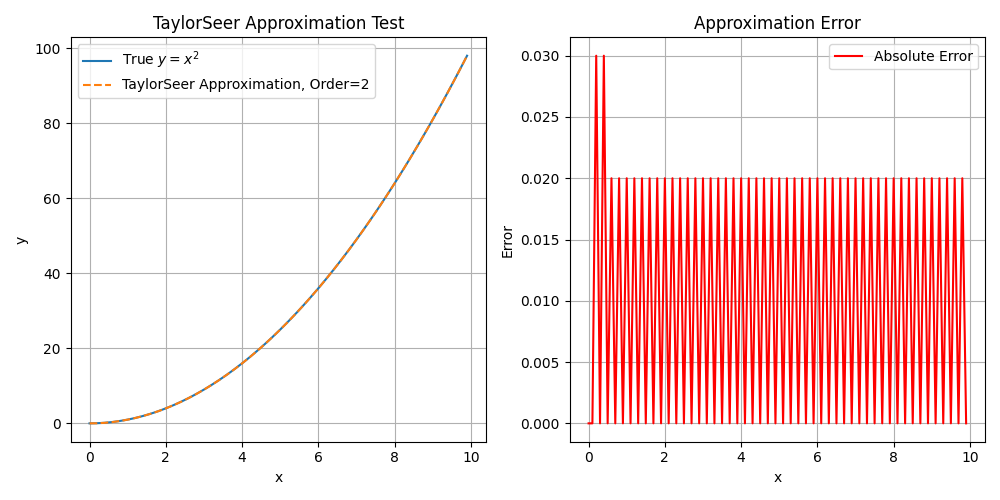
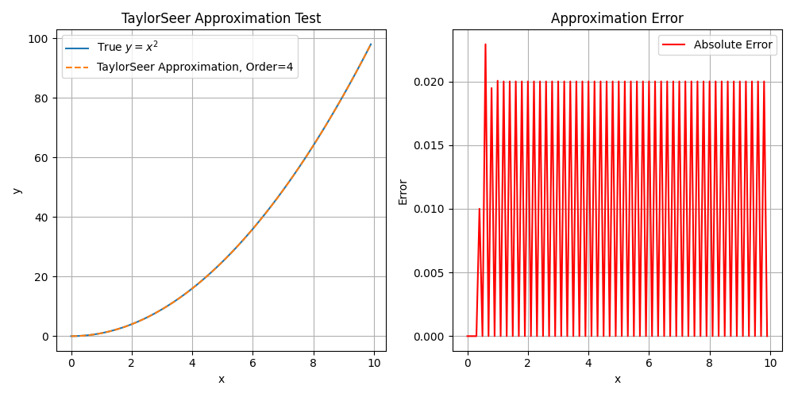

# Tests

## Taylorseer, Order=2  

```bash
python3 test_taylorseer.py --order 2
```



## Taylorseer, Order=4

```bash
python3 test_taylorseer.py --order 4
```



## Metrics

Image Metrics

```bash
# F1B0 w/o TaylorSeer
python3 test_metrics.py --img-true data/U0_C0_NONE_R0.08_S0_T24.82s.png --img-test data/U0_C0_DBCACHE_F1B0S1W0T0O2_R0.08_S11_T15.43s.png

data/U0_C0_NONE_R0.08_S0_T24.82s.png vs data/U0_C0_DBCACHE_F1B0S1W0T0O2_R0.08_S11_T15.43s.png, PSNR: 21.240280356949647
data/U0_C0_NONE_R0.08_S0_T24.82s.png vs data/U0_C0_DBCACHE_F1B0S1W0T0O2_R0.08_S11_T15.43s.png, FID: 136.1958835812449

# F1B0 w/ TaylorSeer, Order=2
python3 test_metrics.py --img-true data/U0_C0_NONE_R0.08_S0_T24.82s.png --img-test data/U0_C0_DBCACHE_F1B0S1W0T1O2_R0.08_S10_T16.30s.png

data/U0_C0_NONE_R0.08_S0_T24.82s.png vs data/U0_C0_DBCACHE_F1B0S1W0T1O2_R0.08_S10_T16.30s.png, PSNR: 24.68392809867634
data/U0_C0_NONE_R0.08_S0_T24.82s.png vs data/U0_C0_DBCACHE_F1B0S1W0T1O2_R0.08_S10_T16.30s.png, FID: 75.76806327295184
```

Video Metrics

```bash
# F1B0 w/o TaylorSeer
python3 test_metrics.py --video-true data/wan.NONE.mp4 --video-test data/wan.DBCACHE_F1B0W0T0O2.mp4
data/wan.NONE.mp4 vs data/wan.DBCACHE_F1B0W0T0O2.mp4, PSNR: 19.043978283539857

# F1B0 w/ TaylorSeer, Order=2
python3 test_metrics.py --video-true data/wan.NONE.mp4 --video-test data/wan.DBCACHE_F1B0W0T1O2.mp4
data/wan.NONE.mp4 vs data/wan.DBCACHE_F1B0W0T1O2.mp4, PSNR: 19.794726079042302

# F1B0 w/ TaylorSeer, Order=4
python3 test_metrics.py --video-true data/wan.NONE.mp4 --video-test data/wan.DBCACHE_F1B0W0T1O4.mp4
data/wan.NONE.mp4 vs data/wan.DBCACHE_F1B0W0T1O4.mp4, PSNR: 19.779299536586567

# F4B0 w/ TaylorSeer, Order=2
python3 test_metrics.py --video-true data/wan.NONE.mp4 --video-test data/wan.DBCACHE_F4B0W0T1O2.mp4
data/wan.NONE.mp4 vs data/wan.DBCACHE_F4B0W0T1O2.mp4, PSNR: 21.52726487066195

# F8B0 w/ TaylorSeer, Order=2
python3 test_metrics.py --video-true data/wan.NONE.mp4 --video-test data/wan.DBCACHE_F8B0W0T1O2.mp4
data/wan.NONE.mp4 vs data/wan.DBCACHE_F8B0W0T1O2.mp4, PSNR: 27.970811066301014

# F12B0 w/ TaylorSeer, Order=2
python3 test_metrics.py --video-true data/wan.NONE.mp4 --video-test data/wan.DBCACHE_F12B0W0T1O2.mp4
data/wan.NONE.mp4 vs data/wan.DBCACHE_F12B0W0T1O2.mp4, PSNR: 33.32353616116749
```
